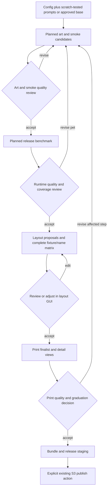

# Config-driven authoring automation proposal

Status: staged implementation proposal. The local deterministic layout proposal
stage in section 8 is implemented as `pawmarvel-author propose-layout`; the
broader workflow coordinator commands remain planned.
Date: 2026-10-04.
Scope: local template authoring through the existing immutable bundle and release.

## 1. Outcome and boundaries

Automate the repeated execution between human quality reviews for three paths:

1. **New design:** start with scratch-tested art and pet prompts; generate
   immutable art candidates, pet benchmarks, comparisons, and a layout proposal.
2. **Product profile expansion:** adapt a production-approved bundle to another
   profile, including the normal case of a different aspect ratio.
3. **Category expansion:** derive a new design from a production-approved base
   and an explicit list of changes; verify in scratch before durable benchmarks.

The operator configures inputs once, runs to the next quality checkpoint,
reviews the evidence, and continues. Manual commands remain available for
focused troubleshooting. Selection, print review, graduation, and publication
retain their current ownership. FE imports the same complete, independent
bundle and owns product activation and rollback.

This proposal adds private orchestration around the existing workflow. It does
not replace the production contract in
[the bundle design](MVP_PRODUCTION_BUNDLE_CATALOG_DESIGN.md). It supersedes that
document's **planned** profile-port execution outline where source handling or
orchestration differs. The [operations guide](MVP_OPERATIONS_GUIDE.md) remains
the executable guide until the corresponding milestones ship.

Success means less operator configuration and fewer avoidable calls, with the
same visual acceptance criteria and stronger evidence about difficult pets and
names. Faster completion alone is not an acceptance criterion.

## 2. Current implementation and gaps

| Existing capability | Reuse | Gap addressed here |
| --- | --- | --- |
| `operation_config.py`: separate shared secrets and design/profile `.env` | Keep credentials separate and import explicit defaults | Shell arrays, winner paths, and downstream settings are still assembled manually |
| `authoring.py`: immutable experiments, attempts, benchmarks, decisions, print, graduation | Use these records as authoritative evidence | No resumable coordinator; generation reconstructs CLI arguments internally |
| `fixture_set.py`: reviewed fixture selection and pinned hashes | Keep selections and coverage warnings | Need one run plan that ties exact fixtures to candidates and name tests |
| `compare` and `comparison_artifacts.py` | Reuse ordinary evaluations and comparison images | Candidate navigation and cross-pet/name layout evidence need improvement |
| Layout editor, font ranking, `renderer.py` | Reuse exact renderer and OFL assets | Placement and fixture/name switching are predominantly manual |
| `print_upscale.py` and split upscale tools | Reuse separate template/pet preparation | Automate invocation from selected components and recovery after interruption |
| `production_bundle.py`, release catalog, S3 publisher | Keep existing public output contracts | Add coordination only after current decision/selection checks pass |
| Planned profile-port, now consolidated here from operations section 11 | Reuse independent target ownership and ratio rules | No orchestrator exists; the earlier outline depended on retained local graduation |
| `pipeline_cli.py`: replaceable debug pipeline | Keep as a focused diagnostic interface | It has narrower input support and its own orchestration; do not make it the durable runner |

New-design prompt discovery is deliberately outside the initial automation
boundary. It starts after the operator has satisfactory scratch prompts. AI
drafting and category adaptation remain optional preparation services.

## 3. Backward compatibility and FE contract

These are release criteria, not aspirations:

| Boundary | Requirement |
| --- | --- |
| Versions | Continue emitting `bundle-v1`, `release-catalog-v2`, `layout-v2`, and `product-profile-v1` |
| Identity | Keep `template_id = <design-id>--<profile-id>`, immutable revisions, and existing S3 key structure |
| Inventory | Keep canonical assets, hashes, dimensions, filenames, conditional fonts, and QA replay files; add no automation files to bundles |
| Runtime | Keep the declared provider/transport/request allowlist, explicit model/quality, customer pet first, and zero to four ordered runtime references |
| Name routing | Keep `renderer.name_mode` authoritative: `none`, `embedded-in-pet`, or `layout-text` |
| Text | Keep existing normalization, code-point length policy, fixed nominal size and shrink-only behavior, bundled font/OFL files |
| Composition | Keep alpha trimming, contain fit, bottom-center pet placement, layer order, and current rounding |
| Print | Derive print layout mechanically and upscale the selected pet pixels; do not substitute a new pet or flattened preview |
| Publication | Keep catalog-to-manifest-to-asset digests, conditional immutable upload, release-last ordering, and receipts |
| Application ownership | Import as draft; FE owns activation, commerce mapping, orders, and customer approval |

Existing supported bundles must still validate and render. Newly automated
bundles must also pass the **pre-automation** schemas and bundle validator in a
compatibility test. A schema that is relaxed to make new output pass is not a
valid compatibility test. Private schemas may evolve explicitly; published
schema or renderer changes require a separate FE-aligned proposal.

Pin compatibility tests to baseline commit
`af689ace671ace54d6752f1f00d10f103c13f09e` (or a subsequently reviewed release
baseline). Run its validator and renderer in an isolated test checkout against
new bundles; do not copy another implementation into production code. Compare
decoded pixels under pinned Pillow/font dependencies, not PNG encoding bytes.
Allow only documented tolerances when environments differ. Existing published
bundle bytes are never rewritten by an upgrade.

No FE lookup of a base design, category preset, workflow file, source workspace,
or source bundle is permitted at runtime. Every target bundle is self-contained.
The generator cannot infer FE activation from an S3 publication receipt.

## 4. What runs automatically and what needs review

| Stage | Automatic work | Human quality checkpoint |
| --- | --- | --- |
| Preparation | Validate files, modes, dimensions, references, hashes, fixtures and source bundle; generate plan | Resolve missing or ambiguous design intent when needed |
| Category scratch | Derive prompt changes and render bounded scratch candidates | Confirm intended changes, preserved style, and pet identity |
| Art and pet smoke | Create experiments, art attempts and smoke benchmarks; generate evidence | Choose an art candidate and shortlist the pet runtime |
| Release benchmark | Run the selected fixture set once per shortlisted runtime and compare | Accept style, identity, alpha, latency and coverage; select runtime |
| Layout | Seed boxes/font; search bounded alternatives; render fixture/name matrix | Confirm aesthetics, typography and any intended overlaps; adjust if needed |
| Print | Reuse split preparation, compose, validate geometry, write detail crops | Accept print appearance and final combination |
| Package | Graduate the approved combination, build and validate bundle/release, produce upload plan | Explicit publication authorization; FE activation remains separate |

One screen or command may record multiple quality decisions, but must write the
existing individual review decisions and identify their exact evaluations.
Passing technical checks never writes an approval automatically.

## 5. Configuration and proposed operator interface

### 5.1 One non-secret workflow config

Add a JSON config beside the existing private `.env` file:

```text
work/configs/pawmarvel-shared.env
work/configs/<design-id>--<profile-id>--v01.env
work/configs/<design-id>--<profile-id>--v01.workflow.json
```

`workflow init --from-env` imports an allowlisted set of **already sourced**
non-secret environment values. It does not execute or parse shell files and
does not capture provider keys, AWS credentials, or the complete environment.
Existing manual `.env` commands continue to work. After initialization the
workflow JSON is authoritative for that run; changing shell variables does not
silently override it. Model IDs are resolved and pinned at planning time.

Illustrative new-design config; initialization fills real paths and settings:

```json
{
  "schema_version": 1,
  "workflow_id": "cooper-king-v01",
  "scenario": "new-design",
  "workspace": {
    "authoring_root": "../authoring",
    "exchange_root": "../exchange"
  },
  "target": {
    "design_id": "cooper",
    "product_profile": "../../profiles/blanket-king-9375x12375.json"
  },
  "source_bundle": null,
  "name_mode": "layout-text",
  "pet_name_max_length": 12,
  "references": [
    {"path": "../design-inputs/cooper/reference-design.png", "role": "composition"},
    {"path": "../design-inputs/cooper/reference-designs/01-reference-design.png", "role": "variation"}
  ],
  "art": {
    "mode": "generated",
    "prompt": "../design-inputs/cooper/art-template-gpt.md",
    "provider": "openai",
    "model": "gpt-image-2.5-sunburst",
    "quality": "high",
    "attempt_count": 1
  },
  "pet": {
    "prompt": "../design-inputs/cooper/pet-transform-gpt.md",
    "provider": "openai",
    "model": "gpt-image-2.5-sunburst",
    "quality": "low"
  },
  "qa": {
    "evaluation_protocol": "../../examples/authoring/evaluation-protocols/mvp-image-v1.json",
    "smoke_fixture_set": "../../examples/authoring/fixture-sets/mvp-pets-smoke-v1/fixture-set.json",
    "release_fixture_set": "../../examples/authoring/fixture-sets/mvp-pets-v1/fixture-set.json",
    "smoke_selection": "../inputs/cooper-smoke.json",
    "release_selection": "../inputs/cooper-release.json",
    "representative_fixture_id": "sausage-dog",
    "representative_name": "SAUSAGE",
    "layout_names": ["MAX", "CHARLIE", "MARSHMALLOW", "WWWWWWWWWWWW"]
  },
  "layout": {
    "seed": null,
    "font_catalog": "../../assets/fonts",
    "candidate_limit": 3
  },
  "execution": {"max_paid_calls": 24, "concurrency": 1},
  "upscale_backend": "deterministic"
}
```

Initialization creates/reuses the selection drafts through the existing fixture
selector and reports their paths; the example assumes those two drafts have
been reviewed. All relative input paths resolve against the config's directory, never
the shell's current directory. Diagnostics display absolute paths. Unknown
keys, empty required inputs, mode conflicts, unsupported generation settings,
or incompatible profile identities fail before any paid call.

Config schema is private `authoring-workflow-config-v1`. Scenario values are
`new-design`, `profile-port`, and `category-variant`. For `new-design`,
`source_bundle` is null. The other scenarios require a source descriptor with
`release_catalog`, `catalog_sha256`, `template_id`, `bundle_revision`, and
`manifest_sha256`; the source catalog resolves the bundle beneath its verified
exchange root. An optional S3 bucket/prefix identifies the authenticated source
when a local cache is unavailable. Credentials come from the shared settings.
Record the owner's base-design confirmation with exact identity and actor in
the private workflow; do not add an FE activation flag to the bundle.

`profile-port` additionally accepts `art_strategy: auto|regenerate|resize`.
`category-variant` requires a `design_delta` file. Initializers obtain defaults
for the pet runtime, name mode, font and layout from the verified source bundle,
and list every explicit override. The current bundle does **not** contain the
art generation model/quality or every original art-only reference. Require
explicit target art settings from the design config; show them as target
settings, not recovered source facts. Extra source history is optional and is
used only when independently verified. Branch-specific optional fields are validated;
ambiguous or conflicting inheritance is an error. Pet runtime settings copied
from the source must match its actual bundled request, including normalization.
The target profile owns size: recompute generation and postprocess dimensions
from it, display the differences, and preserve the remaining runtime settings.
An unavailable source model requires an explicitly configured successor and
fresh QA; do not silently choose the current default model.

Reference folder discovery runs once at initialization: primary first, then
sorted PNG supporting files. The operator sees the order; planning pins it.
Later additions to the directory do not change a planned request. Role labels
are authoring hints only and do not alter the bundled runtime image-order rule.
Art adaptation references and pet runtime references can be configured
separately. Do not add an art-only source image to FE runtime inputs by accident.

An explicit `art.references` or `pet.references` array replaces the common list;
it is not merged implicitly. Every resolved list is pinned. Adding source art
to four existing references would exceed the current four-reference limit:
fail planning with the proposed order and ask the operator to choose the
supporting subset once. Never silently drop/reorder evidence. Reference roles
and future UI hints cannot expand the published maximum.

`art.mode=empty-canvas` uses the existing deterministic generator without an art
prompt. `references=[]` remains valid: art is prompt-only and pet generation
still takes the customer/fixture pet. Name mode is checked against prompt
tokens, experiment inputs, layouts and final bundle semantics before execution.

Validate named modes against the exact `{{PET_NAME}}` token and the existing
normalization policy. `layout-text` must omit it and retain a separate name
layer; `embedded-in-pet` must contain it and omit that layer; `none` must omit
both and have a null representative name. A supplied name ignored by a prompt
may remain a warning in the low-level generator, but workflow configuration
cannot silently claim an embedded-name contract. Preserve the canonical prompt
template in the bundle; store the substituted effective prompt only privately.

For embedded-name QA, an optional `qa.embedded_name_cases` list contains exact
`fixture_id`/`name` pairs. These get a separate attempt prefix and evidence
inventory; they neither replace nor inflate release-fixture coverage. Use
short, typical and maximum-length readable examples; layout-text's synthetic
wide-letter stress string need not be sent to the image model. Mode `none`
does not require a font catalog or a name test set.

### 5.2 One proposed CLI family

Extend `pawmarvel-author` with `workflow`; keep the existing atomic commands.
These commands are design examples, not runnable instructions today:

```bash
WORKFLOW_CONFIG="$(pawmarvel-author workflow init --from-env --scenario new-design)"
PLAN="$(pawmarvel-author workflow plan --config "$WORKFLOW_CONFIG" --until candidates)"
pawmarvel-author workflow run --plan "$PLAN"
pawmarvel-author workflow review --plan "$PLAN"
PLAN="$(pawmarvel-author workflow continue --plan "$PLAN")"
pawmarvel-author workflow run --plan "$PLAN"
```

`plan` performs no generation and prints resolved paths, calls, inputs and
settings. `run` executes only the planned work until its next quality
checkpoint. `review` presents numbered candidates, warnings and contact sheets;
the operator chooses once and provides review notes. The result is the normal
`reviews/<kind>/<id>/decision.json`; downstream IDs and paths are derived.
`continue` resolves and writes the next immutable phase plan from those
decisions; it performs no generation. `run` is the execution authorization for
that plan. Path-producing commands print only the resulting absolute path to
stdout and send summaries to stderr. Noninteractive review accepts exact candidate IDs and
reviewer/notes for scripted use, with the same validation.

For routine operation, `workflow review --plan "$PLAN" --continue` combines
recording the human choice and executing the next generated phase, within the
already accepted config and remaining call budget. It prints that new plan's
absolute path. It stops at the next quality checkpoint. This is the one-action
path after review; separate `continue`/`run` remains available for inspection.
Any new inputs, changed settings, exceeded budget or uncertain prior request
requires a corrected plan and cannot be hidden by this convenience option.

`status` reports pending review, running, failed, or complete, links artifacts,
and prints the next command. `layout` opens the existing GUI initialized with a
candidate. `retry` plans replacement attempts for specified failures; it never
rewrites attempts. Existing direct tools remain the fallback for custom work.

Use JSON results for machine callers and concise summaries for operators.
A normal wait for quality review is a successful paused result, distinguishable
from an error. Terminal progress identifies the stage, fixture, elapsed time,
completed/remaining tasks and absolute report path.

Gate handling is precise: smoke review records a private shortlist event, not a
production pet approval. Art acceptance writes an art decision. Release-runtime
acceptance writes a pet decision and pins the representative attempt in the
next phase. Layout acceptance writes layout and assembly decisions. Print
acceptance invokes `graduate` with those decisions and the exact finalist,
then local bundle/release building may continue. No unfinished prerequisite is
filled with a fabricated passing decision. The report shows all decision IDs.

The default sequence is `candidates → release → layout → print → package`.
Category derivation adds `scratch` first. A workflow status carries an explicit
`awaiting_review` state and the pending gate; a paused process need not remain
running. Repeated `review` of the same accepted bytes is idempotent; a changed
winner creates a new review ID and successor phase. Layout edits may stay in
scratch until saved. Continuing always resolves the latest explicitly accepted
branch, never a lexicographically latest attempt or review.



The return arrow is conceptual: the dependency rules in section 11 preserve
unaffected components rather than restarting all stages.

Scenario setup changes only the initialization inputs:

| Scenario | Enter once | First checkpoint | Subsequent operation |
| --- | --- | --- | --- |
| New design | Scratch-tested prompts, product config, reviewed fixture selections | Art/smoke candidates | Review and continue through release, layout, print, package |
| Profile expansion | Exact approved source bundle identity and target profile | Target art/smoke candidates | Same review/continue loop; plan resolves equal/unequal ratio |
| Category alternative | Exact source bundle identity, new design ID, delta, target references if needed | Scratch delta/style comparison | Edit scratch if needed, freeze prompts, then use the same review/continue loop |

No downstream command requires retyping the selected art, pet or layout path.
The report provides direct links to its next command and exact ordinary
artifacts for troubleshooting. A changed winner produces a successor branch;
the operator never edits a plan's hashes by hand.

## 6. Private artifacts, selection, and recovery

```text
authoring/<design-id>/<profile-id>/
  workflows/<workflow-id>/
    config.snapshot.json
    sources/                         # verified, target-owned source bundle inputs
    plans/<phase-id>.json             # immutable inputs, task IDs and call budget
    inputs/<snapshot-id>/             # pinned non-secret plan inputs
    events/<event-id>.json            # started/completed/failed task evidence
    report.json                      # rebuildable navigation, not approval
    report.html                      # rebuildable local report
    scratch/                         # disposable prompt/image exploration
    layout-proposals/<proposal-id>/   # candidate configs and geometry metrics
  experiments/{art,pet,layout}/...    # existing authoritative experiments
  reviews/{art,pet,layout,assembly}/... # existing evaluations and decisions
  print-candidates/...
  graduations/<id>/{selection.json,publications/...}
exchange/{bundles,releases}/...       # existing FE handoff, unchanged
```

Each phase plan pins the config, prompts, ordered references, fixtures, source
bundle, product profile, selected upstream artifacts, tool version, runtime
settings and planned task IDs. Scratch can be overwritten; executed plans,
attempts, evaluations and decisions cannot. A configuration or winner change
creates a successor phase and invalidates only downstream work that consumes
the changed hashes.

Plan creation copies mutable inputs into immutable local snapshots and verifies
their hashes after copying. Execution reads snapshots, not the original config
paths. Already immutable product artifacts are referenced by relative path plus
hash. A missing/changed snapshot is a preflight failure, not a reason to fetch
different source bytes. New private schemas cover config, phase plans and
events; normal review/selection formats remain authoritative.

The immutable plan is a small task list, not a programmable DAG language.
Each task has an ID, a supported operation, input descriptors with hashes,
dependencies, output locations and charged-call allowance. Use one dispatcher
over existing services. Task events never contain API keys or signed URLs.
An event outcome is recorded only after output hashes are durable. Resume
reconciles a succeeded ordinary attempt even if the workflow completion event
was not written before a crash. It never infers success from file existence.

Store portable relative paths inside records. The target owns every required
copy; no experiment references a sibling product's files or mutable source
cache. The report can be rebuilt from plans and existing records; it cannot
override them. Category lineage belongs in private source/plan metadata.

Recovery checks output hashes before skipping succeeded tasks. Failed calls
receive successor attempt IDs. A request interrupted after provider submission
has an unknown outcome: record it explicitly and require an operator retry
choice unless the provider gives a usable recovery mechanism. Do not promise
exactly-once paid generation or silently repeat an uncertain call.

`max_paid_calls` is cumulative across the workflow's phases, retries, scratch
and any prompt-assistance calls. Report separate image, prompt-analysis and
upscale request counts; provider billing units/cost may differ. Unknown-outcome
submissions consume their allowance until reconciled. Operator-requested budget
changes create a recorded successor plan. Example: one art call + three smoke
pets + fifteen release pets = nineteen image calls; embedded-name probes and
paid upscaling must be added explicitly. No default cross-product matrix of
models, qualities, prompts and names. Dollar estimates are optional,
versioned price data; call budgets work without a pricing service.

Start with sequential execution and one writer per product workspace. Atomic
creation/locking prevents two processes from claiming the same phase or output.
Independent art/pet tasks can later run with bounded concurrency without
changing artifacts. Do not add a queue service or database for this scope.

Freeze the execution dependency version as well as the repository revision in
private plan metadata. If a code upgrade changes request/render behavior, make
a successor plan and reevaluate affected results. Rebuilding reports alone does
not invalidate image acceptance. Failed/retried events preserve counts and
latency; succeeded samples must not conceal failures in aggregate reports.

### 6.1 Retirement and storage

Keep work local by default; only normal graduated bundles/releases go to S3.
`workflow retire` writes a private terminal event and prevents further execution
of that workflow. Starting a successor does not change a selected experiment's
immutable status. Unselected losing experiments can use the existing discarded
status and cleanup commands.

Add a small active-workflow reference check to existing cleanup: do not delete
an experiment, review or finalist needed by an active phase until that workflow
is retired or superseded. This is required for reliable resume; full retention
for all reviewed-but-ungraduated manual history remains future work. Preview
cleanup candidates and bytes before explicit deletion. Stale locks are never
deleted merely by age while their owner is running.

After retirement, disposable scratch, regenerable reports and losing proposals
are eligible for cleanup. Keep small plans/events and source identity/digests
for traceability. Required source bytes have already been copied into normal
experiment inputs. Preserve selected experiments, reviews, finalists,
graduations and publication receipts under the existing protection rules.
Local bundle-cache removal does not retire an FE product. S3 retention and FE
retirement stay explicit operations outside automatic experiment cleanup.

### 6.2 Packaging, revisions and handoff

After explicit print/graduation acceptance, one package task calls the existing
builder and release validator. Reserve one revision under the local template
lock; resume validates an existing completed bundle from that task instead of
calling `--bundle-revision next` again. Incomplete output is reconciled or
reported with its exact path, not silently adopted.

When authoring on a new machine or after exchange cleanup, the local revision
allocator alone is insufficient. Before production package allocation,
reconcile the target template's immutable S3 revision keys with local bundles
and retained receipts, or use a previously verified current revision inventory.
Record that inventory/digest privately and pass the chosen explicit revision
to the builder. Missing history or unavailable remote verification can pause
production packaging while local experiments continue. Never fabricate old
publication receipts to advance the counter. Keep one release writer for MVP;
conditional writes and remote hash checks remain the final conflict defense.

A source bundle used for derivation does not enter the new release unless it is
explicitly selected for re-publication and its normal receipt prerequisites
are present. This avoids requiring lost source graduations merely to publish
new target bundles. Package task output identifies the bundle, release catalog
and publication plan. The existing S3 command remains separately authorized;
FE import/activation is not part of `review --continue`.

## 7. Scenario A: scratch-tested new design

1. Import the current config; pin accepted scratch prompts and their explicit
   art/pet runtime settings. Preserve zero-reference and empty-canvas cases.
2. Generate the configured immutable art attempts and one attempt per selected
   smoke pet. Art and pet work may be prepared together because neither depends
   on the final layout. Produce art and pet contact sheets, failures and latency.
3. **Checkpoint A:** select the exact art attempt and shortlist a pet runtime.
   The operator can return to scratch; a changed prompt gets a new experiment.
4. Run release fixtures for the shortlisted runtime and write the ordinary pet
   evaluation. Missing fixtures stay visible and remain advisory as in the MVP.
5. **Checkpoint B:** select the runtime and a successful representative pet;
   record accepted coverage warnings. Do not choose an arbitrary latest attempt.
6. Generate layout proposals and the fixture/name composition matrix below.
7. **Checkpoint C:** accept or edit a proposal; record ordinary layout and
   assembly decisions over the final saved settings and evidence.
8. Prepare the print finalist. **Checkpoint D:** inspect it, explicitly accept
   the exact selected combination, then run graduation and local package
   preparation. Publication remains an explicit existing catalog action.

Default art work is one accepted candidate with optional repeats for stability;
do not require artificial prompt alternatives. Default fixtures remain 2–3
smoke pets and an operator-selected release set, one attempt per fixture.
Single observations are samples, not proof of p95 latency or reliability.
Preserve the existing ability to accept reduced fixture coverage manually.

For every phase report expected, executed, succeeded, failed and missing fixture
IDs plus exact input hashes. Zero successful pets cannot proceed to layout or
graduation. The chosen representative must be a successful, reviewed member of
the intended release evidence; if its call failed, the operator picks another
successful fixture once or retries. An old record with the same fixture ID but
different image bytes never satisfies coverage. Smoke and release are distinct
attempt inventories by default; do not count a scratch or smoke output as a
fresh release call.

### Scratch promotion policy

Initially promote **prompt/configuration**, then generate an immutable art
attempt as the existing guide requires. The operator reviews that actual
candidate; scratch acceptance does not approve a newly generated image.

Later support exact art-pixel adoption only from a tool-produced scratch record
with pinned prompt, effective request, ordered references, profile, output hash
and generator version. Write an honest private imported-art derivation and
record a fresh art evaluation/decision. Never synthesize provider metrics or
claim that copied pixels are a new API result. Arbitrary scratch PNGs lack
sufficient provenance and must be regenerated. Pet scratch is never evidence
that a reusable runtime passed fixture QA; benchmark the frozen pet runtime.

## 8. Layout proposal and name-mode coverage

MVP implementation: `pawmarvel-author propose-layout` consumes an existing
layout experiment, discovers its successful release-prefixed transformed-pet
attempts, evaluates at most 60 deterministic candidates, and retains at most
three size-diverse finalists. It writes private `proposal.json`, importable
layout-v2 candidates, representative/debug previews, a ranked contact sheet,
and per-finalist fixture/name matrices under
`<layout-experiment>/proposals/<proposal-id>/`.
The command makes no provider call. The operator may import an accepted
candidate through the unchanged `run-attempt --layout-file` path or use the
existing GUI fallback. Proposals never enter bundles or FE contracts.

Use the same Pillow compositor as the GUI and assembly. Add renderer-owned
metrics for pet visible bounds, text ink bounds, applied font size and clipping;
do not implement a second geometry engine in the optimizer or browser.

An existing layout is not a prerequisite. Prefer an operator-confirmed layout
reference when one exists. Otherwise, derive a candidate region from transparent
art free space and use finished-reference foreground subtraction only as a
confidence-gated advisory estimate. Search compact, balanced, and prominent
absolute size tiers plus bounded position variants; do not penalize candidates
for moving away from an arbitrary generic seed. Preserve at least one finalist
from each viable size tier so a single heuristic cannot hide materially larger
compositions. Record the seed source, free region, reference estimate,
confidence, warnings, and scoring metrics in `proposal.json`.

The finished-design image used for this analysis is an immutable layout-
experiment input. By default, layout creation selects the first content-identical
reference shared by the chosen art and pet experiments. It records the copied
asset hash, selection method, and whether art, pet, or both upstream experiments
used it. If both upstream experiments have references but share none, creation
fails instead of silently deriving geometry from the wrong design. An explicit
layout `--reference-design` is accepted only when its content hash occurs in both
selected upstream experiments. No external mutable path is read during proposal
generation.

Search a small bounded neighborhood of pet/name rectangles and nominal font
size. Reuse the accepted font for descendants; test at most a few ranked OFL
alternatives when typography changes. Keep the configured visual minimum
size/padding; the optimizer cannot make everything fit simply by making text
unreadably small.

Reject structurally invalid layouts and render/name-fit failures. Rank valid
candidates by displacement from the intended composition, minimum pet visual
scale, name shrinkage and consistency across fixtures. Report each metric;
avoid unsupported percentage claims about aesthetic quality. Low-confidence or
no-feasible-candidate outcomes open the GUI with explicit problems to fix.

Start with a maximum of 60 candidate parameter sets and retain at most three
finalists. Cache pet alpha bounds and font measurements while searching, then
render the full cross-product for the finalists and the final edited winner.
Process images one at a time; do not retain all full-size surfaces in memory.
Rank by the worst failing pair first, then declared aesthetic heuristics, with
stable tie-breaking. Preview-resolution search never renders a 116-megapixel
print canvas per candidate. Record actual runtime/memory during the M2 pilot;
no latency claim is made before measurement.

Use actual alpha/text bounds for overlap diagnostics. Transparent image padding
and intersecting rectangular boxes are not proof of an unwanted collision.
Fixed art may cover the whole canvas, so alpha overlap with art cannot be a
universal failure. Optional operator-confirmed protected regions are private
search constraints, not new FE layout masks. Unconfirmed visual/OCR analysis
produces warnings only. The tool cannot repair upstream missing ears, tails,
wrong pose or extra background by shrinking the pet.

| Mode | Test execution | Quality review |
| --- | --- | --- |
| `layout-text` | Render every successful release pet × reviewed short/typical/long/wide name samples, locally | Font/style, visual scale, padding, name fit; same nominal/shrink-only settings for all customers |
| `embedded-in-pet` | Render each already-lettered cutout; generate explicit additional pet/name test calls when different names are tested | Spelling, identity, lettering style and readability inside the combined cutout |
| `none` | Render pets with no name arguments, text controls or font artifacts | Pet placement and fixed-art balance |

For embedded names, keep the normal release benchmark at one QA name per pet;
configure a small separate name-stress test set. Count every extra image call in
the plan and record its exact name. A single cutout cannot test different baked
names, and local font overlays would test the wrong FE behavior.

Apply the existing name policy to test strings and maximum length; character
count alone does not predict glyph width. Names used for QA are not saved as
layout text. Keep one exact representative pet/name pair for the bundle replay
and print finalist; the broader matrix remains private evidence.

After any GUI edit, recompute the full local matrix before the layout/assembly
decision. Save all tested input/output hashes in the immutable evaluation
packet. Do not treat a prior candidate's scores as evidence for edited settings.

## 9. Scenario B: another product profile

### Production source and target ownership

Accept an exact source release-catalog entry and verified bundle, including a
local cache of published bytes. This works after the original authoring tree
has been retired. Verify catalog digest, manifest digest, assets and the current
bundle contract before using anything. Record the application owner's explicit
identification of that revision as the production-approved base; publication
alone does not prove activation. A local graduation may accelerate resolution
only if it matches the chosen published bundle identity and hashes.

Authenticate source downloads with the existing AWS profile/region settings.
Use an explicit immutable release key and recorded catalog hash; there is no
mutable `latest` selection. Copy/download only declared contained asset paths,
verify limits/types/hashes, and reject traversal or escaping symlinks. The
source adapter operates on a selected bundle even when its release catalog
lists unrelated designs. A moved machine may use an explicitly selected local
cache; an absent asset causes a clear preflight failure.

The public bundle contains final art, prompts, runtime, layouts and QA, not the
full original authoring record. Source evaluation/decision hashes are lineage
evidence, not transferable target approvals. Materialize new target experiments
and evaluations honestly; do not reconstruct synthetic original attempts,
decisions or timing. A source with currently unsupported runtime semantics must
be explicitly migrated through a new tested runtime before target graduation.

Source identity is immutable: release ID, template ID, revision and manifest
hash. Profile expansion retains `design_id` and uses a different profile ID.
Never edit the source profile or bundle. Copy the source prompt, art, reference
bytes, layout, selected font and runtime into target-owned inputs.

### Different-ratio path: default

1. Build a plan that shows dimensions/ratio changes, art strategy, references,
   pet configuration, QA fixture count and call budget.
2. Adapt the approved art prompt with a recorded directive for target geometry.
   Use source art as adaptation evidence, preserve fixed elements/style and
   permit necessary reflow. Art references and runtime pet references remain
   separate and bounded. No stretching, implicit crop or letterboxing.
3. Generate target art and smoke pet candidates. Keep approved pet prompt and
   model settings unless the profile requires a pose/crop change. Generate fresh
   target pet attempts; do not claim source benchmark coverage for them.
4. Review target art and smoke outputs before paying for the release set.
5. Map source layout rectangles as advisory normalized edges, then optimize
   against actual target art and the target fixture matrix. Copy the selected
   font and derive text sizes using the existing renderer semantics.
6. Continue through the same release, layout, print and package checkpoints as
   scenario A. Failures rerun only affected components and their dependents.

### Exact-ratio path

`auto` may choose deterministic art copy/resize only when reduced integer ratios
match and no design delta requires reflow. Same ratio does not establish equal
safe areas, vendor behavior or composition suitability. An explicit `resize`
strategy with unequal ratios is rejected before execution.

Record a **private** local-resize/import derivation with source hash, target
size and resampler. Extend private experiment validation and bundle assembly
to resolve the source art prompt/provider honestly. Do not invent an OpenAI
generation record for resized pixels, and do not add a local model to the
public pet runtime. The resulting bundle retains the existing art prompt asset
and selected-art provenance fields. Empty-canvas source art uses the existing
empty-canvas generator at the target size and retains a null art prompt.

Initially rerun target pet fixtures even when pet dimensions match. That keeps
benchmark provenance simple. Cross-product pet-pixel caching is a later
optimization requiring explicit identical-request evidence. Always create and
review target print artifacts; source print pixels are not rebound silently.

## 10. Scenario C: category alternatives

The source is the same verified production bundle as scenario B. A category
alternative receives a new `design_id`; improvement of the same design keeps
its identity and creates successor experiments and a new bundle revision.
`category_id` and source lineage are private navigation fields only.

Use a small reviewed delta alongside the workflow config:

```json
{
  "preserve": ["illustration medium", "palette family", "pet pose and crop", "typographic hierarchy"],
  "change": ["fixed headline to PORCH SUPERVISOR", "replace garden decoration with porch decoration"],
  "forbid": ["pet or personalized name in template art", "extra fixed text"],
  "pet_treatment_changed": false,
  "layout_structure_changed": false
}
```

1. Copy approved prompts/settings. Produce a human-readable prompt diff and
   change summary. Protect background/isolation rules, image roles and name
   mode. Do not rewrite the entire pet prompt when only art changes.
2. Optional multimodal prompt assistance receives the source bundle inputs,
   target references and delta. Its output is a candidate; ambiguity produces
   a question in the review packet, never an invented design requirement.
3. Run bounded disposable scratch art/pet previews. Operator checks the stated
   delta and unchanged base style, iterating prompt text as necessary.
4. Freeze accepted prompts/settings and execute scenario A benchmarks. Copy
   unchanged pet runtime text byte-for-byte, but still test the new composition
   and fresh target runtime requests where references changed.
5. Reuse base layout/font as a seed, optimize locally, review, then prepare the
   print finalist and bundle using the ordinary quality checkpoints.

Target and base finished-design references may conflict. Require explicit
roles/order and show the exact final runtime references in scratch and benchmark
reports. Old references that contradict a changed pet treatment must be removed
or replaced before testing. Reference changes count as a runtime change even
when prompt text is unchanged. New reference role metadata stays private; the
final bundled prompt explains the roles using the existing ordered inputs.

Approved prompts are safer starting points when style, composition and name
mode are compatible. Otherwise use the canonical source prompt and ordinary
scratch tuning. Multiple references help distinguish fixed/personalized content
only when they vary those elements; manual region/intent confirmation remains
necessary for ambiguous screenshots. Automatic intake segmentation and prompt
drafting for wholly new designs are optional later work, not dependencies of
the post-scratch workflow.

In M4, deterministic copying and operator prompt edits are always available.
Optional AI-assisted editing requires an explicit analysis provider/model in
the private config, is budgeted, and emits a patch plus candidate text for
review. Do not force existing Markdown prompts into a new section grammar or
assume a successful API response means the delta was obeyed. Freeze reviewed
full prompt bytes; do not apply a dynamic category delta in FE production.

The category trial should initially hold the profile fixed. To change both
design and profile, review the category change first and use its approved
result for profile expansion, or explicitly accept a combined scratch trial
with fresh checks for both changes. This avoids an unclear cause when output
quality regresses.

For the first implementation, one workflow config describes one art prompt and
one pet runtime candidate, with configurable art repetitions. Comparing more
prompt/model candidates uses sibling workflow IDs and the existing cross-
experiment comparison; its winning immutable decisions feed the next phase.
Layout search is bounded internally. This avoids introducing an experiment-grid
language before operator evidence requires one.

## 11. Quality and selective iteration

| Changed input | Regenerate or reevaluate | Reuse |
| --- | --- | --- |
| Art prompt/model/output | Art candidates, layout/assembly, print and package | Unchanged pet runtime/attempts within the same product |
| Pet prompt/model/quality/references/name mode | Pet smoke/release, representative binding, layout/assembly, pet print and package | Accepted art; template print only through current reuse checks |
| Layout geometry/font/text setting | Local fixture/name matrix, layout/assembly decisions, affected print and package | Art and pet generation |
| Upscale configuration | Print candidate/review and package | Accepted preview components |
| Target profile | Independent target workflow and geometry/print validation | Copied source intent and permitted exact-ratio art derivation |
| Fixture selection or name test set | Benchmark/evaluation evidence that covers that exact set | Matching immutable input/output results only when explicitly planned |

Hashes determine reuse; neither filenames nor a mutable winner variable proves
compatibility. Missing fixture coverage remains advisory, with explicit
acceptance of warnings in the existing decision. Corrupt outputs, invalid
geometry, unsupported runtime contracts or mismatched evidence remain errors.

Technical checks do not certify identity, style, expression, semantic artwork
completeness, true fur transparency or physical print quality. Keep human review
for those areas. The operator can zoom normal/debug images, compare against the
source and inspect representative print detail crops. Contact sheets alone are
insufficient for final print inspection.

Correct an existing assembly-evidence gap before orchestration: the current
`compare(kind="assembly")` selects the first successful pet path in sorted
order. It must instead use the exact pet run pinned by the selected layout,
and use its exact QA name where applicable. Render the reviewed release/name
matrix in addition to that representative; list every attempted, missing and
failed pair. A separate name stress suite must not silently change the bundle's
representative pet or its baked name.

Finalize `artifacts/matrix.json` and its previews before writing the immutable
evaluation. Inventory the matrix and artifact hashes through existing
`review_artifacts`; the existing decision hashes that evaluation. Private matrix
schema records candidate ID, input/output hashes, pet attempt, normalized name,
geometry/font metrics and result per pair. Final selection validation rechecks
these artifacts; a mutable HTML report is never sufficient approval evidence.

## 12. Targeted refactoring and simplification

Refactor where automation needs a stable service boundary. Preserve CLI behavior
and public output compatibility; avoid a repository-wide rewrite.

| Evidence in current source | Proposed change | Exit check |
| --- | --- | --- |
| `authoring.py` combines roughly 2,600 lines of lifecycle, generation, review, print and cleanup | Extract experiment execution, review/decision, and graduation services incrementally; retain a thin facade during migration | Existing authoring/CLI tests and artifact behavior pass |
| `_run_generation` reconstructs generator CLI args; `poc_runner`/`pipeline_cli` also import CLI internals | Extract typed generation request/result and validation into `generation_service.py`; make CLI an adapter | Exact input order, effective prompt, model/quality, sizes and error behavior preserved across callers |
| Renderer imports byte-writing from `cli.py`; artifact I/O already has an independent module | Move generic atomic byte writing into `artifact_io.py`; preserve exclusive-vs-replace semantics at callers | Renderer imports no CLI and failed writes leave no reserved outputs |
| Large `layout_server.py` owns initialization, fonts, rendering and HTTP | Extract headless layout proposal/evaluation from HTTP; keep editor as adapter | GUI, optimizer and final assembly use identical render primitives |
| `compare` contains component-specific branches and couples fixture names to saved calibration | Extract matrix rendering/report assembly; use existing evaluations plus referenced private matrix evidence | Existing decisions remain hash-bound and name modes stay distinct |
| Assembly comparison chooses the first sorted successful pet rather than the layout-pinned run | Resolve the representative from validated layout lineage and test the broader matrix separately | Golden preview, print finalist and assembly replay the same pet/name |
| `production_bundle.py` combines assembly with validation | Keep the validator stable as compatibility oracle; extract assembly only when imported/derived art is added | Old consumer validates new bundles; new consumer validates old bundles |
| Scratch pipeline has separate stage settings and narrower reference support | Delegate shared generation/render/print work to services; keep replaceable debug behavior | Independent art/pet model-quality settings do not diverge from workflow config |

Add only the needed modules: `workflow_config.py`, `workflow.py`,
`source_bundle.py`, `layout_proposal.py`, and a small report builder, alongside
the service extractions above. Use standard JSON/dataclasses and existing
dependencies first. Prompt assistance is a replaceable adapter; renderer and
workflow correctness do not depend on its provider.

Dead/redundant code candidates are duplicate argument construction, repeated
request defaults, parallel comparison loops and orchestration branches replaced
by shared services. None is safe to delete merely because it is old. Confirm
call sites, entry points and behavior tests first. Keep split and combined
upscale CLIs, low-level generation, and scratch diagnostics: they have distinct
operator uses. Remove obsolete wrappers only after their callers migrate.
Do not remove contract, error-path or name-mode tests as historical noise.

For local art derivations, introduce an explicit private experiment schema
version supporting source-bundle copy/resize and optional scratch adoption.
Continue reading existing experiment/attempt v1 records; never edit their
hashes or migrate a published selection in place. The new assembler resolves
art prompt provenance from that private derivation, while serializing only the
existing bundle fields. Keep empty-canvas's existing representation. Reject an
unrepresentable case instead of loosening the public validator or relabeling a
local resize as an API call.

## 13. Milestones, execution order and exit criteria

Estimates are engineering effort for one maintainer familiar with this code,
including focused tests/docs, excluding provider wait time and visual review.
They are planning ranges, not measured commitments. Ship incrementally.

| Milestone | Deliverables | Exit criteria | Estimate |
| --- | --- | --- | --- |
| M0: contract baseline | Freeze pre-automation schemas/validator in test setup; small generated compatibility fixtures; config/source plan specification | Both compatibility directions pass for all three modes, references 0/1/4, generated/empty art; no real provider calls | 1–2 days |
| M1: post-scratch runner | Config initialization, pinned phase plans, shared generation service, resumable art/smoke/release execution, existing decisions/reports, active-run protection | One new design reaches benchmark review from one config; manual/automated requests match; restart skips succeeded calls; warnings remain reviewable; canonical assembly uses pinned pet | 3–5 days |
| M2: layout assistance | Renderer metrics, bounded proposals, all-fixture/name matrix, GUI handoff and reevaluation | Accepted layout renders identically via GUI and assembly; no mode mixing; impossible constraints reported; no API calls in text-layout search | 3–5 days |
| M3: profile expansion | Verified published-source loader, target snapshots, different-ratio adaptation, exact-ratio private art derivation | One unequal-ratio and one equal-ratio target complete quality review and produce old-consumer-compatible bundles after source authoring is unavailable | 4–6 days |
| M4: category expansion | Delta config, prompt derivation/diff, scratch loop, source layout/font seed | Two reviewed alternatives preserve declared invariants; unchanged pet prompt remains identical; runtime-reference changes trigger new QA | 3–5 days |
| M5: packaging and operations | Guided print/graduation/package staging, revision reconciliation, release/upload plan, retirement, docs consolidation | One action after print acceptance stages a validated release; explicit publish only; FE-independent replay succeeds; interrupted build resumes without allocating another revision | 2–3 days |

Dependencies: M0 → M1; M2 builds on M1; M3 builds on M1/M2; M4 reuses M3's
source loader and M1/M2; M5 packaging helpers may land after M1 and be reused by
later milestones. A 3–5 day first increment should target a reduced M0/M1
post-scratch runner with existing manual layout, not claim all scenarios are
production-ready. Full scope is approximately 16–26 engineering days.

Implement as small reviewable changes:

1. **M0:** capture the existing bundle/renderer behavior and request fixtures;
   define private schemas and test each new source/phase invariant before paid
   orchestration exists. Generator engineer owns compatibility tests; FE owner
   confirms the pinned consumer baseline once, not per design.
2. **M1a:** move generation request/result and byte I/O behind services without
   changing defaults. **M1b:** add config/plan validation, deterministic IDs,
   snapshots, execution events, locking and active-run cleanup protection.
   **M1c:** wire art and pet stages to existing benchmarks/reviews, correct the
   pinned representative issue, then add review-and-continue and reports.
3. **M2a:** expose renderer metrics without changing pixels. **M2b:** implement
   bounded search and mode-specific QA. **M2c:** initialize the current GUI from
   the proposal and bind post-edit matrix evidence before writing decisions.
4. **M3a:** verify and snapshot a published bundle without needing the old work
   tree. **M3b:** implement honest private art derivation and the bundle adapter,
   testing old-consumer compatibility. **M3c:** wire different-ratio art
   adaptation, target pet runs and layout seeds through M1/M2. Use existing
   manual graduation/package commands until M5 is available.
5. **M4a:** add delta validation, byte-preserving inheritance and manual scratch
   edits. **M4b:** add optional budgeted prompt assistance and paired base/variant
   reports. **M4c:** freeze scratch candidates into M1 and complete two pilot
   category alternatives; exact scratch-pixel adoption remains optional.
6. **M5:** coordinate print review and existing graduation/build operations,
   reconcile revision history, test restart/publication planning, implement
   retire/cleanup presentation, and replace obsolete operation-guide blocks.

The generator engineer owns implementation and automated checks. The template
operator executes pilots and reports active effort; the application owner
accepts visual/print quality and names the approved production base. FE validates
sample bundles with its current importer/renderer when available; an external
FE test delay does not justify changing the contract. Avoid service extraction
unrelated to the milestone being delivered.

For each milestone: add characterization tests first, extract the smallest
service, add orchestration, exercise injected failure/restart cases, update
only implemented operation commands, and perform operator acceptance using
the current example inputs. Keep paid tests opt-in and publish nothing during
unit/integration validation. Maintain focused synthetic contract fixtures;
production bundles remain outside Git.

Acceptance matrix includes:

- all three name modes, no-reference art/pet, deterministic empty art;
- profile ratios equal/unequal, minimum/maximum names and differing pet shapes;
- source bundle available without its authoring tree, wrong digest and missing
  assets, ordered references and reference limits;
- failures before/after paid submission, partial output, changed config on
  resume, repeated execution, duplicate writer and bundle revision collision;
- changed prompt/model/quality and layout edit invalidation;
- old/new bundle contract validation, preview/print rendering and publication
  plan parity;
- missing fixtures and explicit warning acceptance without fabricated results.

Compare automation against the manual baseline using accepted output quality,
operator active minutes, corrections, paid calls, call latency, and first-review
acceptance. Require application-owner acceptance of every pilot output using
the existing rubric. If speed gains require reduced quality checks, the
milestone has not met its exit criteria.

Pilot set: one ordinary new design plus synthetic mode/input edge cases; the
same approved design ported to one equal-ratio and one unequal-ratio profile;
and two category alternatives, one art-only and one changing pet treatment.
Use the same reviewed fixtures for manual and automated comparisons. Require
no new unaccepted visual defects, no weakened validation, and no unpaid/hidden
retry assumptions. Record all rejections and follow-up effort. Select actual
production-approved source revisions at pilot time; the repository examples
are development illustrations, not evidence of production approval.

Rollback is operational: disable the new workflow entry point and use the
existing manual commands for already-supported artifacts. Retain artifacts
created with new private derivations and inspect them with the new reader;
older private tools need not understand them. Published bundles keep working
with the unchanged FE consumer. Do not roll back by editing bundle bytes or
requiring a mass local-artifact migration.

## 14. Roadmap alignment and deliberately deferred work

This proposal implements selected authoring-throughput items from stages 3 and
5 of [the future roadmap](FUTURE_PERSONALIZATION_ITERATIONS.md), plus the already
planned profile adaptation. It does not supersede the roadmap's vendor,
customer-data or FE release responsibilities.

| Roadmap area | Alignment |
| --- | --- |
| Stage 0, FE trial | Same source-of-truth bundle; add operator-time and acceptance measurements |
| Stage 1, vendor/cross-resolution | Reuse current geometry checks; renderer metrics prepare later conformance; physical vendor qualification remains required on its existing schedule |
| Stage 2, pet quality/latency | Shared benchmark runner and pinned request configuration; provider expansion still requires its separate FE contract |
| Stage 3, authoring | Layout proposals, category delta, font reuse and reports; no rotation, shadows, masks or new graphics schema |
| Stage 4, orders | No customer job/order state in offline authoring; exact selected pixels and bundle revision remain preserved |
| Stage 5, lifecycle | Small service extractions and local reports; full content-addressed storage and deployment packaging remain deferred |
| Stage 6, service scale | Task IDs and data-only plans permit a later scheduler; no database/queue/cloud authoring service now |

Defer automatic aesthetic approval, automatic new-design segmentation,
unbounded prompt/model search, learned layout ranking, shared live component
dependencies, cross-product pet-result caches, and automatic FE activation.
Do not claim these are required for initial scaling. Exact scratch-pixel import
is optional after source/provenance handling is proven.

## 15. Review and implementation handoff

The [review record](AUTHORING_AUTOMATION_REVIEW.md) records three review/update
passes and their dispositions. Implement milestones in dependency order. At
each release, the operations guide must clearly distinguish available commands
from planned features; remove superseded planned instructions as their
implementation lands. No code or production artifacts are changed by this
design proposal.
