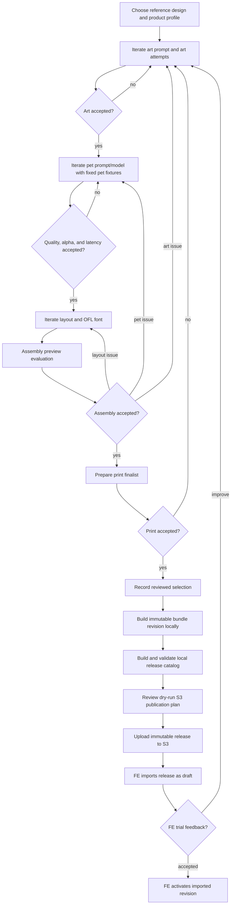

# PawMarvel MVP Template Authoring Operations Guide

This guide starts with the supported immutable development flow:

```text
art prompt + art.png -> art evaluation + decision
        -> pet-transform candidates -> pet evaluation + decision
        -> layout/font -> layout and assembly evaluations + decisions
        -> print upscale/finalist
        -> reviewed selection
        -> locally validated bundle and release catalog
        -> immutable S3 publication
```

Disposable pipeline and focused-command debugging are documented only after
the production-bundle workflow. The application/FE consumes a versioned bundle;
it must never consume `authoring/`, `work/`, `scratch/`, experiment, evaluation,
selection, or print-candidate paths.

## 1. Operating rules

- Scope every authoring workspace by both design and product profile:
  `authoring/<design-id>/<product-profile-id>/`.
- Treat an experiment as one prompt/model/configuration candidate.
- Treat an attempt as one immutable execution. A stochastic rerun gets a new
  attempt ID; changing prompt, model, references, or generation settings gets a
  new experiment ID.
- Author layout against one exact art attempt and representative pet attempt.
- Upscale only a short-listed combination.
- Publish only from a reviewed `selection.json` and succeeded print candidate.
- Keep experiments and generated attempts local. No experiment, pipeline, or
  bundle-build command uploads files.
- Upload only a locally validated release catalog with the explicit
  `pawmarvel-catalog publish-s3 --execute` graduation command.
- Once a selection references an experiment, do not change that experiment's
  status; create a successor experiment for later work.
- Never overwrite a bundle revision. An improvement becomes the next revision.
- Use `scratch/` only for replaceable diagnostics.



## 2. Install and configure

```bash
cd "/Users/qbit/Documents/PawMarvel/Code/playground/TemplateGenerator"
python3 -m venv .venv
.venv/bin/python -m pip install -e .
```

Repository/CI verification also installs the schema-validation test extra:

```bash
.venv/bin/python -m pip install -e '.[test]'
```

Confirm the lifecycle commands:

```bash
.venv/bin/pawmarvel-author --help
.venv/bin/pawmarvel-bundle --help
.venv/bin/pawmarvel-catalog --help
.venv/bin/pawmarvel-pipeline --help
```

## 3. Generate and edit private operation configurations

The primary example uses GPT Image 2 for both art and pet generation. Alternate
provider experiments, including Gemini, are optional and documented at the end.
Generate the shared private configuration once per checkout. It contains only
design-independent provider credentials and AWS/S3 publication settings:

```bash
PAWMARVEL_PROJECT="/Users/qbit/Documents/PawMarvel/Code/playground/TemplateGenerator"
PAWMARVEL_SHARED_CONFIG="$("$PAWMARVEL_PROJECT/.venv/bin/pawmarvel-author" init-shared-config)"
"${EDITOR:-vi}" "$PAWMARVEL_SHARED_CONFIG"
source "$PAWMARVEL_SHARED_CONFIG"
```

Then prepare the private design inputs and generate one configuration for this
design/product iteration:

```bash
PAWMARVEL_DESIGN_ID="life-is-good"
PAWMARVEL_PRODUCT_PROFILE_ID="blanket-king-9375x12375"
PAWMARVEL_DESIGN_INPUT="$PAWMARVEL_PROJECT/work/design-inputs/$PAWMARVEL_DESIGN_ID"

mkdir -p "$PAWMARVEL_DESIGN_INPUT"
cp "$PAWMARVEL_PROJECT/examples/life-is-good/reference-design.png" "$PAWMARVEL_DESIGN_INPUT/"
cp "$PAWMARVEL_PROJECT/examples/life-is-good/art-template-gpt.md" "$PAWMARVEL_DESIGN_INPUT/"
cp "$PAWMARVEL_PROJECT/examples/life-is-good/pet-transform-gpt.md" "$PAWMARVEL_DESIGN_INPUT/"
cp "$PAWMARVEL_PROJECT/examples/life-is-good/font-reference.json" "$PAWMARVEL_DESIGN_INPUT/"
cp "$PAWMARVEL_PROJECT/examples/life-is-good/layout-reference.json" "$PAWMARVEL_DESIGN_INPUT/"

PAWMARVEL_CONFIG="$("$PAWMARVEL_PROJECT/.venv/bin/pawmarvel-author" init-config \
  --design-id "$PAWMARVEL_DESIGN_ID" \
  --product-profile-id "$PAWMARVEL_PRODUCT_PROFILE_ID")"

"${EDITOR:-vi}" "$PAWMARVEL_CONFIG"
source "$PAWMARVEL_CONFIG"
```

`init-shared-config` derives and prints the fixed absolute path
`work/configs/pawmarvel-shared.env`. It has mode `0600`; update its empty
`OPENAI_API_KEY`, S3 values, and any AWS profile/region that differs from the
example. Leave unused provider keys empty. Prefer an AWS profile or SSO; do not
put AWS access and secret keys in this file. Enter `PAWMARVEL_S3_PREFIX` as path
segments such as `Template/MVP-test`, with no leading or trailing slash;
sourcing the file rejects either form. Reuse this file for every design and
product iteration in the checkout.

`init-config` derives and prints the absolute path
`work/configs/<design-id>--<product-profile-id>--v01.env`; the command
substitution assigns that exact path to `PAWMARVEL_CONFIG`. The generated file
also has mode `0600` and contains only the iteration-specific baseline inputs:
design/profile/prompt/pet paths, default art and pet provider/model/quality,
local authoring/exchange roots, pet-name policy, and release identity. It does
not duplicate credentials or AWS/S3 settings. Update any design-specific paths
or settings that differ from the example.
The editable repository root is detected automatically. Use `--project-root`
only when intentionally writing the private workspace under another checkout.

The generated design paths point to
`work/design-inputs/<design-id>/`, not directly to checked-in examples. Before
creating a config, copy the primary reference and the prompt files required by
the chosen providers into that private source folder. Copy optional
`font-reference.json` and `layout-reference.json` only when they are valid for
the design. Missing optional references are exported as empty values instead
of invalid paths. For a private production design, copy its approved source
files into the same folder; do not add them to `examples/` or Git.

`PAWMARVEL_RELEASE_ID` is the identity of the release this iteration will
create; it does not search for or select an older catalog. If you intend to
publish an existing release, change it to that catalog's exact directory name
before sourcing the config. Otherwise complete `build-release` below before
running `publish-s3`.

Both files are mutable operator input, not immutable experiment artifacts. For a
new configuration iteration, rerun `init-config` with `--version-number 2` to
derive the `--v02.env` filename. Each experiment still snapshots its exact
prompt, references, profile, provider, model, and quality. Re-source the
intended file when opening a new terminal:

```bash
PAWMARVEL_PROJECT="/Users/qbit/Documents/PawMarvel/Code/playground/TemplateGenerator"
PAWMARVEL_SHARED_CONFIG="$PAWMARVEL_PROJECT/work/configs/pawmarvel-shared.env"
PAWMARVEL_CONFIG="$PAWMARVEL_PROJECT/work/configs/life-is-good--blanket-king-9375x12375--v01.env"
source "$PAWMARVEL_SHARED_CONFIG"
source "$PAWMARVEL_CONFIG"
printf 'loaded shared config: %s\n' "$PAWMARVEL_SHARED_CONFIG_FILE"
printf 'loaded config: %s\n' "$PAWMARVEL_CONFIG_FILE"
```

Configuration files under `work/` are ignored by Git. Never move one into an
example, bundle, experiment, or release directory. Both initialization commands
refuse to overwrite an existing file unless `--force` is explicit. In
particular, avoid `init-shared-config --force` after adding credentials. Because
`source` executes shell syntax, source only configs generated and edited by a
trusted operator.

The checked-in reference and pet images are development workflow inputs and are
not automatically approved production fixtures. The MVP deliberately uses a
lightweight image-rights QA instead of a formal license gate: before publishing,
the operator records the image source and intended trial use, confirms there is
no known restriction or obvious third-party/customer content, and uses a
non-customer QA pet. This review is operational rather than tool-enforced and
does not represent formal legal clearance.

These repository-local ignored paths are the intended fast MVP setup. They keep
generated art, pet, and layout attempts available for reruns without an S3
round trip. For valuable long-running work, the same variables may point to a
private backed-up POSIX location outside Git. Do not point them at S3.

Validate the loaded configuration before any paid call:

```bash
test -f "$PAWMARVEL_SAMPLE"
test -f "$PAWMARVEL_ART_PROMPT"
test -f "$PAWMARVEL_PET_PROMPT"
test -f "$PAWMARVEL_PET"
test -f "$PAWMARVEL_PROFILE"
test -d "$PAWMARVEL_FONT_CATALOG"
test -f "$PAWMARVEL_EVALUATION_PROTOCOL"
test -f "$PAWMARVEL_FIXTURE_SET"
test -z "${PAWMARVEL_FONT_REFERENCE:-}" || test -f "$PAWMARVEL_FONT_REFERENCE"
test -z "${PAWMARVEL_LAYOUT_REFERENCE:-}" || test -f "$PAWMARVEL_LAYOUT_REFERENCE"
test "$PAWMARVEL_ART_PROVIDER" != openai || test -n "${OPENAI_API_KEY:-}"
test "$PAWMARVEL_PET_PROVIDER" != openai || test -n "${OPENAI_API_KEY:-}"
test "$PAWMARVEL_ART_PROVIDER" != gemini || test -n "${GEMINI_API_KEY:-}"
test "$PAWMARVEL_PET_PROVIDER" != gemini || test -n "${GEMINI_API_KEY:-}"
test "$PAWMARVEL_UPSCALE_BACKEND" != bria || test -n "${BRIA_API_TOKEN:-}"
```

If an optional reference variable is empty, a quoted empty value such as
`--font-reference "$PAWMARVEL_FONT_REFERENCE"` is invalid. Build the optional
argument list once after sourcing the config:

```bash
printf 'font reference:   <%s>\n' "$PAWMARVEL_FONT_REFERENCE"
printf 'layout reference: <%s>\n' "$PAWMARVEL_LAYOUT_REFERENCE"
PAWMARVEL_LAYOUT_REFERENCE_ARGS=()
test -z "$PAWMARVEL_FONT_REFERENCE" || PAWMARVEL_LAYOUT_REFERENCE_ARGS+=(--font-reference "$PAWMARVEL_FONT_REFERENCE")
test -z "$PAWMARVEL_LAYOUT_REFERENCE" || PAWMARVEL_LAYOUT_REFERENCE_ARGS+=(--layout-reference "$PAWMARVEL_LAYOUT_REFERENCE")
```

For the first layout experiment of a new design, omit both options instead of
passing empty strings. Save the regions in the editor, then use that attempt's
`outputs/qa/font-reference.json` and `outputs/qa/layout-reference.json` as the
inputs to its successor experiment.

The profile controls preview art size, transformed-pet canvas, and print size.
The screenshot supplies visual evidence only. Its normalized region ratios may
seed layout authoring, but its pixel dimensions are never authoritative product
or print geometry.

## 4. Artifact lifecycle

Operator-supplied design sources are separate from generated experiments:

```text
work/design-inputs/life-is-good/
  reference-design.png
  art-template-gpt.md
  pet-transform-gpt.md
  font-reference.json                 # optional
  layout-reference.json               # optional
```

This ignored folder is mutable operator input. Every experiment snapshots the
exact files it consumes under its own `inputs/` directory, so later source
edits cannot silently alter an existing attempt.

One reference design used for two products creates two independent roots:

```text
work/authoring/life-is-good/
  blanket-king-9375x12375/
  blanket-twin-full-7875x9375/
```

Do not place generated files directly under `authoring/life-is-good/`. The
design directory is a namespace, not a selectable workspace.

The king-blanket example evolves as follows:

```text
work/authoring/life-is-good/blanket-king-9375x12375/
  experiments/
    art/art-gpt-v01/
      experiment.json
      inputs/                         # prompt, references, profile snapshots
      attempts/
        attempt-0001/{run.json,outputs/,qa/}
        attempt-0002/{run.json,outputs/,qa/}
    art/art-gpt-v02/                  # a different prompt/configuration
      experiment.json
      inputs/
      attempts/
        attempt-0001/{run.json,outputs/,qa/}
    pet/pet-gpt-v01/
      experiment.json
      inputs/                         # prompt, references, profile snapshots
      attempts/
        attempt-0001/{run.json,inputs/,outputs/,qa/}
        benchmark-*/{run.json,inputs/,outputs/,qa/}
    layout/layout-v01/
      experiment.json
      inputs/                         # pinned art/pet, layout/font references, OFL catalog
      attempts/
        attempt-0001/{run.json,outputs/,qa/}
        attempt-0002/{run.json,outputs/,qa/} # optional layout/font alternative
  reviews/                            # self-contained evaluation/decision packets
    art/art-prompt-v01-v02/
      evaluation.json
      artifacts/art-comparison.png
      decision.json
    pet/pet-gpt-baseline/
      evaluation.json
      artifacts/pet-comparison.png
      decision.json
    layout/layout-fixture/
      evaluation.json
      artifacts/layout-comparison.png
      decision.json
    assembly/assembly-baseline/
      evaluation.json
      artifacts/{preview.png,preview-debug.png}
      decision.json
  print-candidates/
    print-finalist-0001/
      print-candidate.json
      outputs/
  graduations/
    life-is-good-blanket-king-v01/
      selection.json                  # final hash-bound approval and bundle input
      publications/2026-09-13.001--v000001.json
  scratch/                            # replaceable and never publishable

work/exchange/
  bundles/
    life-is-good--blanket-king-9375x12375/
      v000001/                        # immutable FE input
  releases/
    <release-id>/catalog.json         # local immutable S3 staging index
```

`work/authoring/` is the durable local experiment history. `work/exchange/` is
a local staging/cache containing only reviewed bundle revisions. Neither is
tracked by Git, and neither is visible to FE. The shared production copy exists
only after the exact exchange release is published below an immutable S3 key.

Review the complete decision history at any point by listing the immutable
stage records. Each JSON file contains the reviewer, timestamp, notes, chosen
candidate, and hash of the exact evaluation reviewed:

```bash
find "$PAWMARVEL_AUTHORING_PRODUCT/reviews" -type f -name '*.json' -print | sort
```

Do not overwrite a decision to change a winner. Create a new review ID. The
earlier review packet remains the audit trail. The review directories passed to
the final `graduate` command identify the current winners.

In the walkthrough, every winner block separates **operator inputs** from
**derived downstream parameters**. Enter the review ID, selected experiment ID,
and—where applicable—selected attempt ID once. Capture the path printed by
`record-decision` in a `PAWMARVEL_*_DECISION` variable, then derive the review,
experiment, and attempt paths from those values. Later commands must reuse
these variables instead of reconstructing paths by hand.

| Development step | New durable artifacts | What remains reusable |
| --- | --- | --- |
| Art prompt/art iteration | Art experiment, attempts, evaluation, and art decision | Reference and product profile source files |
| Pet prompt/model iteration | Pet experiment, fixture attempts, evaluation, and pet decision | Accepted art candidate |
| Layout/font iteration | Layout experiment, evaluation, and layout/assembly decisions | Pet runtime candidate when geometry remains compatible |
| Print finalist | Hash-bound print candidate and target-resolution render | Accepted low-resolution candidates |
| Bundle graduation | Selection, immutable bundle revision, release entry | Nothing is rewritten; later improvement creates a new revision |

## 5. Iterate the art prompt and `art.png`

Use experiments and attempts for different purposes:

| Question | Change | Storage unit |
| --- | --- | --- |
| Does a different prompt produce better fixed artwork? | Prompt file | New art experiment |
| Is `high` visibly better enough to justify its latency/cost versus `low`? | `--quality` | New art experiment using the same prompt |
| Is one exact prompt/model/quality configuration reliable? | Nothing | Multiple attempts in that experiment |

For a clean comparison, change one variable between parent and child
experiments. Two preview attempts per candidate are a useful screening
baseline; use more attempts for finalists when reliability matters. Do not use
extra stochastic attempts as a substitute for trying a materially different
prompt.

Create the first art experiment. `create-experiment` snapshots the exact
product profile, prompt, and ordered reference images.

```bash
"$PAWMARVEL_PROJECT/.venv/bin/pawmarvel-author" create-experiment \
  --kind art \
  --experiment-id art-gpt-v01 \
  --design-id "$PAWMARVEL_DESIGN_ID" \
  --product-profile "$PAWMARVEL_PROFILE" \
  --reference-design "$PAWMARVEL_SAMPLE" \
  --prompt-file "$PAWMARVEL_ART_PROMPT" \
  --provider "$PAWMARVEL_ART_PROVIDER" \
  --model "$PAWMARVEL_ART_MODEL" \
  --quality "$PAWMARVEL_ART_QUALITY" \
  --authoring-root "$PAWMARVEL_AUTHORING_ROOT"

PAWMARVEL_ART_EXPERIMENT="$PAWMARVEL_AUTHORING_PRODUCT/experiments/art/art-gpt-v01"

"$PAWMARVEL_PROJECT/.venv/bin/pawmarvel-author" run-attempt \
  --experiment "$PAWMARVEL_ART_EXPERIMENT" \
  --attempt-id attempt-0001

"$PAWMARVEL_PROJECT/.venv/bin/pawmarvel-author" run-attempt \
  --experiment "$PAWMARVEL_ART_EXPERIMENT" \
  --attempt-id attempt-0002

"$PAWMARVEL_PROJECT/.venv/bin/pawmarvel-author" compare \
  --kind art \
  --review-id art-baseline \
  --experiment art-gpt-v01 \
  --evaluation-protocol "$PAWMARVEL_EVALUATION_PROTOCOL" \
  --authoring-product "$PAWMARVEL_AUTHORING_PRODUCT"
```

Review each `attempts/<id>/outputs/art.png`. It must contain reusable fixed
artwork only: no example pet, personalized name, product mockup, garment, or
placeholder animal.

The baseline evaluation measures variation and latency between stochastic runs
of one exact prompt/configuration. The main prompt-authoring loop also needs a
cross-experiment evaluation. Make a private candidate prompt, edit the wording,
and snapshot it in a second experiment:

```bash
mkdir -p "$PAWMARVEL_PROMPT_CANDIDATES"
cp "$PAWMARVEL_ART_PROMPT" "$PAWMARVEL_PROMPT_CANDIDATES/art-template-gpt-v02.md"

# Edit v02 to test a specific hypothesis; do not edit immutable experiment inputs.
"${EDITOR:-vi}" "$PAWMARVEL_PROMPT_CANDIDATES/art-template-gpt-v02.md"

# Authoring prompt variants may add a lowercase suffix after the provider
# category. Graduation canonicalizes the selected file to art-template-gpt.md
# (or art-template-gemini.md) in the FE bundle.

"$PAWMARVEL_PROJECT/.venv/bin/pawmarvel-author" create-experiment \
  --kind art \
  --experiment-id art-gpt-v02 \
  --design-id "$PAWMARVEL_DESIGN_ID" \
  --product-profile "$PAWMARVEL_PROFILE" \
  --reference-design "$PAWMARVEL_SAMPLE" \
  --prompt-file "$PAWMARVEL_PROMPT_CANDIDATES/art-template-gpt-v02.md" \
  --provider "$PAWMARVEL_ART_PROVIDER" \
  --model "$PAWMARVEL_ART_MODEL" \
  --quality "$PAWMARVEL_ART_QUALITY" \
  --parent-experiment-id art-gpt-v01 \
  --authoring-root "$PAWMARVEL_AUTHORING_ROOT"

PAWMARVEL_ART_EXPERIMENT_V02="$PAWMARVEL_AUTHORING_PRODUCT/experiments/art/art-gpt-v02"

"$PAWMARVEL_PROJECT/.venv/bin/pawmarvel-author" run-attempt \
  --experiment "$PAWMARVEL_ART_EXPERIMENT_V02" \
  --attempt-id attempt-0001

"$PAWMARVEL_PROJECT/.venv/bin/pawmarvel-author" run-attempt \
  --experiment "$PAWMARVEL_ART_EXPERIMENT_V02" \
  --attempt-id attempt-0002

"$PAWMARVEL_PROJECT/.venv/bin/pawmarvel-author" compare \
  --kind art \
  --review-id art-prompt-v01-v02 \
  --experiment art-gpt-v01 \
  --experiment art-gpt-v02 \
  --evaluation-protocol "$PAWMARVEL_EVALUATION_PROTOCOL" \
  --authoring-product "$PAWMARVEL_AUTHORING_PRODUCT"
```

Open
`reviews/art/art-prompt-v01-v02/artifacts/art-comparison.png`. Its labeled
tiles show all renderable attempts from both prompt experiments on a checkerboard
background, including gate status, latency, and a short content hash. Use it for
side-by-side review, then inspect the original `outputs/art.png` files at full
resolution before choosing a winner. The evaluation JSON records the complete
candidate list and the contact-sheet hash; it does not make the visual decision.

Repeat `--experiment` for any number of prompt candidates. Prefer changing one
prompt hypothesis at a time, and create a new review ID whenever the
candidate set changes. Never replace an experiment, attempt, or review.

`--quality` is part of the experiment configuration. For OpenAI it is passed
to the image API. To isolate quality, create—for example—`art-gpt-v02-low`
using the exact v02 prompt/model/reference inputs but `--quality low`, run the
same number of attempts, and add it to a new comparison:

```bash
"$PAWMARVEL_PROJECT/.venv/bin/pawmarvel-author" create-experiment \
  --kind art \
  --experiment-id art-gpt-v02-low \
  --design-id "$PAWMARVEL_DESIGN_ID" \
  --product-profile "$PAWMARVEL_PROFILE" \
  --reference-design "$PAWMARVEL_SAMPLE" \
  --prompt-file "$PAWMARVEL_PROMPT_CANDIDATES/art-template-gpt-v02.md" \
  --provider "$PAWMARVEL_ART_PROVIDER" \
  --model "$PAWMARVEL_ART_MODEL" \
  --quality low \
  --parent-experiment-id art-gpt-v02 \
  --authoring-root "$PAWMARVEL_AUTHORING_ROOT"

PAWMARVEL_ART_EXPERIMENT_V02_LOW="$PAWMARVEL_AUTHORING_PRODUCT/experiments/art/art-gpt-v02-low"

"$PAWMARVEL_PROJECT/.venv/bin/pawmarvel-author" run-attempt \
  --experiment "$PAWMARVEL_ART_EXPERIMENT_V02_LOW" \
  --attempt-id attempt-0001

"$PAWMARVEL_PROJECT/.venv/bin/pawmarvel-author" run-attempt \
  --experiment "$PAWMARVEL_ART_EXPERIMENT_V02_LOW" \
  --attempt-id attempt-0002

"$PAWMARVEL_PROJECT/.venv/bin/pawmarvel-author" compare \
  --kind art \
  --review-id art-v02-high-vs-low \
  --experiment art-gpt-v02 \
  --experiment art-gpt-v02-low \
  --evaluation-protocol "$PAWMARVEL_EVALUATION_PROTOCOL" \
  --authoring-product "$PAWMARVEL_AUTHORING_PRODUCT"
```

This comparison is meaningful only when prompt, model, references, and attempt
count are held constant. Compare median latency and failure rate together with
the visual result; do not assume `high` wins automatically.

After reviewing the comparison, enter the winning review, experiment, and
attempt once. The block records the immutable decision and derives every art
parameter used by later sections; do not separately type an art-attempt path.
If the quality comparison wins instead, change the three IDs to that review's
actual winner before running the block.

```bash
# Operator selection inputs: edit only these three values.
PAWMARVEL_ART_REVIEW_ID="art-prompt-v01-v02"
PAWMARVEL_ART_SELECTED_EXPERIMENT_ID="art-gpt-v02"
PAWMARVEL_ART_SELECTED_ATTEMPT_ID="attempt-0001"

PAWMARVEL_ART_REVIEW="$PAWMARVEL_AUTHORING_PRODUCT/reviews/art/$PAWMARVEL_ART_REVIEW_ID"

PAWMARVEL_ART_DECISION="$("$PAWMARVEL_PROJECT/.venv/bin/pawmarvel-author" record-decision \
  --review "$PAWMARVEL_ART_REVIEW" \
  --selected-experiment "$PAWMARVEL_ART_SELECTED_EXPERIMENT_ID" \
  --selected-attempt "$PAWMARVEL_ART_SELECTED_ATTEMPT_ID" \
  --selected-by application-owner \
  --notes "Best fixed-art fidelity and acceptable run stability")"

# Derived downstream parameters: do not edit these independently.
PAWMARVEL_ART_EXPERIMENT="$PAWMARVEL_AUTHORING_PRODUCT/experiments/art/$PAWMARVEL_ART_SELECTED_EXPERIMENT_ID"
PAWMARVEL_ART_ATTEMPT="$PAWMARVEL_ART_EXPERIMENT/attempts/$PAWMARVEL_ART_SELECTED_ATTEMPT_ID"

test "$PAWMARVEL_ART_DECISION" = "$PAWMARVEL_ART_REVIEW/decision.json"
test -f "$PAWMARVEL_ART_ATTEMPT/run.json"
printf 'art decision: %s\nart attempt:  %s\n' "$PAWMARVEL_ART_DECISION" "$PAWMARVEL_ART_ATTEMPT"
```

This records the shortlist immediately. It is not yet a production bundle
selection. The decision command validates that both selected IDs occur in the
review and passed its hard gates. If later art work changes the winner, create
a new review and rerun the block with its new IDs; keep the earlier packet so
the prior decision remains traceable.

## 6. Iterate the transformed-pet prompt and model

The primary MVP path uses GPT Image 2 because offline tests found Gemini's pet
cutout and transparency behavior insufficiently reliable. A changed pet prompt
or request configuration is a new experiment. Repeated runs of the same
experiment measure stability, failure rate, and latency against fixed fixtures.
At runtime, the customer pet is always the first image and the finished-design
references follow in recorded order.

```bash
"$PAWMARVEL_PROJECT/.venv/bin/pawmarvel-author" create-experiment \
  --kind pet \
  --experiment-id pet-gpt-v01 \
  --design-id "$PAWMARVEL_DESIGN_ID" \
  --product-profile "$PAWMARVEL_PROFILE" \
  --reference-design "$PAWMARVEL_SAMPLE" \
  --prompt-file "$PAWMARVEL_PET_PROMPT" \
  --provider "$PAWMARVEL_PET_PROVIDER" \
  --model "$PAWMARVEL_PET_MODEL" \
  --quality "$PAWMARVEL_PET_QUALITY" \
  --authoring-root "$PAWMARVEL_AUTHORING_ROOT"

PAWMARVEL_PET_EXPERIMENT="$PAWMARVEL_AUTHORING_PRODUCT/experiments/pet/pet-gpt-v01"

"$PAWMARVEL_PROJECT/.venv/bin/pawmarvel-author" run-attempt \
  --experiment "$PAWMARVEL_PET_EXPERIMENT" \
  --attempt-id attempt-0001 \
  --pet-image "$PAWMARVEL_PET"

"$PAWMARVEL_PROJECT/.venv/bin/pawmarvel-author" benchmark \
  --experiment "$PAWMARVEL_PET_EXPERIMENT" \
  --fixture-set "$PAWMARVEL_FIXTURE_SET" \
  --evaluation-protocol "$PAWMARVEL_EVALUATION_PROTOCOL" \
  --attempts-per-fixture 2 \
  --attempt-id-prefix benchmark

"$PAWMARVEL_PROJECT/.venv/bin/pawmarvel-author" compare \
  --kind pet \
  --review-id pet-gpt-baseline \
  --experiment pet-gpt-v01 \
  --attempt-prefix benchmark- \
  --fixture-set "$PAWMARVEL_FIXTURE_SET" \
  --evaluation-protocol "$PAWMARVEL_EVALUATION_PROTOCOL" \
  --authoring-product "$PAWMARVEL_AUTHORING_PRODUCT"
```

Review identity retention, pose/expression/crop, style, genuine transparency,
failure rate, retries, and latency. A small benchmark reports minimum, maximum,
and median; treat p95 as meaningful only with at least 20 successful calls.
`--attempt-prefix benchmark-` excludes one-off smoke tests. Do not select the
experiment until every fixture has a successful hard-gate-passing result.

After reviewing the pet comparison, enter the winning review and runtime
experiment once. Also choose one successful attempt from that experiment as
the representative layout fixture. The pet decision intentionally selects the
reusable runtime experiment rather than one stochastic output; the layout
experiment will snapshot the representative attempt separately.

```bash
# Operator selection inputs: edit only these three values.
PAWMARVEL_PET_REVIEW_ID="pet-gpt-baseline"
PAWMARVEL_PET_SELECTED_EXPERIMENT_ID="pet-gpt-v01"
PAWMARVEL_PET_LAYOUT_ATTEMPT_ID="benchmark-sausage-dog-0001"

PAWMARVEL_PET_REVIEW="$PAWMARVEL_AUTHORING_PRODUCT/reviews/pet/$PAWMARVEL_PET_REVIEW_ID"

PAWMARVEL_PET_DECISION="$("$PAWMARVEL_PROJECT/.venv/bin/pawmarvel-author" record-decision \
  --review "$PAWMARVEL_PET_REVIEW" \
  --selected-experiment "$PAWMARVEL_PET_SELECTED_EXPERIMENT_ID" \
  --selected-by application-owner \
  --notes "GPT baseline passed identity, style, alpha, and latency review")"

# Derived downstream parameters: do not edit these independently.
PAWMARVEL_PET_EXPERIMENT="$PAWMARVEL_AUTHORING_PRODUCT/experiments/pet/$PAWMARVEL_PET_SELECTED_EXPERIMENT_ID"
PAWMARVEL_PET_ATTEMPT="$PAWMARVEL_PET_EXPERIMENT/attempts/$PAWMARVEL_PET_LAYOUT_ATTEMPT_ID"

test "$PAWMARVEL_PET_DECISION" = "$PAWMARVEL_PET_REVIEW/decision.json"
test -f "$PAWMARVEL_PET_ATTEMPT/run.json"
printf 'pet decision: %s\npet fixture:  %s\n' "$PAWMARVEL_PET_DECISION" "$PAWMARVEL_PET_ATTEMPT"
```

The bundle selects the pet experiment's runtime contract, not this one pet's
pixels. The attempt is representative QA evidence.

## 7. Iterate layout and font

Create a layout experiment pinned to the exact short-listed art and pet
attempts. The entire OFL catalog is snapshotted so later local font changes
cannot alter the experiment.

```bash
"$PAWMARVEL_PROJECT/.venv/bin/pawmarvel-author" create-experiment \
  --kind layout \
  --experiment-id layout-v01 \
  --design-id "$PAWMARVEL_DESIGN_ID" \
  --product-profile "$PAWMARVEL_PROFILE" \
  --art-attempt "$PAWMARVEL_ART_ATTEMPT" \
  --pet-attempt "$PAWMARVEL_PET_ATTEMPT" \
  --font-catalog "$PAWMARVEL_FONT_CATALOG" \
  "${PAWMARVEL_LAYOUT_REFERENCE_ARGS[@]}" \
  --authoring-root "$PAWMARVEL_AUTHORING_ROOT"

PAWMARVEL_LAYOUT_EXPERIMENT="$PAWMARVEL_AUTHORING_PRODUCT/experiments/layout/layout-v01"

"$PAWMARVEL_PROJECT/.venv/bin/pawmarvel-author" run-attempt \
  --experiment "$PAWMARVEL_LAYOUT_EXPERIMENT" \
  --attempt-id attempt-0001 \
  --pet-name "$PAWMARVEL_PET_NAME"
```

`--pet-name` only initializes the assembled preview and may be omitted; its
default is `PET`. The value in the **Preview pet name** field at Save time
becomes the QA fixture recorded for this immutable attempt. It is deliberately
independent from the exact lettering in the finished reference.

The checked-in LifeIsGood `layout-reference.json` identifies separate pet and
personalized-name regions in the screenshot and binds them to the screenshot
hash. On a new layout, the editor maps the regions' normalized edges to the
product-profile art canvas. For this 242×265 reference and 800×1056 preview it
seeds the pet box at approximately `162,143,479,590` and the name box at
approximately `40,713,720,215`. Screenshot pixels remain authoring guidance,
not the print contract.

The checked-in LifeIsGood `font-reference.json` identifies the screenshot
rectangle containing `CHARLIE`, records that exact visible text, and binds both
to the reference image hash. The editor renders `CHARLIE` through every
candidate font for a like-for-like comparison; it never compares `SAUSAGE` to
the screenshot's `CHARLIE` or projects the product-layout name box back onto the
screenshot. This artifact is authoring evidence only and is not included in
the production bundle.

For a new design, omit both `--layout-reference` and `--font-reference` on the
first layout experiment. In the reference canvas, use **Select pet region** to
draw the intended replaceable-pet placement envelope. Then use **Select name
region** to draw a tight rectangle around the complete personalized-name line,
type the exact visible characters in **Reference text as shown**, and select
**Apply reference geometry**. Analyze fonts and review the authoritative
Pillow preview before saving. Saving writes `qa/layout-reference.json` and
`qa/font-reference.json`; pass both files to later layout experiments using the
same reference bytes. Both artifacts deliberately use the same name region.
Use `--reference-text "CHARLIE"` only as an initial UI convenience when no
saved region artifact exists.

The mapped boxes are initial recommendations. A screenshot can have a different
aspect ratio, and generated art can reflow fixed decorations, so adjust the
boxes against the actual art/pet output before saving. If fixed art elements
such as the LifeIsGood title, rainbow, paws, or tagline differ materially from
the reference, reject or rerun the art experiment; do not disguise an upstream
art failure by moving the pet or name box.

The compositor alpha-trims the representative pet, contains it without
distortion, and
bottom-centers the visible result in the red pet box. When the pet crop's aspect
ratio differs from that box, the yellow debug bounds can be narrower or shorter
than red. Review those actual visible bounds as well as the red container before
saving.

Only layout schema v2 is accepted. There is no layout migration or compatibility
mode in the MVP.

The local editor ranks the snapshotted OFL fonts after the reference region
and text are confirmed, then presents the top 15. When those inputs already
exist at startup, the initial preview uses the rank-one font and its calibrated
nominal and minimum sizes. Similarity measures glyph
shape; confidence is conservative evidence for choosing the winner, not a
probability. A high-confidence winner may be selected automatically. Medium or
low confidence still uses rank one for the initial preview but requires an
explicit operator selection before Save; this is the
expected LifeIsGood behavior because distressed screenshot lettering is noisy.
Changing the reference region or reference text invalidates the ranking and
reruns it.

After selecting a font, the editor applies the reference lettering's ink-fill
ratio to the current name box and sets one fixed nominal font size. Use **Match
reference text scale** again after materially changing the name box. Resizing
the name box by its handle or changing its height scales the nominal size,
minimum size, and safety padding proportionally, so enlarging the container no
longer leaves the text at its old scale. This is authoring-time calibration:
production still uses the saved nominal size for every name and only shrinks a
name that cannot fit.

By default, the minimum font size is calculated from the selected font and the
padded name box so that 12 common printable name characters fit. This aligns
with the bundle's default 12-code-point name limit. The minimum remains an
authoring control: verify
representative wide and non-Latin names when the product accepts them, and
override it when the design needs a stricter visual lower bound.

**Safety padding** is a minimum fit inset, not the total blank margin visible
around a word. Additional margin depends on the selected font, fixed nominal
size, and characters in the QA name. A `padding_px` value of zero therefore does
not mean that every name stretches to the box edges.

Adjust the pet box, name box, font, nominal font size, minimum font size,
padding, and color; then save and close the window.
Change **Preview pet name** between a short, typical, and long value while
tuning. Use **Add transformed pet for QA** to load transformed-pet outputs from
other successful pet fixtures, then switch them through **Preview transformed
pet** without changing the layout settings. Uploaded pets remain in memory for
this editor session; they do not change the experiment's pinned pet and are not
copied into the bundle. Switch back to **Pinned experiment pet** for the final
calibration preview unless an alternate fixture is intentionally preferred.

The name is QA input and is not saved in `layout.json`. The last successfully
previewed name and active pet are saved in `qa/calibration-fixture.json`, along
with the hashes of every transformed pet previewed during the session. These
records are copied into the immutable attempt for traceability.

The displayed image is always produced by the same Pillow renderer used by
assembly. A changed control marks the old image stale, cancels the earlier
request, and disables Save until the current revision finishes. The status
shows whether the configured nominal size was used or the name was shrunk. The
attempt owns its `layout.json`, selected font/OFL license, exact calibration
preview, `qa/layout-reference.json`, `qa/font-reference.json`,
`qa/font-recommendation.json`, preview, and debug preview.

Validate the same draft against a second pet and longer name before saving. The
selected pet-runtime benchmark already produced the alternate fixture:

```bash
PAWMARVEL_LAYOUT_ALT_PET="$PAWMARVEL_PET_EXPERIMENT/attempts/benchmark-white-fluffy-dog-0001/outputs/transformed-pet.png"
test -f "$PAWMARVEL_LAYOUT_ALT_PET"
```

Choose that file from **Add transformed pet for QA**, test both `SAUSAGE` and
`MARSHMALLOW`, switch between the alternate and pinned pet, and save once the
same geometry works for both. A temporary alternate pet does not require a new
layout experiment.

Create another attempt inside `layout-v01` only when comparing different font,
nominal/minimum size, name box, or placement candidates against the same pinned
inputs. Changing the selected art, product profile, font catalog, or the
official pinned representative pet still requires a new layout experiment;
temporary GUI pet switching does not.

```bash
"$PAWMARVEL_PROJECT/.venv/bin/pawmarvel-author" compare \
  --kind layout \
  --review-id layout-fixture \
  --experiment layout-v01 \
  --evaluation-protocol "$PAWMARVEL_EVALUATION_PROTOCOL" \
  --authoring-product "$PAWMARVEL_AUTHORING_PRODUCT"
```

Inspect
`reviews/layout/layout-fixture/artifacts/layout-comparison.png`. It labels the
experiment, pet name, font, and name-box dimensions. Confirm that pet placement
and nominal-size/shrink-only name fitting work for both the SAUSAGE and
MARSHMALLOW fixtures.

After review, enter the winning review, experiment, and attempt once. The block
records the layout decision and derives the exact paths used by assembly, print
preparation, and graduation.

```bash
# Operator selection inputs: edit only these three values.
PAWMARVEL_LAYOUT_REVIEW_ID="layout-fixture"
PAWMARVEL_LAYOUT_SELECTED_EXPERIMENT_ID="layout-v01"
PAWMARVEL_LAYOUT_SELECTED_ATTEMPT_ID="attempt-0001"

PAWMARVEL_LAYOUT_REVIEW="$PAWMARVEL_AUTHORING_PRODUCT/reviews/layout/$PAWMARVEL_LAYOUT_REVIEW_ID"

PAWMARVEL_LAYOUT_DECISION="$("$PAWMARVEL_PROJECT/.venv/bin/pawmarvel-author" record-decision \
  --review "$PAWMARVEL_LAYOUT_REVIEW" \
  --selected-experiment "$PAWMARVEL_LAYOUT_SELECTED_EXPERIMENT_ID" \
  --selected-attempt "$PAWMARVEL_LAYOUT_SELECTED_ATTEMPT_ID" \
  --selected-by application-owner \
  --notes "Accepted placement, fixed nominal text size, and OFL font")"

# Derived downstream parameters: do not edit these independently.
PAWMARVEL_LAYOUT_EXPERIMENT="$PAWMARVEL_AUTHORING_PRODUCT/experiments/layout/$PAWMARVEL_LAYOUT_SELECTED_EXPERIMENT_ID"
PAWMARVEL_LAYOUT_ATTEMPT="$PAWMARVEL_LAYOUT_EXPERIMENT/attempts/$PAWMARVEL_LAYOUT_SELECTED_ATTEMPT_ID"

test "$PAWMARVEL_LAYOUT_DECISION" = "$PAWMARVEL_LAYOUT_REVIEW/decision.json"
test -f "$PAWMARVEL_LAYOUT_ATTEMPT/run.json"
printf 'layout decision: %s\nlayout attempt:  %s\n' "$PAWMARVEL_LAYOUT_DECISION" "$PAWMARVEL_LAYOUT_ATTEMPT"
```

Create the assembly review from the derived stage winners:

```bash
"$PAWMARVEL_PROJECT/.venv/bin/pawmarvel-author" compare \
  --kind assembly \
  --review-id assembly-baseline \
  --art-attempt "$PAWMARVEL_ART_ATTEMPT" \
  --pet-experiment "$PAWMARVEL_PET_EXPERIMENT" \
  --layout-attempt "$PAWMARVEL_LAYOUT_ATTEMPT" \
  --fixture-set "$PAWMARVEL_FIXTURE_SET" \
  --evaluation-protocol "$PAWMARVEL_EVALUATION_PROTOCOL" \
  --authoring-product "$PAWMARVEL_AUTHORING_PRODUCT"
```

Inspect `reviews/assembly/assembly-baseline/artifacts/`. If the mismatch is in
fixed artwork, return to section 5. If it is pet style/alpha/latency, return to
section 6. If it is placement or typography, create another layout experiment
or attempt and repeat this section.

The assembly command intentionally has no separate pet-name option. It renders
the exact name saved by the layout UI and recorded by
`PAWMARVEL_LAYOUT_ATTEMPT`, ensuring the layout preview and assembly preview use
identical text inputs. To preserve a second named comparison, save another
layout attempt after changing **Preview pet name**.

The walkthrough selects `layout-v01/attempt-0001`. If another candidate wins,
create a new layout review ID, run its selection block, and create a new
assembly review ID for that derived combination.

After accepting the complete assembly, record that decision before preparing
print output:

```bash
PAWMARVEL_ASSEMBLY_REVIEW_ID="assembly-baseline"
PAWMARVEL_ASSEMBLY_REVIEW="$PAWMARVEL_AUTHORING_PRODUCT/reviews/assembly/$PAWMARVEL_ASSEMBLY_REVIEW_ID"

PAWMARVEL_ASSEMBLY_DECISION="$("$PAWMARVEL_PROJECT/.venv/bin/pawmarvel-author" record-decision \
  --review "$PAWMARVEL_ASSEMBLY_REVIEW" \
  --selected-by application-owner \
  --notes "Selected art, pet runtime, and layout render correctly together")"

test "$PAWMARVEL_ASSEMBLY_DECISION" = "$PAWMARVEL_ASSEMBLY_REVIEW/decision.json"
printf 'assembly decision: %s\n' "$PAWMARVEL_ASSEMBLY_DECISION"
```

Assembly decisions infer the single evaluated combination, so they do not take
`--selected-experiment` or `--selected-attempt`.

## 8. Prepare and inspect the print finalist

Upscale only the accepted combination. The normal path consumes the recorded
art, pet-runtime, and layout decisions. It derives the art/layout attempts and
the representative pet attempt pinned by the winning layout, preventing shell
variables from accidentally mixing candidates. This operation creates a
hash-bound candidate and does not publish anything.

```bash
# The decision files are the shell source of truth. Derive the review packets
# required by prepare-print rather than retyping their paths.
PAWMARVEL_ART_REVIEW="$(dirname "$PAWMARVEL_ART_DECISION")"
PAWMARVEL_PET_REVIEW="$(dirname "$PAWMARVEL_PET_DECISION")"
PAWMARVEL_LAYOUT_REVIEW="$(dirname "$PAWMARVEL_LAYOUT_DECISION")"
PAWMARVEL_PRINT_CANDIDATE_ID="print-finalist-0001"

PAWMARVEL_PRINT_FINALIST="$("$PAWMARVEL_PROJECT/.venv/bin/pawmarvel-author" prepare-print \
  --candidate-id "$PAWMARVEL_PRINT_CANDIDATE_ID" \
  --authoring-product "$PAWMARVEL_AUTHORING_PRODUCT" \
  --art-review "$PAWMARVEL_ART_REVIEW" \
  --pet-review "$PAWMARVEL_PET_REVIEW" \
  --layout-review "$PAWMARVEL_LAYOUT_REVIEW" \
  --pet-name "$PAWMARVEL_PET_NAME" \
  --backend "$PAWMARVEL_UPSCALE_BACKEND")"

test "$PAWMARVEL_PRINT_FINALIST" = "$PAWMARVEL_AUTHORING_PRODUCT/print-candidates/$PAWMARVEL_PRINT_CANDIDATE_ID"
printf 'print finalist: %s\n' "$PAWMARVEL_PRINT_FINALIST"
```

Inspect:

```text
print-candidates/print-finalist-0001/
  print-candidate.json
  outputs/
    art-print.png
    transformed-pet-print.png
    layout-print.json
    product-profile.json
    template-print-manifest.json
    pet-print-manifest.json
    final-print.png
    final-print-debug.png
    fonts/<selected-font>.ttf
    fonts/OFL.txt
```

If the print result exposes an art, pet, or layout problem, return to the
corresponding section and create new immutable IDs. The explicit attempt flags
remain available for advanced diagnostics and intentional candidate mixing.
Supply all three together; the command rejects partial or mixed
decision/attempt input. For example, if only the pet prompt, model, or pet
upscale changes, reuse the exact template-side print result:

```bash
"$PAWMARVEL_PROJECT/.venv/bin/pawmarvel-author" prepare-print \
  --candidate-id print-finalist-0002 \
  --authoring-product "$PAWMARVEL_AUTHORING_PRODUCT" \
  --art-attempt "$PAWMARVEL_ART_ATTEMPT" \
  --pet-attempt "/path/to/new/pet/attempt" \
  --layout-attempt "$PAWMARVEL_LAYOUT_ATTEMPT" \
  --pet-name "$PAWMARVEL_PET_NAME" \
  --backend "$PAWMARVEL_UPSCALE_BACKEND" \
  --reuse-template-from "$PAWMARVEL_PRINT_FINALIST"
```

Reuse succeeds only when the source candidate is complete and its hashes,
design/product identity, art attempt, and layout attempt all match. It copies
the print art/layout/profile/font and upscales only the new pet.

## 9. Record the winner, stage locally, and publish to S3

Graduate the exact print finalist and four review packets. `graduate` is the
final approval action: it checks the finalist against each sibling
`evaluation.json`/`decision.json`, binds their hashes and product-relative
paths, and records the reviewer directly in `selection.json`. There is no
separate reusable approval file.

```bash
PAWMARVEL_GRADUATION_ID="life-is-good-blanket-king-v01"
PAWMARVEL_ASSEMBLY_REVIEW="$(dirname "$PAWMARVEL_ASSEMBLY_DECISION")"

PAWMARVEL_SELECTION="$("$PAWMARVEL_PROJECT/.venv/bin/pawmarvel-author" graduate \
  --graduation-id "$PAWMARVEL_GRADUATION_ID" \
  --print-candidate "$PAWMARVEL_PRINT_FINALIST" \
  --art-review "$PAWMARVEL_ART_REVIEW" \
  --pet-review "$PAWMARVEL_PET_REVIEW" \
  --layout-review "$PAWMARVEL_LAYOUT_REVIEW" \
  --assembly-review "$PAWMARVEL_ASSEMBLY_REVIEW" \
  --selected-by application-owner \
  --notes "Accepted art, pet runtime, layout/font, latency, and print finalist" \
  --authoring-root "$PAWMARVEL_AUTHORING_ROOT")"

PAWMARVEL_GRADUATION="$(dirname "$PAWMARVEL_SELECTION")"
test "$PAWMARVEL_SELECTION" = "$PAWMARVEL_AUTHORING_PRODUCT/graduations/$PAWMARVEL_GRADUATION_ID/selection.json"
printf 'graduated selection: %s\n' "$PAWMARVEL_SELECTION"

"$PAWMARVEL_PROJECT/.venv/bin/pawmarvel-author" trace \
  --graduation "$PAWMARVEL_GRADUATION"
```

If `graduate` reports an assembly mismatch, create a new assembly review for
the exact selected combination and a new print candidate. Do not edit an old
review, finalist, or graduation. For example:

```bash
PAWMARVEL_ASSEMBLY_REVIEW_ID="assembly-winner-v01"

"$PAWMARVEL_PROJECT/.venv/bin/pawmarvel-author" compare \
  --kind assembly \
  --review-id "$PAWMARVEL_ASSEMBLY_REVIEW_ID" \
  --art-attempt "$PAWMARVEL_ART_ATTEMPT" \
  --pet-experiment "$PAWMARVEL_PET_EXPERIMENT" \
  --layout-attempt "$PAWMARVEL_LAYOUT_ATTEMPT" \
  --fixture-set "$PAWMARVEL_FIXTURE_SET" \
  --evaluation-protocol "$PAWMARVEL_EVALUATION_PROTOCOL" \
  --authoring-product "$PAWMARVEL_AUTHORING_PRODUCT"
```

Review the newly rendered compatibility preview, record it, create a matching
print finalist, and repeat `graduate` with the new review path:

```bash
PAWMARVEL_ASSEMBLY_REVIEW="$PAWMARVEL_AUTHORING_PRODUCT/reviews/assembly/$PAWMARVEL_ASSEMBLY_REVIEW_ID"
PAWMARVEL_ASSEMBLY_DECISION="$("$PAWMARVEL_PROJECT/.venv/bin/pawmarvel-author" record-decision \
  --review "$PAWMARVEL_ASSEMBLY_REVIEW" \
  --selected-by application-owner \
  --notes "Accepted updated winning assembly")"
```

The print candidate must report those exact three product-relative sources. If
it does not, rerun `prepare-print` with a new candidate ID before graduating.

Build and validate the next immutable bundle revision:

```bash
PAWMARVEL_BUNDLE="$("$PAWMARVEL_PROJECT/.venv/bin/pawmarvel-bundle" \
  --selection "$PAWMARVEL_SELECTION" \
  --qa-input-pet "$PAWMARVEL_PET" \
  --bundle-revision next \
  --pet-name-max-length "$PAWMARVEL_PET_NAME_MAX_LENGTH" \
  --output-dir "$PAWMARVEL_EXCHANGE/bundles")"

printf 'bundle revision: %s\n' "$PAWMARVEL_BUNDLE"

"$PAWMARVEL_PROJECT/.venv/bin/pawmarvel-catalog" validate \
  --bundle "$PAWMARVEL_BUNDLE"
```

Choose `--pet-name-max-length` for the usable name box in this design; it is
stored in `bundle.json.personalization.pet_name`. The application must apply
that bundle policy before rendering and must reuse the normalized value for
preview and print. Twelve Unicode code points is the CLI default, but spelling
the value out during graduation makes the product decision reviewable.

`--qa-input-pet` must be an operator-reviewed, non-customer fixture and must
byte-match the input saved by the representative pet attempt used by the print
finalist. Formal license evidence is not required by the MVP tool. The bundle
includes the fixture as `qa/input-pet.png`, which lets FE replay the accepted
pet-transform contract without access to private authoring files.

Create and validate a release catalog. Repeat `--bundle` to include other
design-product revisions in the same FE handoff.

```bash
PAWMARVEL_RELEASE="$("$PAWMARVEL_PROJECT/.venv/bin/pawmarvel-catalog" build-release \
  --release-id "$PAWMARVEL_RELEASE_ID" \
  --bundle "$PAWMARVEL_BUNDLE" \
  --exchange-root "$PAWMARVEL_EXCHANGE")"

test -f "$PAWMARVEL_RELEASE"
printf 'release catalog: %s\n' "$PAWMARVEL_RELEASE"

"$PAWMARVEL_PROJECT/.venv/bin/pawmarvel-catalog" validate \
  --release-catalog "$PAWMARVEL_RELEASE" \
  --exchange-root "$PAWMARVEL_EXCHANGE"
```

`build-release` accepts only bundles already located below the supplied
`exchange/bundles/` tree and writes the catalog to the canonical
`exchange/releases/<release-id>/catalog.json` path. Release validation follows
every exchange-root-relative manifest path, checks the catalog-to-manifest
digest and identity, then validates every bundle asset. This is the final local
integrity check before transfer.

### Review and publish the immutable release

Do the visual review from the local authoring and bundle outputs first. Install
and configure AWS CLI v2 only on the operator machine that performs graduation.
The publishing command needs permission to put and read objects below the
chosen prefix. If the bucket uses KMS encryption, checksum reads also need the
corresponding KMS permissions.

The repository example stops at the dry-run upload plan. Run the `--execute`
form below only after the release's reference and QA images pass the lightweight
MVP review described above. The repository examples do not receive production
approval merely because they are checked in.

```bash
test -n "$PAWMARVEL_S3_BUCKET"
test "$PAWMARVEL_S3_PREFIX" = "${PAWMARVEL_S3_PREFIX#/}"
test "$PAWMARVEL_S3_PREFIX" = "${PAWMARVEL_S3_PREFIX%/}"
printf 'AWS profile/region: %s / %s\n' "$AWS_PROFILE" "$AWS_REGION"
printf 'S3 destination: s3://%s/%s/\n' "$PAWMARVEL_S3_BUCKET" "$PAWMARVEL_S3_PREFIX"
aws sso login --profile "$AWS_PROFILE"
aws sts get-caller-identity --profile "$AWS_PROFILE" --region "$AWS_REGION"

# Default is a local validation plus a no-network upload plan.
"$PAWMARVEL_PROJECT/.venv/bin/pawmarvel-catalog" publish-s3 \
  --release-catalog "$PAWMARVEL_RELEASE" \
  --exchange-root "$PAWMARVEL_EXCHANGE" \
  --bucket "$PAWMARVEL_S3_BUCKET" \
  --prefix "$PAWMARVEL_S3_PREFIX" \
  --aws-profile "$AWS_PROFILE" \
  --region "$AWS_REGION" \
  --authoring-root "$PAWMARVEL_AUTHORING_ROOT"

# Run only after the plan and local visual outputs have been reviewed.
"$PAWMARVEL_PROJECT/.venv/bin/pawmarvel-catalog" publish-s3 \
  --release-catalog "$PAWMARVEL_RELEASE" \
  --exchange-root "$PAWMARVEL_EXCHANGE" \
  --bucket "$PAWMARVEL_S3_BUCKET" \
  --prefix "$PAWMARVEL_S3_PREFIX" \
  --aws-profile "$AWS_PROFILE" \
  --region "$AWS_REGION" \
  --authoring-root "$PAWMARVEL_AUTHORING_ROOT" \
  --execute

```

After a successful publication, the immutable S3 objects follow the same
relative paths as `work/exchange/`. For example, with bucket
`alphapaw-pod-designer-prod`, prefix `Template/MVP-test`, release
`2026-09-13.001`, and one Life Is Good blanket bundle, S3 contains:

```text
s3://alphapaw-pod-designer-prod/Template/MVP-test/
  bundles/
    life-is-good--blanket-king-9375x12375/
      v000001/
        bundle.json                         # FE contract and asset inventory
        product-profile.json
        art.png                             # low-resolution web art
        layout.json                         # low-resolution web composition
        layout-print.json                   # print-resolution composition
        art-template-gpt.md                 # offline art-generation provenance
        pet-transform-gpt.md                # production pet-transform prompt
        reference-design.png                # primary runtime reference
        reference-designs/                  # present only with extra references
          reference-design-0002.png
        print/
          art.png                           # high-resolution reusable print art
        fonts/
          <selected-font>.ttf
          OFL.txt
        qa/
          input-pet.png
          transformed-pet.png
          golden-preview.png
          golden-preview-debug.png
  releases/
    2026-09-13.001/
      catalog.json                          # FE release entry point; uploaded last
```

The complete FE handoff starts at the release catalog:

```text
s3://$PAWMARVEL_S3_BUCKET/$PAWMARVEL_S3_PREFIX/releases/$PAWMARVEL_RELEASE_ID/catalog.json
```

Each catalog entry identifies one immutable `template_id` and
`bundle_revision`, points to its `bundle.json`, and binds that manifest by
SHA-256. The bundle manifest then inventories and hashes every file under its
revision directory. FE should resolve only objects referenced by the selected
release catalog; it must not list the bucket, choose the numerically latest
revision, or consume files directly from `work/exchange/`.

Additional design/product bundles are sibling directories under `bundles/`.
Later improvements are sibling immutable revisions such as `v000002/`; they do
not replace `v000001/`. A later release gets its own
`releases/<new-release-id>/catalog.json` and may select either old or new bundle
revisions independently.

The command validates the complete local release again. It uploads each object
with a SHA-256 checksum and conditional create, uploads each `bundle.json` only
after its assets, and uploads `catalog.json` last. Existing objects are accepted
only when their stored checksum and byte count match, which makes retry after a
partial upload safe. A conflicting object stops publication; create a new
bundle revision or release rather than overwriting S3.

AWS references: [conditional writes](https://docs.aws.amazon.com/AmazonS3/latest/userguide/conditional-writes.html),
[`put-object`](https://docs.aws.amazon.com/cli/latest/reference/s3api/put-object.html),
and [`head-object` checksum verification](https://docs.aws.amazon.com/cli/latest/reference/s3api/head-object.html).

After every object has been uploaded and checksum-verified,
`publish-s3 --execute` automatically writes one idempotent publication receipt
under each selected graduation. Confirm it before reclaiming local exchange
files:

```bash
find "$PAWMARVEL_GRADUATION/publications" -maxdepth 1 -name '*--v*.json' -print
```

If S3 verification completed but the local receipt write was interrupted,
rerun the same `publish-s3 --execute` command. Existing matching S3 objects and
matching receipts are accepted, so the retry is safe. The lower-level
`pawmarvel-author record-publication` command remains available only for an
explicit recovery/backfill operation.

Receipts are keyed by both release ID and bundle revision. Therefore a later
release may intentionally re-list the same immutable bundle without colliding
with the receipt from its earlier release.

Only the S3 release catalog and the immutable S3 objects it references are FE
handoff artifacts. `work/exchange/` remains a local staging copy and
`work/authoring/` remains private implementation evidence. They may be retained
for fast follow-up iteration. Once a receipt exists and the S3 release has been
revalidated/imported, the local exchange copy may be reclaimed independently.
`--bundle-revision next` reads retained publication receipts as well as local
exchange revisions, so allocation remains monotonic after this cleanup;
do not delete selected authoring lineage with a filesystem command.

## 10. Iterate after FE trial feedback

FE feedback must identify `template_id`, `bundle_revision`, and a safe
reproduction input. Classify the defect before rerunning anything:

| Feedback | Repeat | Required downstream work |
| --- | --- | --- |
| Fixed art/style | Section 5 | Revalidate layout, assembly, print, selection, and bundle |
| Pet quality, alpha, latency, or model | Section 6 | Revalidate assembly and pet print; reuse verified template print assets when eligible |
| Placement or typography | Section 7 | Rebuild assembly, print layout/render, selection, and bundle |
| Print upscale | Section 8 | Create a new print candidate with a new ID |
| Product geometry | Start a new product-profile workspace | Regenerate all profile-dependent artifacts |

An accepted improvement produces `v000002` or the next revision. Never patch
`v000001`. A materially different visual design gets a new `design_id`; a
different product geometry gets a new `product_profile_id`.

## 11. Verify bundle consumption and FE-independent debugging

This is a consumer simulation, not template authoring. It reads only the
immutable bundle and writes customer-specific outputs elsewhere.

Before trying another pet, FE can diagnose the handoff without access to the
offline workspace:

1. validate `bundle.json` and every asset hash;
2. call the declared provider/model/transport with `qa/input-pet.png`, then the
   ordered `runtime.reference_assets`, the declared prompt, and the exact
   `runtime.request_parameters`;
3. apply `runtime.normalization` and visually compare the result with
   `qa/transformed-pet.png`; and
4. render with the QA pet name in `provenance.qa_fixture` and compare with the
   golden preview and debug preview.

Image generation is stochastic, so transformed-pet pixels need not be equal.
The fixture detects role-order, request-setting, alpha, geometry, and renderer
mistakes; it is not a pixel-equality oracle.

The concrete provider, model, request parameters, prompt filename, and
reference order below are
the values in this example bundle. A production consumer must read them from
`bundle.json.runtime`; it must not infer them from filenames or copy these
literal values into application code.

```bash
PAWMARVEL_SECOND_PET="$PAWMARVEL_PROJECT/examples/pet-inputs/white-fluffy-dog.png"
PAWMARVEL_SECOND_RUN="$PAWMARVEL_PROJECT/work/consumer-tests/life-is-good--blanket-king-9375x12375/v000001/white-fluffy-dog"
mkdir -p "$PAWMARVEL_SECOND_RUN/preview" "$PAWMARVEL_SECOND_RUN/print"

"$PAWMARVEL_PROJECT/.venv/bin/pawmarvel-poc-run" \
  --template-dir "$PAWMARVEL_BUNDLE" \
  --pet-image "$PAWMARVEL_SECOND_PET" \
  --reference-design "$PAWMARVEL_BUNDLE/reference-design.png" \
  --prompt-file "$PAWMARVEL_BUNDLE/pet-transform-gpt.md" \
  --provider openai \
  --model gpt-image-2 \
  --pet-name FLUFFY \
  --size 816x816 \
  --output-dir "$PAWMARVEL_SECOND_RUN/preview"
```

For a bundle with supporting references, repeat `--reference-design` in the
exact order declared by `bundle.json.runtime.reference_assets`.

Scale only the approved customer pet and compose it with bundled print art:

```bash
"$PAWMARVEL_PROJECT/.venv/bin/pawmarvel-upscale-pet" \
  --template-dir "$PAWMARVEL_BUNDLE" \
  --layout "$PAWMARVEL_BUNDLE/layout.json" \
  --print-layout "$PAWMARVEL_BUNDLE/layout-print.json" \
  --transformed-pet "$PAWMARVEL_SECOND_RUN/preview/transformed-pet.png" \
  --output-dir "$PAWMARVEL_SECOND_RUN/print" \
  --backend deterministic

"$PAWMARVEL_PROJECT/.venv/bin/pawmarvel-render" \
  --template-dir "$PAWMARVEL_BUNDLE" \
  --layout "$PAWMARVEL_BUNDLE/layout-print.json" \
  --pet "$PAWMARVEL_SECOND_RUN/print/transformed-pet-print.png" \
  --pet-name FLUFFY \
  --output "$PAWMARVEL_SECOND_RUN/final-print.png" \
  --debug-output "$PAWMARVEL_SECOND_RUN/final-print-debug.png"
```

The preview and print must use the same bundle revision and customer values.

## 12. Clean up losing experiments

Mark a losing experiment before cleanup:

```bash
"$PAWMARVEL_PROJECT/.venv/bin/pawmarvel-author" set-status \
  --experiment "$PAWMARVEL_AUTHORING_PRODUCT/experiments/art/art-gpt-v02" \
  --status discarded
```

Always dry-run first, then review every path before applying:

```bash
"$PAWMARVEL_PROJECT/.venv/bin/pawmarvel-author" cleanup \
  --authoring-root "$PAWMARVEL_AUTHORING_ROOT" \
  --status discarded \
  --older-than-days 30 \
  --dry-run

"$PAWMARVEL_PROJECT/.venv/bin/pawmarvel-author" cleanup \
  --authoring-root "$PAWMARVEL_AUTHORING_ROOT" \
  --status discarded \
  --older-than-days 30 \
  --apply
```

Cleanup refuses selected lineage. It never touches
`exchange/bundles/` or `exchange/releases/`. Product retirement is an
application operation, not authoring filesystem cleanup.

Failed attempts use the same reviewed two-step flow with `--status failed`.
Use `--status unselected` to list old review packets and print candidates that
are not referenced by any graduation; dry-run and inspect the trace of every
retained graduation before applying it. In the MVP, a recorded decision or
print candidate that has not been graduated is still unselected and may appear
in this list; preserve it manually if it is still needed. The command never
removes graduated lineage.
Cleanup rejects a negative retention period and a filesystem-root authoring
path.

## 13. Scratch/debug pipeline

Use the pipeline only to reproduce the whole visual flow quickly or isolate a
stage. It overwrites explicitly selected outputs, records `run.json`, and never
creates a production bundle.

```bash
PAWMARVEL_SCRATCH_PRODUCT="$PAWMARVEL_PROJECT/work/scratch/$PAWMARVEL_DESIGN_ID/$PAWMARVEL_PRODUCT_PROFILE_ID"
PAWMARVEL_SCRATCH_TEMPLATE="$PAWMARVEL_SCRATCH_PRODUCT/template"
PAWMARVEL_SCRATCH_RUN="$PAWMARVEL_SCRATCH_PRODUCT/runs/sausage-dog-puppy"
PAWMARVEL_SCRATCH_PRINT="$PAWMARVEL_SCRATCH_RUN/print"

pawmarvel_pipeline_debug() {
  "$PAWMARVEL_PROJECT/.venv/bin/pawmarvel-pipeline" \
    --sample-design "$PAWMARVEL_SAMPLE" \
    --art-prompt "$PAWMARVEL_ART_PROMPT" \
    --pet-prompt "$PAWMARVEL_PET_PROMPT" \
    --pet-image "$PAWMARVEL_PET" \
    --pet-name "$PAWMARVEL_PET_NAME" \
    --product-profile "$PAWMARVEL_PROFILE" \
    --font-catalog "$PAWMARVEL_FONT_CATALOG" \
    "${PAWMARVEL_LAYOUT_REFERENCE_ARGS[@]}" \
    --template-dir "$PAWMARVEL_SCRATCH_TEMPLATE" \
    --run-dir "$PAWMARVEL_SCRATCH_RUN" \
    --print-dir "$PAWMARVEL_SCRATCH_PRINT" \
    --upscale-backend "$PAWMARVEL_UPSCALE_BACKEND" \
    --image-model "$PAWMARVEL_ART_MODEL" \
    --quality "$PAWMARVEL_ART_QUALITY" \
    "$@"
}

pawmarvel_pipeline_debug --dry-run
pawmarvel_pipeline_debug
```

`"$@"` forwards any arguments supplied to the shell function. It allows the
same base command to run selective diagnostics:

```bash
pawmarvel_pipeline_debug --rerun-step art
pawmarvel_pipeline_debug --rerun-step pet
pawmarvel_pipeline_debug --rerun-step layout
pawmarvel_pipeline_debug --rerun-step art --rerun-step layout
```

The selected stage is replaced and dependent scratch preview/print outputs are
refreshed. Layout-only reruns make no image API call. Do not combine a selective
rerun with `--force`; use a new scratch product directory when references or
product geometry change.

Scratch output looks like this:

```text
work/scratch/life-is-good/blanket-king-9375x12375/
  template/
    source-reference-design.png
    product-profile.json
    art.png
    layout.json
    fonts/<selected-font>.ttf
    fonts/OFL.txt
  runs/sausage-dog-puppy/
    input-pet.png
    transformed-pet.png
    preview.png
    preview-debug.png
    layout.snapshot.json
    run.json
    print/
      art-print.png
      transformed-pet-print.png
      layout-print.json
      final-print.png
      final-print-debug.png
```

No file in this tree is a valid `pawmarvel-bundle` source. Recreate a promising
scratch result as immutable experiments before selection.

## 14. Focused debugging and troubleshooting

Use focused commands when the pipeline hides the failing boundary:

- `pawmarvel-generate`: one art or pet image-model call;
- `pawmarvel-layout-config`: layout/font editor only;
- `pawmarvel-render`: deterministic composition only;
- `pawmarvel-upscale-template`: reusable print art/layout only;
- `pawmarvel-upscale-pet`: transformed-pet print layer only;
- `pawmarvel-catalog validate`: bundle or release validation only.

| Problem | Action |
| --- | --- |
| Art contains a pet or name | Create a new art-prompt experiment; do not edit an old attempt |
| Pet identity, crop, style, or alpha is weak | Create a new pet prompt/model experiment and rerun the fixed fixture set |
| Placement or typography is wrong | Create a new layout experiment or attempt pinned to the intended art/pet bytes |
| Print aspect ratio fails | Confirm preview art came from the same product profile; never upscale screenshot-sized art |
| Gemini returns an opaque background | Reject it or apply a separately reviewed matting stage before selection |
| Output ID already exists | Choose a new experiment, attempt, candidate, selection, release, or bundle revision ID |
| FE trial disagrees with local output | Confirm both used the same `template_id`, `bundle_revision`, runtime image order, and renderer semantics |

All CLIs now distinguish missing files, directories, read failures, invalid
UTF-8, malformed JSON, and schema/contract failures. JSON diagnostics include
the resolved absolute path and, for malformed documents, the line and column.
Follow the `Correction:` text before retrying.

Unexpected failures are concise by default. To include a Python traceback,
rerun with `--debug`. For commands with subcommands, place it before the
subcommand:

```bash
"$PAWMARVEL_PROJECT/.venv/bin/pawmarvel-author" --debug graduate ...
"$PAWMARVEL_PROJECT/.venv/bin/pawmarvel-catalog" --debug publish-s3 ...
```

Provider failures report the provider/model and request ID when available. S3
failures report the object URL, AWS profile, region, exit code, and a safe
stderr excerpt. If an SSO token expired, run the exact `aws sso login` command
shown in the error before retrying publication.

Run the offline test suite without consuming API credits:

```bash
cd "$PAWMARVEL_PROJECT"
.venv/bin/python -m unittest discover -s tests -v
```

The suite mocks OpenAI, Gemini, and Bria calls.

## 15. Optional alternate-provider pet experiment

Run this only after the GPT-based primary flow works. Offline testing has found
Gemini faster in some cases but less reliable at returning a pet-only image
with genuine transparency. It is therefore an experimental candidate, not the
MVP production runtime. Never select it only because its median latency is lower: opaque
background, identity, crop, pose, or style failures are hard-gate failures.

Set `GEMINI_API_KEY` in the reusable shared configuration. Set any alternate
Gemini prompt paths in the design configuration, then source both again:

```bash
"${EDITOR:-vi}" "$PAWMARVEL_SHARED_CONFIG_FILE"
"${EDITOR:-vi}" "$PAWMARVEL_CONFIG_FILE"
source "$PAWMARVEL_SHARED_CONFIG_FILE"
source "$PAWMARVEL_CONFIG_FILE"
test -n "$GEMINI_API_KEY"
test -f "$PAWMARVEL_PET_PROMPT_GEMINI"
```

Create and benchmark a separate immutable experiment using the same reference
and fixture set as the GPT baseline:

```bash
"$PAWMARVEL_PROJECT/.venv/bin/pawmarvel-author" create-experiment \
  --kind pet \
  --experiment-id pet-gemini-v01 \
  --design-id "$PAWMARVEL_DESIGN_ID" \
  --product-profile "$PAWMARVEL_PROFILE" \
  --reference-design "$PAWMARVEL_SAMPLE" \
  --prompt-file "$PAWMARVEL_PET_PROMPT_GEMINI" \
  --provider gemini \
  --model gemini-3.1-flash-image \
  --quality low \
  --parent-experiment-id pet-gpt-v01 \
  --authoring-root "$PAWMARVEL_AUTHORING_ROOT"

PAWMARVEL_PET_EXPERIMENT_GEMINI="$PAWMARVEL_AUTHORING_PRODUCT/experiments/pet/pet-gemini-v01"

"$PAWMARVEL_PROJECT/.venv/bin/pawmarvel-author" benchmark \
  --experiment "$PAWMARVEL_PET_EXPERIMENT_GEMINI" \
  --fixture-set "$PAWMARVEL_FIXTURE_SET" \
  --evaluation-protocol "$PAWMARVEL_EVALUATION_PROTOCOL" \
  --attempts-per-fixture 2 \
  --attempt-id-prefix benchmark

"$PAWMARVEL_PROJECT/.venv/bin/pawmarvel-author" compare \
  --kind pet \
  --review-id pet-gpt-vs-gemini \
  --experiment pet-gpt-v01 \
  --experiment pet-gemini-v01 \
  --attempt-prefix benchmark- \
  --fixture-set "$PAWMARVEL_FIXTURE_SET" \
  --evaluation-protocol "$PAWMARVEL_EVALUATION_PROTOCOL" \
  --authoring-product "$PAWMARVEL_AUTHORING_PRODUCT"
```

Use this comparison as private research evidence only. The MVP `graduate` and
bundle commands reject a Gemini pet runtime even when its offline review passes.
Enabling another production provider requires a new reviewed runtime transport
contract, schema change, FE adapter, and end-to-end contract tests. The existing
art experiment does not need to be regenerated for this comparison.
