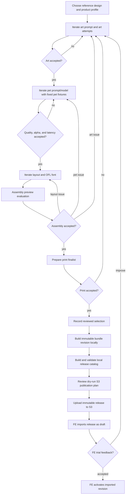

# PawMarvel MVP Template Authoring Operations Guide

This guide starts with the supported immutable development flow:

```text
art prompt + art.png -> art evaluation + decision
        -> pet-transform candidates -> pet evaluation + decision
        -> layout/font -> layout and assembly evaluations + decisions
        -> print upscale/finalist
        -> reviewed selection
        -> locally validated bundle and release catalog
        -> immutable S3 publication
```

Disposable pipeline and focused-command debugging are documented only after
the production-bundle workflow. The application/FE consumes a versioned bundle;
it must never consume `authoring/`, `work/`, `scratch/`, experiment, evaluation,
selection, or print-candidate paths.

For a brand-new design, follow sections 2 through 9 in order. The shortest
supported path is:

1. configure private inputs and ordered references;
2. tune art in disposable scratch, then record one immutable art candidate;
3. tune the pet prompt against one pet, then run smoke and release fixtures;
4. author one layout against the selected art and a successful release fixture;
5. review assembly, prepare print, graduate, bundle, and publish.

Sections 10 through 16 are not prerequisites for that first bundle. They cover
post-preview improvement, consumer verification, cleanup, whole-pipeline
debugging, focused troubleshooting, and alternate providers. Create additional
art, pet, or layout candidates only when the current evidence gives a reason;
the first run does not require a synthetic alternative merely to exercise
comparison tooling.

## 1. Operating rules

- Scope every authoring workspace by both design and product profile:
  `authoring/<design-id>/<product-profile-id>/`.
- For the MVP, develop art and pet transformation independently inside each
  design-product workspace. Do not bind another product profile's selected art
  or pet experiment into this workspace; differing geometry and product QA are
  validated through a complete product-specific authoring flow.
- Treat an experiment as one prompt/model/configuration candidate.
- Treat an attempt as one immutable execution. A stochastic rerun gets a new
  attempt ID; changing prompt, model, references, or generation settings gets a
  new experiment ID.
- Author layout against one exact art attempt and representative pet attempt.
- Upscale only a short-listed combination.
- Publish only from a reviewed `selection.json` and succeeded print candidate.
- Keep experiments and generated attempts local. No experiment, pipeline, or
  bundle-build command uploads files.
- Upload only a locally validated release catalog with the explicit
  `pawmarvel-catalog publish-s3 --execute` graduation command.
- Once a selection references an experiment, do not change that experiment's
  status; create a successor experiment for later work.
- Never overwrite a bundle revision. An improvement becomes the next revision.
- Use `scratch/` only for replaceable diagnostics.



## 2. Install and configure

```bash
cd "/Users/qbit/Documents/PawMarvel/Code/playground/TemplateGenerator"
python3 -m venv .venv
.venv/bin/python -m pip install -e .
```

Repository/CI verification also installs the schema-validation test extra:

```bash
.venv/bin/python -m pip install -e '.[test]'
```

Confirm the lifecycle commands:

```bash
.venv/bin/pawmarvel-author --help
.venv/bin/pawmarvel-bundle --help
.venv/bin/pawmarvel-catalog --help
.venv/bin/pawmarvel-pipeline --help
```

## 3. Generate and edit private operation configurations

The primary example uses GPT Image 2 for both art and pet generation. Alternate
provider experiments, including Gemini, are optional and documented at the end.
Generate the shared private configuration once per checkout. It contains only
design-independent provider credentials and AWS/S3 publication settings:

```bash
PAWMARVEL_PROJECT="/Users/qbit/Documents/PawMarvel/Code/playground/TemplateGenerator"
PAWMARVEL_SHARED_CONFIG="$("$PAWMARVEL_PROJECT/.venv/bin/pawmarvel-author" init-shared-config)"
"${EDITOR:-vi}" "$PAWMARVEL_SHARED_CONFIG"
source "$PAWMARVEL_SHARED_CONFIG"
```

Then prepare the private design inputs and generate one configuration for this
design/product iteration:

```bash
PAWMARVEL_DESIGN_ID="cooper"
PAWMARVEL_PRODUCT_PROFILE_ID="blanket-king-9375x12375"
PAWMARVEL_DESIGN_INPUT="$PAWMARVEL_PROJECT/work/design-inputs/$PAWMARVEL_DESIGN_ID"

mkdir -p "$PAWMARVEL_DESIGN_INPUT/reference-designs"
cp "$PAWMARVEL_PROJECT/examples/cooper/reference-design.png" "$PAWMARVEL_DESIGN_INPUT/"
cp "$PAWMARVEL_PROJECT/examples/cooper/reference-designs/"*.png "$PAWMARVEL_DESIGN_INPUT/reference-designs/"
cp "$PAWMARVEL_PROJECT/examples/cooper/art-template-gpt.md" "$PAWMARVEL_DESIGN_INPUT/"
cp "$PAWMARVEL_PROJECT/examples/cooper/pet-transform-gpt.md" "$PAWMARVEL_DESIGN_INPUT/"

PAWMARVEL_CONFIG="$("$PAWMARVEL_PROJECT/.venv/bin/pawmarvel-author" init-config \
  --design-id "$PAWMARVEL_DESIGN_ID" \
  --product-profile-id "$PAWMARVEL_PRODUCT_PROFILE_ID")"

"${EDITOR:-vi}" "$PAWMARVEL_CONFIG"
source "$PAWMARVEL_CONFIG"
export PAWMARVEL_PET_NAME="COOPER"
```

`init-shared-config` derives and prints the fixed absolute path
`work/configs/pawmarvel-shared.env`. It has mode `0600`; update its empty
`OPENAI_API_KEY`, S3 values, and any AWS profile/region that differs from the
example. Leave unused provider keys empty. Prefer an AWS profile or SSO; do not
put AWS access and secret keys in this file. Enter `PAWMARVEL_S3_PREFIX` as path
segments such as `Template/MVP-test`, with no leading or trailing slash;
sourcing the file rejects either form. Reuse this file for every design and
product iteration in the checkout.

`init-config` derives and prints the absolute path
`work/configs/<design-id>--<product-profile-id>--v01.env`; the command
substitution assigns that exact path to `PAWMARVEL_CONFIG`. The generated file
also has mode `0600` and contains only the iteration-specific baseline inputs:
design/profile/prompt/pet paths, default art and pet provider/model/quality,
local authoring/exchange roots, pet-name policy, and release identity. It does
not duplicate credentials or AWS/S3 settings. Update any design-specific paths
or settings that differ from the example.
The editable repository root is detected automatically. Use `--project-root`
only when intentionally writing the private workspace under another checkout.

The generated design paths point to
`work/design-inputs/<design-id>/`, not directly to checked-in examples. Before
creating a config, copy the primary reference and the prompt files required by
the chosen providers into that private source folder. Copy optional
`font-reference.json` and `layout-reference.json` only when they are valid for
the design. Missing optional references are exported as empty values instead
of invalid paths. For a private production design, copy its approved source
files into the same folder; do not add them to `examples/` or Git.

### 3.1 Configure one or more finished-design references

`reference-design.png` is always the primary reference. It should show the
complete finished design whose composition is being reproduced. Put optional
supporting references directly under `reference-designs/` as PNG files. The
loader sorts their filenames byte-for-byte, so descriptive, zero-padded names
make their model input order obvious and reproducible.

```text
work/design-inputs/<design-id>/
  reference-design.png                     # primary complete finished design
  reference-designs/
    01-pet-style-closeup.png                # optional style/detail evidence
    02-pet-pose-and-crop.png                # optional pose/crop evidence
```

Use supporting references only when they clarify the same design: for example,
a higher-quality view of the pet treatment, a close-up of edge/brush detail, or
another product screenshot that clearly shows the intended pose and crop. Do
not mix different design variants, different desired poses, or contradictory
background/text treatments. More references are not automatically better;
ambiguous evidence usually reduces generation consistency.

After sourcing the configuration, build one shared ordered reference list and
the CLI arguments automatically. The primary reference is always first; every
top-level `*.png` in `reference-designs/` follows in sorted filename order. The
same list is used for art-template and transformed-pet experiments. Pet
experiments accept at most four finished-design references, so the directory
may contain at most three supporting PNGs.

```bash
PAWMARVEL_REFERENCE_DESIGN_DIR="$PAWMARVEL_DESIGN_INPUT/reference-designs"
PAWMARVEL_REFERENCE_DESIGNS=("$PAWMARVEL_SAMPLE")

if test -d "$PAWMARVEL_REFERENCE_DESIGN_DIR"; then
  while IFS= read -r reference; do
    PAWMARVEL_REFERENCE_DESIGNS+=("$reference")
  done < <(
    "$PAWMARVEL_PROJECT/.venv/bin/python" -c '
from pathlib import Path
import sys

for path in sorted(Path(sys.argv[1]).glob("*.png"), key=lambda item: item.name.encode()):
    if path.is_file():
        print(path.resolve())
' "$PAWMARVEL_REFERENCE_DESIGN_DIR"
  )
fi

test "${#PAWMARVEL_REFERENCE_DESIGNS[@]}" -le 4

PAWMARVEL_REFERENCE_ARGS=()
for reference in "${PAWMARVEL_REFERENCE_DESIGNS[@]}"; do
  test -f "$reference"
  PAWMARVEL_REFERENCE_ARGS+=(--reference-design "$reference")
done

printf 'art and pet references, in order:\n'
printf '  %s\n' "${PAWMARVEL_REFERENCE_DESIGNS[@]}"
```

For transformed-pet generation, the API image order is always:

1. the user pet supplied to `run-attempt --pet-image`;
2. the primary finished-design reference; and
3. each supporting finished-design reference in the recorded order.

The pet prompt must describe those roles consistently. It should direct the
model to preserve the first image's pet identity, use the following images only
as pose/crop/style evidence, and output only the transformed pet on transparent
background. Never put a finished-design reference before the user pet or treat
a supporting image as another pet to combine. `create-experiment` snapshots the
ordered references and hashes; later attempts and fixture benchmarks reuse that
immutable order automatically.

`PAWMARVEL_RELEASE_ID` is the identity of the release this iteration will
create; it does not search for or select an older catalog. If you intend to
publish an existing release, change it to that catalog's exact directory name
before sourcing the config. Otherwise complete `build-release` below before
running `publish-s3`.

Both files are mutable operator input, not immutable experiment artifacts. For a
new configuration iteration, rerun `init-config` with `--version-number 2` to
derive the `--v02.env` filename. Each experiment still snapshots its exact
prompt, references, profile, provider, model, and quality. Re-source the
intended file when opening a new terminal:

```bash
PAWMARVEL_PROJECT="/Users/qbit/Documents/PawMarvel/Code/playground/TemplateGenerator"
PAWMARVEL_SHARED_CONFIG="$PAWMARVEL_PROJECT/work/configs/pawmarvel-shared.env"
PAWMARVEL_CONFIG="$PAWMARVEL_PROJECT/work/configs/cooper--blanket-king-9375x12375--v01.env"
source "$PAWMARVEL_SHARED_CONFIG"
source "$PAWMARVEL_CONFIG"
export PAWMARVEL_PET_NAME="COOPER"
printf 'loaded shared config: %s\n' "$PAWMARVEL_SHARED_CONFIG_FILE"
printf 'loaded config: %s\n' "$PAWMARVEL_CONFIG_FILE"
```

The reference array and derived argument array in section 3.1 are shell-local
operator choices, not values stored in the generated config. Recreate them
after sourcing the two config files in each new terminal.

Configuration files under `work/` are ignored by Git. Never move one into an
example, bundle, experiment, or release directory. Both initialization commands
refuse to overwrite an existing file unless `--force` is explicit. In
particular, avoid `init-shared-config --force` after adding credentials. Because
`source` executes shell syntax, source only configs generated and edited by a
trusted operator.

The checked-in reference and pet images are development workflow inputs and are
not automatically approved production fixtures. The MVP deliberately uses a
lightweight image-rights QA instead of a formal license gate: before publishing,
the operator records the image source and intended trial use, confirms there is
no known restriction or obvious third-party/customer content, and uses a
non-customer QA pet. This review is operational rather than tool-enforced and
does not represent formal legal clearance.

These repository-local ignored paths are the intended fast MVP setup. They keep
generated art, pet, and layout attempts available for reruns without an S3
round trip. For valuable long-running work, the same variables may point to a
private backed-up POSIX location outside Git. Do not point them at S3.

Validate the loaded configuration before any paid call:

```bash
test -f "$PAWMARVEL_SAMPLE"
test -f "$PAWMARVEL_ART_PROMPT"
test -f "$PAWMARVEL_PET_PROMPT"
test -f "$PAWMARVEL_PET"
test -f "$PAWMARVEL_PROFILE"
test -d "$PAWMARVEL_FONT_CATALOG"
test -f "$PAWMARVEL_EVALUATION_PROTOCOL"
test -f "$PAWMARVEL_SMOKE_FIXTURE_SET"
test -f "$PAWMARVEL_RELEASE_FIXTURE_SET"
test "${#PAWMARVEL_REFERENCE_DESIGNS[@]}" -ge 1
test "${#PAWMARVEL_REFERENCE_DESIGNS[@]}" -le 4
for reference in "${PAWMARVEL_REFERENCE_DESIGNS[@]}"; do test -f "$reference"; done
"$PAWMARVEL_PROJECT/.venv/bin/pawmarvel-author" validate-fixture-set \
  --fixture-set "$PAWMARVEL_SMOKE_FIXTURE_SET"
"$PAWMARVEL_PROJECT/.venv/bin/pawmarvel-author" validate-fixture-set \
  --fixture-set "$PAWMARVEL_RELEASE_FIXTURE_SET"
test -z "${PAWMARVEL_FONT_REFERENCE:-}" || test -f "$PAWMARVEL_FONT_REFERENCE"
test -z "${PAWMARVEL_LAYOUT_REFERENCE:-}" || test -f "$PAWMARVEL_LAYOUT_REFERENCE"
test "$PAWMARVEL_ART_PROVIDER" != openai || test -n "${OPENAI_API_KEY:-}"
test "$PAWMARVEL_PET_PROVIDER" != openai || test -n "${OPENAI_API_KEY:-}"
test "$PAWMARVEL_ART_PROVIDER" != gemini || test -n "${GEMINI_API_KEY:-}"
test "$PAWMARVEL_PET_PROVIDER" != gemini || test -n "${GEMINI_API_KEY:-}"
test "$PAWMARVEL_UPSCALE_BACKEND" != bria || test -n "${BRIA_API_TOKEN:-}"
```

If an optional reference variable is empty, a quoted empty value such as
`--font-reference "$PAWMARVEL_FONT_REFERENCE"` is invalid. Build the optional
argument list once after sourcing the config:

```bash
printf 'font reference:   <%s>\n' "$PAWMARVEL_FONT_REFERENCE"
printf 'layout reference: <%s>\n' "$PAWMARVEL_LAYOUT_REFERENCE"
PAWMARVEL_LAYOUT_REFERENCE_ARGS=()
test -z "$PAWMARVEL_FONT_REFERENCE" || PAWMARVEL_LAYOUT_REFERENCE_ARGS+=(--font-reference "$PAWMARVEL_FONT_REFERENCE")
test -z "$PAWMARVEL_LAYOUT_REFERENCE" || PAWMARVEL_LAYOUT_REFERENCE_ARGS+=(--layout-reference "$PAWMARVEL_LAYOUT_REFERENCE")
```

For the first layout experiment of a new design, omit both options instead of
passing empty strings. Save the regions in the editor, then use that attempt's
`outputs/qa/font-reference.json` and `outputs/qa/layout-reference.json` as the
inputs to its successor experiment.

The profile controls preview art size, transformed-pet canvas, and print size.
The screenshot supplies visual evidence only. Its normalized region ratios may
seed layout authoring, but its pixel dimensions are never authoritative product
or print geometry. When a design reference and the profile art canvas have
different aspect ratios, `pawmarvel-generate` prints a warning for every
mismatched reference. The call continues using the profile dimensions; inspect
the generated art for unintended cropping, stretching, or reflow.

## 4. Artifact lifecycle

Operator-supplied design sources are separate from generated experiments:

```text
work/design-inputs/cooper/
  reference-design.png
  reference-designs/                  # optional supporting finished-design views
    01-reference-design.png
    02-reference-design.png
  art-template-gpt.md
  pet-transform-gpt.md
  font-reference.json                 # optional
  layout-reference.json               # optional
```

This ignored folder is mutable operator input. Every experiment snapshots the
exact files it consumes under its own `inputs/` directory, so later source
edits cannot silently alter an existing attempt.

One reference design used for two products creates two independent roots. In
the MVP, run art and pet experimentation separately in both roots even when
their prompts begin with the same source text:

```text
work/authoring/cooper/
  blanket-king-9375x12375/
  blanket-twin-full-7875x9375/
```

Do not place generated files directly under `authoring/cooper/`. The
design directory is a namespace, not a selectable workspace.

The king-blanket example evolves as follows:

```text
work/authoring/cooper/blanket-king-9375x12375/
  benchmark-selections/              # reviewed smoke/release run plans
  experiments/
    art/art-gpt-v01/
      experiment.json
      inputs/                         # prompt, references, profile snapshots
      attempts/
        attempt-0001/{run.json,outputs/,qa/}
        attempt-0002/{run.json,outputs/,qa/}
    art/art-gpt-v02/                  # optional later prompt/configuration improvement
      experiment.json
      inputs/
      attempts/
        attempt-0001/{run.json,outputs/,qa/}
        attempt-0002/{run.json,outputs/,qa/}
    pet/pet-gpt-v01/
      experiment.json
      inputs/                         # prompt, references, profile snapshots
      attempts/
        smoke-*/{run.json,inputs/,outputs/,qa/}
        release-*/{run.json,inputs/,outputs/,qa/}
    layout/layout-v01/
      experiment.json
      inputs/                         # pinned art/pet, layout/font references, OFL catalog
      attempts/
        attempt-0001/{run.json,outputs/,qa/}
        attempt-0002/{run.json,outputs/,qa/} # optional layout/font alternative
  reviews/                            # self-contained evaluation/decision packets
    art/art-baseline/
      evaluation.json
      artifacts/art-comparison.png
      decision.json
    art/art-improvement-v02/          # optional later cross-candidate review
    pet/pet-gpt-release/
      evaluation.json
      artifacts/pet-comparison.png
      decision.json
    layout/layout-fixture/
      evaluation.json
      artifacts/layout-comparison.png
      decision.json
    assembly/assembly-baseline/
      evaluation.json
      artifacts/{preview.png,preview-debug.png}
      decision.json
  print-candidates/
    print-finalist-0001/
      print-candidate.json
      outputs/
  graduations/
    cooper-blanket-king-v01/
      selection.json                  # final hash-bound approval and bundle input
      publications/2026-09-13.001--v000001.json
  scratch/                            # replaceable and never publishable

work/exchange/
  bundles/
    cooper--blanket-king-9375x12375/
      v000001/                        # immutable FE input
  releases/
    <release-id>/catalog.json         # local immutable S3 staging index
```

`work/authoring/` is the durable local experiment history. `work/exchange/` is
a local staging/cache containing only reviewed bundle revisions. Neither is
tracked by Git, and neither is visible to FE. The shared production copy exists
only after the exact exchange release is published below an immutable S3 key.

Review the complete decision history at any point by listing the immutable
stage records. Each JSON file contains the reviewer, timestamp, notes, chosen
candidate, and hash of the exact evaluation reviewed:

```bash
find "$PAWMARVEL_AUTHORING_PRODUCT/reviews" -type f -name '*.json' -print | sort
```

Do not overwrite a decision to change a winner. Create a new review ID. The
earlier review packet remains the audit trail. The review directories passed to
the final `graduate` command identify the current winners.

In the walkthrough, every winner block separates **operator inputs** from
**derived downstream parameters**. Enter the review ID, selected experiment ID,
and—where applicable—selected attempt ID once. Capture the path printed by
`record-decision` in a `PAWMARVEL_*_DECISION` variable, then derive the review,
experiment, and attempt paths from those values. Later commands must reuse
these variables instead of reconstructing paths by hand.

| Development step | New durable artifacts | What remains reusable |
| --- | --- | --- |
| Art prompt/art iteration | Art experiment, attempts, evaluation, and art decision | Reference and product profile source files |
| Pet prompt/model iteration | Pet experiment, fixture attempts, evaluation, and pet decision | Accepted art candidate |
| Layout/font iteration | Layout experiment, evaluation, and layout/assembly decisions | Pet runtime candidate when geometry remains compatible |
| Print finalist | Hash-bound print candidate and target-resolution render | Accepted low-resolution candidates |
| Bundle graduation | Selection, immutable bundle revision, release entry | Nothing is rewritten; later improvement creates a new revision |

## 5. Iterate the art prompt and `art.png`

Use experiments and attempts for different purposes:

| Question | Change | Storage unit |
| --- | --- | --- |
| Does a different prompt produce better fixed artwork? | Prompt file | New art experiment |
| Is `high` visibly better enough to justify its latency/cost versus `low`? | `--quality` | New art experiment using the same prompt |
| Is one exact prompt/model/quality configuration reliable? | Nothing | Multiple attempts in that experiment |

For a clean comparison, change one variable between parent and child
experiments. Two preview attempts per candidate are a useful screening
baseline; use more attempts for finalists when reliability matters. Do not use
extra stochastic attempts as a substitute for trying a materially different
prompt.

### 5.1 Tune one representative art result in disposable scratch

Do this before creating an immutable art experiment. The fast loop overwrites
one draft prompt and `art.png` until the fixed artwork is credible. It keeps no
history and none of its files may be selected, reviewed, bundled, or used as an
immutable layout dependency.

For a brand-new design, this is intentionally an art-only workflow. A pet
transformation and layout do not exist yet and are not prerequisites. Never
pass a user pet to the art-generation request: reusable `art.png` must remain
pet- and name-free. Keep the intended art provider, model, quality, product
profile, and ordered references fixed while editing the prompt. Each prompt
iteration still makes one paid art call, but it avoids creating experiments and
repeated stability attempts for an obviously unsatisfactory design.

```bash
PAWMARVEL_ART_SCRATCH="$PAWMARVEL_AUTHORING_PRODUCT/scratch/art-prompt-tuning"
PAWMARVEL_ART_SCRATCH_TEMPLATE="$PAWMARVEL_ART_SCRATCH/template"
PAWMARVEL_ART_SCRATCH_PROMPT="$PAWMARVEL_ART_SCRATCH/art-template-draft-gpt.md"

mkdir -p "$PAWMARVEL_ART_SCRATCH_TEMPLATE"
cp "$PAWMARVEL_ART_PROMPT" "$PAWMARVEL_ART_SCRATCH_PROMPT"

# Repeat this edit-and-generate pair. --force replaces the prior scratch art.
"${EDITOR:-vi}" "$PAWMARVEL_ART_SCRATCH_PROMPT"

"$PAWMARVEL_PROJECT/.venv/bin/pawmarvel-generate" \
  --provider "$PAWMARVEL_ART_PROVIDER" \
  --model "$PAWMARVEL_ART_MODEL" \
  --quality "$PAWMARVEL_ART_QUALITY" \
  "${PAWMARVEL_REFERENCE_ARGS[@]}" \
  --prompt-file "$PAWMARVEL_ART_SCRATCH_PROMPT" \
  --product-profile "$PAWMARVEL_PROFILE" \
  --profile-layer art \
  --background transparent \
  --output-format png \
  --output-dir "$PAWMARVEL_ART_SCRATCH_TEMPLATE" \
  --output-name art.png \
  --force
```

First inspect `template/art.png` by itself. It must contain all reusable fixed
artwork but no example pet, personalized name, mockup, garment, or placeholder
animal. It must also leave a plausible personalization region rather than
blindly reproducing screenshot geometry that conflicts with the product
profile.

Stop at the art-only review for the first version. Do not generate temporary pet
cutouts or invent a provisional layout merely to complete this section. After
sections 6 and 7 produce transformed-pet and layout candidates, section 10.1
provides the optional composition-aware scratch loop used for later design
improvements and preview feedback.

When the art-only result is satisfactory, promote only the prompt text. The
scratch art is disposable. The immutable experiment must regenerate `art.png`,
and the real layout remains a later product of the selected immutable art and
pet attempts.

```bash
mkdir -p "$PAWMARVEL_PROMPT_CANDIDATES"
cp "$PAWMARVEL_ART_SCRATCH_PROMPT" \
  "$PAWMARVEL_PROMPT_CANDIDATES/art-template-gpt-v01.md"

PAWMARVEL_ART_CANDIDATE_PROMPT="$PAWMARVEL_PROMPT_CANDIDATES/art-template-gpt-v01.md"
```

Art has no pet-fixture benchmark of its own. Treat the next two immutable art
attempts as its smoke/stability screen; section 6 then validates the pet runtime
across the fixture benchmark. This separation prevents pet variability from
being misreported as art-generation reliability.

Create the first art experiment. `create-experiment` snapshots the exact
product profile, prompt, and ordered reference images.

```bash
"$PAWMARVEL_PROJECT/.venv/bin/pawmarvel-author" create-experiment \
  --kind art \
  --experiment-id art-gpt-v01 \
  --design-id "$PAWMARVEL_DESIGN_ID" \
  --product-profile "$PAWMARVEL_PROFILE" \
  "${PAWMARVEL_REFERENCE_ARGS[@]}" \
  --prompt-file "$PAWMARVEL_ART_CANDIDATE_PROMPT" \
  --provider "$PAWMARVEL_ART_PROVIDER" \
  --model "$PAWMARVEL_ART_MODEL" \
  --quality "$PAWMARVEL_ART_QUALITY" \
  --authoring-root "$PAWMARVEL_AUTHORING_ROOT"

PAWMARVEL_ART_EXPERIMENT="$PAWMARVEL_AUTHORING_PRODUCT/experiments/art/art-gpt-v01"

"$PAWMARVEL_PROJECT/.venv/bin/pawmarvel-author" run-attempt \
  --experiment "$PAWMARVEL_ART_EXPERIMENT" \
  --attempt-id attempt-0001

"$PAWMARVEL_PROJECT/.venv/bin/pawmarvel-author" run-attempt \
  --experiment "$PAWMARVEL_ART_EXPERIMENT" \
  --attempt-id attempt-0002

"$PAWMARVEL_PROJECT/.venv/bin/pawmarvel-author" compare \
  --kind art \
  --review-id art-baseline \
  --experiment art-gpt-v01 \
  --evaluation-protocol "$PAWMARVEL_EVALUATION_PROTOCOL" \
  --authoring-product "$PAWMARVEL_AUTHORING_PRODUCT"
```

Review each `attempts/<id>/outputs/art.png`. It must contain reusable fixed
artwork only: no example pet, personalized name, product mockup, garment, or
placeholder animal.

The baseline evaluation measures variation and latency between stochastic runs
of the exact prompt/configuration. If both attempts pass and the candidate is
visually satisfactory, select it now. Do not create a second prompt or quality
experiment solely for bookkeeping. Section 10.1 shows how to add and compare a
successor after preview feedback or when this baseline exposes a specific
improvement hypothesis.

After reviewing the comparison, enter the winning review, experiment, and
attempt once. The block records the immutable decision and derives every art
parameter used by later sections; do not separately type an art-attempt path.
For a later multi-candidate review, change the three IDs to that review's actual
winner before running the same block.

```bash
# Operator selection inputs: edit only these three values.
PAWMARVEL_ART_REVIEW_ID="art-baseline"
PAWMARVEL_ART_SELECTED_EXPERIMENT_ID="art-gpt-v01"
PAWMARVEL_ART_SELECTED_ATTEMPT_ID="attempt-0001"

PAWMARVEL_ART_REVIEW="$PAWMARVEL_AUTHORING_PRODUCT/reviews/art/$PAWMARVEL_ART_REVIEW_ID"

PAWMARVEL_ART_DECISION="$("$PAWMARVEL_PROJECT/.venv/bin/pawmarvel-author" record-decision \
  --review "$PAWMARVEL_ART_REVIEW" \
  --selected-experiment "$PAWMARVEL_ART_SELECTED_EXPERIMENT_ID" \
  --selected-attempt "$PAWMARVEL_ART_SELECTED_ATTEMPT_ID" \
  --selected-by application-owner \
  --notes "Best fixed-art fidelity and acceptable run stability")"

# Derived downstream parameters: do not edit these independently.
PAWMARVEL_ART_EXPERIMENT="$PAWMARVEL_AUTHORING_PRODUCT/experiments/art/$PAWMARVEL_ART_SELECTED_EXPERIMENT_ID"
PAWMARVEL_ART_ATTEMPT="$PAWMARVEL_ART_EXPERIMENT/attempts/$PAWMARVEL_ART_SELECTED_ATTEMPT_ID"

test "$PAWMARVEL_ART_DECISION" = "$PAWMARVEL_ART_REVIEW/decision.json"
test -f "$PAWMARVEL_ART_ATTEMPT/run.json"
printf 'art decision: %s\nart attempt:  %s\n' "$PAWMARVEL_ART_DECISION" "$PAWMARVEL_ART_ATTEMPT"
```

This records the shortlist immediately. It is not yet a production bundle
selection. The decision command validates that both selected IDs occur in the
review and passed its hard gates. If later art work changes the winner, create
a new review and rerun the block with its new IDs; keep the earlier packet so
the prior decision remains traceable.

## 6. Iterate the transformed-pet prompt and model

The primary MVP path uses GPT Image 2 because offline tests found Gemini's pet
cutout and transparency behavior insufficiently reliable. After a prompt is
promoted from scratch, every changed prompt or request configuration becomes a
new experiment. The current one-attempt fixture tiers measure cross-pet coverage
and comparative latency; they do not claim repeat-run reliability for any one
pet.
At runtime, the customer pet is always the first image and the finished-design
references follow in recorded order.

When comparing pet prompts or models, hold the ordered reference list constant;
otherwise the comparison changes two variables at once. If the purpose of an
experiment is specifically to test whether an additional style or pose
reference improves results, create a new pet experiment with the revised
`PAWMARVEL_REFERENCE_DESIGNS` list, keep prompt/model/quality fixed, and compare it
against the baseline. Record the winning experiment normally. Its snapshotted
reference list becomes the runtime reference contract carried into the bundle.

### 6.1 Tune one representative result in disposable scratch

Do this before creating an immutable pet experiment or running the smoke
fixtures. Scratch is the fastest place to correct obvious prompt problems such
as the wrong pose, crop, style, identity, or background. This loop deliberately
keeps only the latest draft prompt and output; it is not experiment history and
is never valid input to a review, decision, layout, print candidate, or bundle.
Each iteration still makes one paid image call; it is faster because it avoids
creating immutable records and running two or three fixtures for wording that
has not yet produced one acceptable representative result.

Keep the intended production provider, model, quality, product profile, input
pet, and ordered reference list fixed. Edit only the draft prompt unless the
specific hypothesis is a model/configuration change. In particular, do not use
high quality here when the intended online setting is low quality: that would
validate a different runtime contract.

```bash
PAWMARVEL_PET_SCRATCH="$PAWMARVEL_AUTHORING_PRODUCT/scratch/pet-prompt-tuning"
PAWMARVEL_PET_SCRATCH_PROMPT="$PAWMARVEL_PET_SCRATCH/pet-transform-draft-gpt.md"

mkdir -p "$PAWMARVEL_PET_SCRATCH"
cp "$PAWMARVEL_PET_PROMPT" "$PAWMARVEL_PET_SCRATCH_PROMPT"

# Repeat this edit-and-generate loop. --force replaces the prior scratch image.
"${EDITOR:-vi}" "$PAWMARVEL_PET_SCRATCH_PROMPT"

"$PAWMARVEL_PROJECT/.venv/bin/pawmarvel-generate" \
  --provider "$PAWMARVEL_PET_PROVIDER" \
  --model "$PAWMARVEL_PET_MODEL" \
  --quality "$PAWMARVEL_PET_QUALITY" \
  --pet-image "$PAWMARVEL_PET" \
  "${PAWMARVEL_REFERENCE_ARGS[@]}" \
  --prompt-file "$PAWMARVEL_PET_SCRATCH_PROMPT" \
  --product-profile "$PAWMARVEL_PROFILE" \
  --profile-layer transformed-pet \
  --background transparent \
  --output-format png \
  --output-dir "$PAWMARVEL_PET_SCRATCH" \
  --output-name transformed-pet.png \
  --force
```

Compare the current `transformed-pet.png` directly with the user pet and all
finished-design references. Before paying for a smoke benchmark, confirm:

- the user pet's recognizable identity, markings, and important features remain;
- pose, expression, crop, palette, and rendering style follow the primary
  finished-design reference;
- supporting references clarify style without overriding the primary reference;
- the PNG contains only the transformed pet with usable transparency—no design
  background, personalized text, template artwork, shadow, or mockup; and
- the profile dimensions and representative-call latency are acceptable.

Once one result is credible, promote only the prompt text into a named candidate
and create a fresh immutable experiment from it. Do not copy the scratch image
into the experiment: `run-attempt` must regenerate it so the output has complete
provenance. A provider-specific filename is required because the prompt is part
of that provider's runtime contract.

```bash
mkdir -p "$PAWMARVEL_PROMPT_CANDIDATES"
cp "$PAWMARVEL_PET_SCRATCH_PROMPT" \
  "$PAWMARVEL_PROMPT_CANDIDATES/pet-transform-gpt-v01.md"

PAWMARVEL_PET_CANDIDATE_PROMPT="$PAWMARVEL_PROMPT_CANDIDATES/pet-transform-gpt-v01.md"
```

The remaining section uses `$PAWMARVEL_PET_CANDIDATE_PROMPT` for the immutable
experiment and then runs the smoke fixtures. If scratch tuning discovers that
the model or quality must change, update the corresponding config value and the
candidate filename/experiment ID before promotion. The overwritten scratch
states require no cleanup or retention; the immutable experiment is the first
durable record.

Use the two fixture tiers deliberately:

- `mvp-pets-smoke-v1` has three morphology-diverse dogs and costs three calls
  per experiment. Use it after the scratch gate to compare credible candidate
  prompts or request configurations.
- `mvp-pets-v1` has a fourteen-pet inventory with eleven dogs and three cats,
  spanning varied body shapes, coats, tones, and source-background difficulty.
  A release run selects 6-14 of them and runs once per shortlisted experiment.

Both manifests fix `attempts_per_fixture` at one. Fixture selection is a
no-cost, two-step operation: `prepare-benchmark` applies the requested count
and filters and writes a JSON draft; the operator reviews or edits its exact
`selected_fixture_ids`; then both `benchmark` and `compare` consume that same
file. This avoids duplicated filter arguments and makes the paid call set
explicit before submission. Repeat `--fixture-filter FIELD=VALUE` while
preparing the draft to narrow by `id`, `species`, `breed`, `size_class`,
`morphology`, or `risk_tag`. Values repeated for one field are OR conditions; different fields
are AND conditions. The fixture-set ID, tier, and manifest SHA-256 are pinned,
so a stale selection is rejected. This stage measures coverage
across pets, not repeated stochastic reliability. If repeated-run stability is
needed later, create a separate protocol and fixture-set version rather than
silently changing the attempt count. The manifest pins every image SHA-256 and
records breed, size, morphology, capture risks, source, and license status.

The release inventory is intentionally coverage-oriented rather than a breed
popularity ranking:

| Fixture | Species | Size | Primary coverage |
| --- | --- | --- | --- |
| Dachshund | dog | small | long body, short legs |
| Pomeranian-type | dog | toy | light, dense fluffy coat |
| Australian Shepherd | dog | medium | merle pattern, double coat |
| Bernese Mountain Dog | dog | large | dark dense coat, heavy build |
| Doodle mix | dog | medium | curly edges, environmental background |
| Golden Retriever | dog | large | light feathered coat |
| French Bulldog | dog | small | brachycephalic face, upright ears |
| Greyhound | dog | large | sighthound silhouette, thin legs |
| Great Dane | dog | giant | giant scale, long legs |
| German Shepherd | dog | large | dark coat, upright ears |
| Beagle | dog | medium | drop ears, tri-color markings |
| Siamese | cat | medium | color-point coat, large ears, fine whiskers |
| Maine Coon | cat | large | long fur, large build, full-body side view |
| British Shorthair | cat | medium | compact build, round face, dense short coat |

```bash
"$PAWMARVEL_PROJECT/.venv/bin/pawmarvel-author" create-experiment \
  --kind pet \
  --experiment-id pet-gpt-v01 \
  --design-id "$PAWMARVEL_DESIGN_ID" \
  --product-profile "$PAWMARVEL_PROFILE" \
  "${PAWMARVEL_REFERENCE_ARGS[@]}" \
  --prompt-file "$PAWMARVEL_PET_CANDIDATE_PROMPT" \
  --provider "$PAWMARVEL_PET_PROVIDER" \
  --model "$PAWMARVEL_PET_MODEL" \
  --quality "$PAWMARVEL_PET_QUALITY" \
  --authoring-root "$PAWMARVEL_AUTHORING_ROOT"

PAWMARVEL_PET_EXPERIMENT="$PAWMARVEL_AUTHORING_PRODUCT/experiments/pet/pet-gpt-v01"
PAWMARVEL_SMOKE_SELECTION="$PAWMARVEL_BENCHMARK_SELECTION_ROOT/pet-smoke-v01.json"

# Step 1 (no API calls): create and inspect the exact smoke run.
"$PAWMARVEL_PROJECT/.venv/bin/pawmarvel-author" prepare-benchmark \
  --fixture-set "$PAWMARVEL_SMOKE_FIXTURE_SET" \
  --fixture-count 3 \
  --output "$PAWMARVEL_SMOKE_SELECTION"

cat "$PAWMARVEL_SMOKE_SELECTION"
${EDITOR:-vi} "$PAWMARVEL_SMOKE_SELECTION"

"$PAWMARVEL_PROJECT/.venv/bin/pawmarvel-author" benchmark \
  --experiment "$PAWMARVEL_PET_EXPERIMENT" \
  --fixture-set "$PAWMARVEL_SMOKE_FIXTURE_SET" \
  --fixture-selection "$PAWMARVEL_SMOKE_SELECTION" \
  --evaluation-protocol "$PAWMARVEL_EVALUATION_PROTOCOL" \
  --attempts-per-fixture 1 \
  --attempt-id-prefix smoke

"$PAWMARVEL_PROJECT/.venv/bin/pawmarvel-author" compare \
  --kind pet \
  --review-id pet-gpt-smoke \
  --experiment pet-gpt-v01 \
  --attempt-prefix smoke- \
  --fixture-set "$PAWMARVEL_SMOKE_FIXTURE_SET" \
  --fixture-selection "$PAWMARVEL_SMOKE_SELECTION" \
  --evaluation-protocol "$PAWMARVEL_EVALUATION_PROTOCOL" \
  --authoring-product "$PAWMARVEL_AUTHORING_PRODUCT"
```

Review `pet-gpt-smoke/artifacts/pet-comparison.png`. If the prompt is still
changing, create a new experiment and repeat only the smoke tier. Once the
candidate is shortlisted, prepare an exact release selection. This example
deliberately includes the Dachshund and white fluffy dog used by later layout
and bundle-consumption checks, plus one dog and all three cat morphology
complements:

```bash
PAWMARVEL_RELEASE_SELECTION="$PAWMARVEL_BENCHMARK_SELECTION_ROOT/pet-release-v01.json"

# Step 1 (no API calls): filter into a reviewable draft.
"$PAWMARVEL_PROJECT/.venv/bin/pawmarvel-author" prepare-benchmark \
  --fixture-set "$PAWMARVEL_RELEASE_FIXTURE_SET" \
  --fixture-count 6 \
  --fixture-filter id=sausage-dog \
  --fixture-filter id=white-fluffy-dog \
  --fixture-filter id=australian-shepherd \
  --fixture-filter id=siamese-cat \
  --fixture-filter id=maine-coon-cat \
  --fixture-filter id=british-shorthair-cat \
  --output "$PAWMARVEL_RELEASE_SELECTION"

cat "$PAWMARVEL_RELEASE_SELECTION"
${EDITOR:-vi} "$PAWMARVEL_RELEASE_SELECTION"

# Step 2 (paid): run exactly the reviewed IDs, then compare the same set.
"$PAWMARVEL_PROJECT/.venv/bin/pawmarvel-author" benchmark \
  --experiment "$PAWMARVEL_PET_EXPERIMENT" \
  --fixture-set "$PAWMARVEL_RELEASE_FIXTURE_SET" \
  --fixture-selection "$PAWMARVEL_RELEASE_SELECTION" \
  --evaluation-protocol "$PAWMARVEL_EVALUATION_PROTOCOL" \
  --attempts-per-fixture 1 \
  --attempt-id-prefix release

"$PAWMARVEL_PROJECT/.venv/bin/pawmarvel-author" compare \
  --kind pet \
  --review-id pet-gpt-release \
  --experiment pet-gpt-v01 \
  --attempt-prefix release- \
  --fixture-set "$PAWMARVEL_RELEASE_FIXTURE_SET" \
  --fixture-selection "$PAWMARVEL_RELEASE_SELECTION" \
  --evaluation-protocol "$PAWMARVEL_EVALUATION_PROTOCOL" \
  --authoring-product "$PAWMARVEL_AUTHORING_PRODUCT"
```

Review identity retention, pose/expression/crop, style, genuine transparency,
failure rate, and latency. The evaluation reports overall fixture coverage plus
coverage grouped by species, size, morphology, and risk tag. A one-attempt-per-pet MVP
benchmark reports minimum, maximum, and median; it does not establish p95 or
repeat-run stability. Do not select the experiment until every fixture in the
recorded release selection has a successful hard-gate-passing result.

The draft records the original filters only as provenance. The reviewed
`selected_fixture_ids` array is authoritative and may be reordered or edited
before the paid run. IDs must be unique and present in the pinned manifest; a
release selection must contain 6-15 pets. Regenerate with `--force` when you
intend to replace an existing draft. Use explicit `id=` filters when later
steps require named fixtures, as in this example.

Before the first provider call, `benchmark` verifies that the target is a pet
experiment and that its attempt prefix, fixture set, selection, and protocol
are valid. If an individual provider attempt fails, the batch continues so the
remaining fixtures still produce evidence, then exits nonzero with every
failed attempt ID and error. Fix the cause and use a new attempt prefix; failed
attempt records are immutable.

After reviewing the pet comparison, enter the winning review and runtime
experiment once. Also choose one successful attempt from that experiment as
the representative layout fixture. The pet decision intentionally selects the
reusable runtime experiment rather than one stochastic output; the layout
experiment will snapshot the representative attempt separately.

```bash
# Operator selection inputs: edit only these three values.
PAWMARVEL_PET_REVIEW_ID="pet-gpt-release"
PAWMARVEL_PET_SELECTED_EXPERIMENT_ID="pet-gpt-v01"
PAWMARVEL_PET_LAYOUT_ATTEMPT_ID="release-sausage-dog-0001"

PAWMARVEL_PET_REVIEW="$PAWMARVEL_AUTHORING_PRODUCT/reviews/pet/$PAWMARVEL_PET_REVIEW_ID"

PAWMARVEL_PET_DECISION="$("$PAWMARVEL_PROJECT/.venv/bin/pawmarvel-author" record-decision \
  --review "$PAWMARVEL_PET_REVIEW" \
  --selected-experiment "$PAWMARVEL_PET_SELECTED_EXPERIMENT_ID" \
  --selected-by application-owner \
  --notes "GPT baseline passed identity, style, alpha, and latency review")"

# Derived downstream parameters: do not edit these independently.
PAWMARVEL_PET_EXPERIMENT="$PAWMARVEL_AUTHORING_PRODUCT/experiments/pet/$PAWMARVEL_PET_SELECTED_EXPERIMENT_ID"
PAWMARVEL_PET_ATTEMPT="$PAWMARVEL_PET_EXPERIMENT/attempts/$PAWMARVEL_PET_LAYOUT_ATTEMPT_ID"

test "$PAWMARVEL_PET_DECISION" = "$PAWMARVEL_PET_REVIEW/decision.json"
test -f "$PAWMARVEL_PET_ATTEMPT/run.json"
printf 'pet decision: %s\npet fixture:  %s\n' "$PAWMARVEL_PET_DECISION" "$PAWMARVEL_PET_ATTEMPT"
```

The bundle selects the pet experiment's runtime contract, not this one pet's
pixels. The attempt is representative QA evidence.

## 7. Iterate layout and font

Create a layout experiment pinned to the exact short-listed art and pet
attempts. The entire OFL catalog is snapshotted so later local font changes
cannot alter the experiment.

```bash
"$PAWMARVEL_PROJECT/.venv/bin/pawmarvel-author" create-experiment \
  --kind layout \
  --experiment-id layout-v01 \
  --design-id "$PAWMARVEL_DESIGN_ID" \
  --product-profile "$PAWMARVEL_PROFILE" \
  --art-attempt "$PAWMARVEL_ART_ATTEMPT" \
  --pet-attempt "$PAWMARVEL_PET_ATTEMPT" \
  --font-catalog "$PAWMARVEL_FONT_CATALOG" \
  "${PAWMARVEL_LAYOUT_REFERENCE_ARGS[@]}" \
  --authoring-root "$PAWMARVEL_AUTHORING_ROOT"

PAWMARVEL_LAYOUT_EXPERIMENT="$PAWMARVEL_AUTHORING_PRODUCT/experiments/layout/layout-v01"

"$PAWMARVEL_PROJECT/.venv/bin/pawmarvel-author" run-attempt \
  --experiment "$PAWMARVEL_LAYOUT_EXPERIMENT" \
  --attempt-id attempt-0001 \
  --pet-name "$PAWMARVEL_PET_NAME"
```

`--pet-name` only initializes the assembled preview and may be omitted; its
default is `PET`. The value in the **Preview pet name** field at Save time
becomes the QA fixture recorded for this immutable attempt. It is deliberately
independent from the exact lettering in the finished reference.

The Cooper example intentionally starts without checked-in layout or font
reference JSON. In its first layout experiment, omit both
`--layout-reference` and `--font-reference`. In the reference canvas, use
**Select pet region** to
draw the intended replaceable-pet placement envelope. Then use **Select name
region** to draw a tight rectangle around the complete personalized-name line,
type the exact visible characters in **Reference text as shown**, and select
**Apply reference geometry**. Analyze fonts and review the authoritative
Pillow preview before saving. Saving writes `qa/layout-reference.json` and
`qa/font-reference.json`; pass both files to later layout experiments using the
same reference bytes. Both artifacts deliberately use the same name region.
Use `--reference-text "CHARLIE"` only as an initial UI convenience when no saved
region artifact exists. This value must match the visible text in the primary
reference; it is separate from the `COOPER` personalized preview name.

The mapped boxes are initial recommendations. A screenshot can have a different
aspect ratio, and generated art can reflow fixed decorations, so adjust the
boxes against the actual art/pet output before saving. If fixed art elements
differ materially from the Cooper reference, reject or rerun the art
experiment; do not disguise an upstream art failure by moving the pet or name
box.

The compositor alpha-trims the representative pet, contains it without
distortion, and
bottom-centers the visible result in the red pet box. When the pet crop's aspect
ratio differs from that box, the yellow debug bounds can be narrower or shorter
than red. Review those actual visible bounds as well as the red container before
saving.

Only layout schema v2 is accepted. There is no layout migration or compatibility
mode in the MVP.

The local editor ranks the snapshotted OFL fonts after the reference region
and text are confirmed, then presents the top 15. When those inputs already
exist at startup, the initial preview uses the rank-one font and its calibrated
nominal and minimum sizes. Similarity measures glyph
shape; confidence is conservative evidence for choosing the winner, not a
probability. A high-confidence winner may be selected automatically. Medium or
low confidence still uses rank one for the initial preview but requires an
explicit operator selection before Save.
Changing the reference region or reference text invalidates the ranking and
reruns it.

If the catalog has no acceptable match, enter an exact family name under
**Explore another OFL font** and select **Search**. The editor offers matching
local faces first. Only when no exact local family/file match exists does it
query the official Google Fonts `ofl/` collection; fuzzy local suggestions
remain visible alongside the remote results. Select a family, download it, and
compare its available TTF faces with the authoritative Pillow preview. This is
a bounded OFL-only lookup, not a general web-font search. It requires network
access; `GITHUB_TOKEN` may be set in the shared private environment if
unauthenticated GitHub API requests are rate-limited.

Downloaded families live only in the editor's temporary session cache. Saving
a downloaded face copies the selected TTF, its `OFL.txt`, `METADATA.pb`, and
hashed `source.json` into the immutable layout attempt. Other downloaded faces
are removed when the editor closes. A later bundle includes the same four
selected artifacts, so FE never searches for or downloads a font at runtime.

After selecting a font, the editor applies the reference lettering's ink-fill
ratio to the current name box and sets one fixed nominal font size. Use **Match
reference text scale** again after materially changing the name box. Resizing
the name box by its handle or changing its height scales the nominal size,
minimum size, and safety padding proportionally, so enlarging the container no
longer leaves the text at its old scale. This is authoring-time calibration:
production still uses the saved nominal size for every name and only shrinks a
name that cannot fit.

By default, the minimum font size is calculated from the selected font and the
padded name box so that 12 common printable name characters fit. This aligns
with the bundle's default 12-code-point name limit. The minimum remains an
authoring control: verify
representative wide and non-Latin names when the product accepts them, and
override it when the design needs a stricter visual lower bound.

**Safety padding** is a minimum fit inset, not the total blank margin visible
around a word. Additional margin depends on the selected font, fixed nominal
size, and characters in the QA name. A `padding_px` value of zero therefore does
not mean that every name stretches to the box edges.

Adjust the pet box, name box, font, nominal font size, minimum font size,
padding, and color; then save and close the window.
Change **Preview pet name** between a short, typical, and long value while
tuning. Use **Add transformed pet for QA** to load transformed-pet outputs from
other successful pet fixtures, then switch them through **Preview transformed
pet** without changing the layout settings. Uploaded pets remain in memory for
this editor session; they do not change the experiment's pinned pet and are not
copied into the bundle. Switch back to **Pinned experiment pet** for the final
calibration preview unless an alternate fixture is intentionally preferred.

The name is QA input and is not saved in `layout.json`. The last successfully
previewed name and active pet are saved in `qa/calibration-fixture.json`, along
with the hashes of every transformed pet previewed during the session. These
records are copied into the immutable attempt for traceability.

The displayed image is always produced by the same Pillow renderer used by
assembly. A changed control marks the old image stale, cancels the earlier
request, and disables Save until the current revision finishes. The status
shows whether the configured nominal size was used or the name was shrunk. The
attempt owns its `layout.json`, selected font/OFL license, exact calibration
preview, `qa/layout-reference.json`, `qa/font-reference.json`,
`qa/font-recommendation.json`, preview, and debug preview.
For a remotely explored selected face, `fonts/METADATA.pb` and
`fonts/source.json` are also owned by the attempt.

Validate the same draft against a second pet and longer name before saving. The
selected pet-runtime benchmark already produced the alternate fixture:

```bash
PAWMARVEL_LAYOUT_ALT_PET="$PAWMARVEL_PET_EXPERIMENT/attempts/release-white-fluffy-dog-0001/outputs/transformed-pet.png"
test -f "$PAWMARVEL_LAYOUT_ALT_PET"
```

Choose that file from **Add transformed pet for QA**, test both `COOPER` and
`MARSHMALLOW`, switch between the alternate and pinned pet, and save once the
same geometry works for both. A temporary alternate pet does not require a new
layout experiment.

Create another attempt inside `layout-v01` only when comparing different font,
nominal/minimum size, name box, or placement candidates against the same pinned
inputs. Changing the selected art, product profile, font catalog, or the
official pinned representative pet still requires a new layout experiment;
temporary GUI pet switching does not.

```bash
"$PAWMARVEL_PROJECT/.venv/bin/pawmarvel-author" compare \
  --kind layout \
  --review-id layout-fixture \
  --experiment layout-v01 \
  --evaluation-protocol "$PAWMARVEL_EVALUATION_PROTOCOL" \
  --authoring-product "$PAWMARVEL_AUTHORING_PRODUCT"
```

Inspect
`reviews/layout/layout-fixture/artifacts/layout-comparison.png`. It labels the
experiment, pet name, font, and name-box dimensions. Confirm that pet placement
and nominal-size/shrink-only name fitting work for both the COOPER and
MARSHMALLOW fixtures.

After review, enter the winning review, experiment, and attempt once. The block
records the layout decision and derives the exact paths used by assembly, print
preparation, and graduation.

```bash
# Operator selection inputs: edit only these three values.
PAWMARVEL_LAYOUT_REVIEW_ID="layout-fixture"
PAWMARVEL_LAYOUT_SELECTED_EXPERIMENT_ID="layout-v01"
PAWMARVEL_LAYOUT_SELECTED_ATTEMPT_ID="attempt-0001"

PAWMARVEL_LAYOUT_REVIEW="$PAWMARVEL_AUTHORING_PRODUCT/reviews/layout/$PAWMARVEL_LAYOUT_REVIEW_ID"

PAWMARVEL_LAYOUT_DECISION="$("$PAWMARVEL_PROJECT/.venv/bin/pawmarvel-author" record-decision \
  --review "$PAWMARVEL_LAYOUT_REVIEW" \
  --selected-experiment "$PAWMARVEL_LAYOUT_SELECTED_EXPERIMENT_ID" \
  --selected-attempt "$PAWMARVEL_LAYOUT_SELECTED_ATTEMPT_ID" \
  --selected-by application-owner \
  --notes "Accepted placement, fixed nominal text size, and OFL font")"

# Derived downstream parameters: do not edit these independently.
PAWMARVEL_LAYOUT_EXPERIMENT="$PAWMARVEL_AUTHORING_PRODUCT/experiments/layout/$PAWMARVEL_LAYOUT_SELECTED_EXPERIMENT_ID"
PAWMARVEL_LAYOUT_ATTEMPT="$PAWMARVEL_LAYOUT_EXPERIMENT/attempts/$PAWMARVEL_LAYOUT_SELECTED_ATTEMPT_ID"

test "$PAWMARVEL_LAYOUT_DECISION" = "$PAWMARVEL_LAYOUT_REVIEW/decision.json"
test -f "$PAWMARVEL_LAYOUT_ATTEMPT/run.json"
printf 'layout decision: %s\nlayout attempt:  %s\n' "$PAWMARVEL_LAYOUT_DECISION" "$PAWMARVEL_LAYOUT_ATTEMPT"
```

Repository-wide promotion of a newly downloaded OFL font is not required for
this layout or bundle. Continue directly to assembly. Section 16 documents the
optional maintenance procedure for making that family available to future
authoring work.

Before print preparation, render the selected release fixtures through the
selected art and layout. This reuses the already-generated pet cutouts and does
not make provider calls:

```bash
"$PAWMARVEL_PROJECT/.venv/bin/pawmarvel-author" compare \
  --kind pet \
  --review-id pet-release-composition \
  --experiment "$PAWMARVEL_PET_SELECTED_EXPERIMENT_ID" \
  --attempt-prefix release- \
  --fixture-set "$PAWMARVEL_RELEASE_FIXTURE_SET" \
  --fixture-selection "$PAWMARVEL_RELEASE_SELECTION" \
  --art-attempt "$PAWMARVEL_ART_ATTEMPT" \
  --layout-attempt "$PAWMARVEL_LAYOUT_ATTEMPT" \
  --evaluation-protocol "$PAWMARVEL_EVALUATION_PROTOCOL" \
  --authoring-product "$PAWMARVEL_AUTHORING_PRODUCT"
```

Inspect
`reviews/pet/pet-release-composition/artifacts/pet-composition-comparison.png`.
It is the useful template-compatibility view: the selected final compositions
labeled by fixture ID, breed, and size class. Reject the layout if any body shape is
clipped, hidden by fixed art, or collides with the name region. This review is
QA evidence, not another pet-runtime winner decision.

Create the assembly review from the derived stage winners:

```bash
"$PAWMARVEL_PROJECT/.venv/bin/pawmarvel-author" compare \
  --kind assembly \
  --review-id assembly-baseline \
  --art-attempt "$PAWMARVEL_ART_ATTEMPT" \
  --pet-experiment "$PAWMARVEL_PET_EXPERIMENT" \
  --layout-attempt "$PAWMARVEL_LAYOUT_ATTEMPT" \
  --fixture-set "$PAWMARVEL_RELEASE_FIXTURE_SET" \
  --evaluation-protocol "$PAWMARVEL_EVALUATION_PROTOCOL" \
  --authoring-product "$PAWMARVEL_AUTHORING_PRODUCT"
```

Inspect `reviews/assembly/assembly-baseline/artifacts/`. If the mismatch is in
fixed artwork, return to section 5. If it is pet style/alpha/latency, return to
section 6. If it is placement or typography, create another layout experiment
or attempt and repeat this section.

The assembly command intentionally has no separate pet-name option. It renders
the exact name saved by the layout UI and recorded by
`PAWMARVEL_LAYOUT_ATTEMPT`, ensuring the layout preview and assembly preview use
identical text inputs. To preserve a second named comparison, save another
layout attempt after changing **Preview pet name**.

The walkthrough selects `layout-v01/attempt-0001`. If another candidate wins,
create a new layout review ID, run its selection block, and create a new
assembly review ID for that derived combination.

After accepting the complete assembly, record that decision before preparing
print output:

```bash
PAWMARVEL_ASSEMBLY_REVIEW_ID="assembly-baseline"
PAWMARVEL_ASSEMBLY_REVIEW="$PAWMARVEL_AUTHORING_PRODUCT/reviews/assembly/$PAWMARVEL_ASSEMBLY_REVIEW_ID"

PAWMARVEL_ASSEMBLY_DECISION="$("$PAWMARVEL_PROJECT/.venv/bin/pawmarvel-author" record-decision \
  --review "$PAWMARVEL_ASSEMBLY_REVIEW" \
  --selected-by application-owner \
  --notes "Selected art, pet runtime, and layout render correctly together")"

test "$PAWMARVEL_ASSEMBLY_DECISION" = "$PAWMARVEL_ASSEMBLY_REVIEW/decision.json"
printf 'assembly decision: %s\n' "$PAWMARVEL_ASSEMBLY_DECISION"
```

Assembly decisions infer the single evaluated combination, so they do not take
`--selected-experiment` or `--selected-attempt`.

## 8. Prepare and inspect the print finalist

Upscale only the accepted combination. The normal path consumes the recorded
art, pet-runtime, and layout decisions. It derives the art/layout attempts and
the representative pet attempt pinned by the winning layout, preventing shell
variables from accidentally mixing candidates. This operation creates a
hash-bound candidate and does not publish anything.

```bash
# The decision files are the shell source of truth. Derive the review packets
# required by prepare-print rather than retyping their paths.
PAWMARVEL_ART_REVIEW="$(dirname "$PAWMARVEL_ART_DECISION")"
PAWMARVEL_PET_REVIEW="$(dirname "$PAWMARVEL_PET_DECISION")"
PAWMARVEL_LAYOUT_REVIEW="$(dirname "$PAWMARVEL_LAYOUT_DECISION")"
PAWMARVEL_PRINT_CANDIDATE_ID="print-finalist-0001"

PAWMARVEL_PRINT_FINALIST="$("$PAWMARVEL_PROJECT/.venv/bin/pawmarvel-author" prepare-print \
  --candidate-id "$PAWMARVEL_PRINT_CANDIDATE_ID" \
  --authoring-product "$PAWMARVEL_AUTHORING_PRODUCT" \
  --art-review "$PAWMARVEL_ART_REVIEW" \
  --pet-review "$PAWMARVEL_PET_REVIEW" \
  --layout-review "$PAWMARVEL_LAYOUT_REVIEW" \
  --pet-name "$PAWMARVEL_PET_NAME" \
  --backend "$PAWMARVEL_UPSCALE_BACKEND")"

test "$PAWMARVEL_PRINT_FINALIST" = "$PAWMARVEL_AUTHORING_PRODUCT/print-candidates/$PAWMARVEL_PRINT_CANDIDATE_ID"
printf 'print finalist: %s\n' "$PAWMARVEL_PRINT_FINALIST"
```

Inspect:

```text
print-candidates/print-finalist-0001/
  print-candidate.json
  outputs/
    art-print.png
    transformed-pet-print.png
    layout-print.json
    product-profile.json
    template-print-manifest.json
    pet-print-manifest.json
    final-print.png
    final-print-debug.png
    fonts/<selected-font>.ttf
    fonts/OFL.txt
```

### Optional reuse after a pet-only print change

Skip this subsection in the normal first-design flow.

If the print result exposes an art, pet, or layout problem, return to the
corresponding section and create new immutable IDs. The explicit attempt flags
remain available for advanced diagnostics and intentional candidate mixing.
Supply all three together; the command rejects partial or mixed
decision/attempt input. For example, if only the pet prompt, model, or pet
upscale changes, reuse the exact template-side print result:

```bash
"$PAWMARVEL_PROJECT/.venv/bin/pawmarvel-author" prepare-print \
  --candidate-id print-finalist-0002 \
  --authoring-product "$PAWMARVEL_AUTHORING_PRODUCT" \
  --art-attempt "$PAWMARVEL_ART_ATTEMPT" \
  --pet-attempt "/path/to/new/pet/attempt" \
  --layout-attempt "$PAWMARVEL_LAYOUT_ATTEMPT" \
  --pet-name "$PAWMARVEL_PET_NAME" \
  --backend "$PAWMARVEL_UPSCALE_BACKEND" \
  --reuse-template-from "$PAWMARVEL_PRINT_FINALIST"
```

Reuse succeeds only when the source candidate is complete and its hashes,
design/product identity, art attempt, and layout attempt all match. It copies
the print art/layout/profile/font and upscales only the new pet.

## 9. Record the winner, stage locally, and publish to S3

Graduate the exact print finalist and four review packets. `graduate` is the
final approval action: it checks the finalist against each sibling
`evaluation.json`/`decision.json`, binds their hashes and product-relative
paths, and records the reviewer directly in `selection.json`. There is no
separate reusable approval file.

```bash
PAWMARVEL_GRADUATION_ID="cooper-blanket-king-v01"
PAWMARVEL_ASSEMBLY_REVIEW="$(dirname "$PAWMARVEL_ASSEMBLY_DECISION")"

PAWMARVEL_SELECTION="$("$PAWMARVEL_PROJECT/.venv/bin/pawmarvel-author" graduate \
  --graduation-id "$PAWMARVEL_GRADUATION_ID" \
  --print-candidate "$PAWMARVEL_PRINT_FINALIST" \
  --art-review "$PAWMARVEL_ART_REVIEW" \
  --pet-review "$PAWMARVEL_PET_REVIEW" \
  --layout-review "$PAWMARVEL_LAYOUT_REVIEW" \
  --assembly-review "$PAWMARVEL_ASSEMBLY_REVIEW" \
  --selected-by application-owner \
  --notes "Accepted art, pet runtime, layout/font, latency, and print finalist" \
  --authoring-root "$PAWMARVEL_AUTHORING_ROOT")"

PAWMARVEL_GRADUATION="$(dirname "$PAWMARVEL_SELECTION")"
test "$PAWMARVEL_SELECTION" = "$PAWMARVEL_AUTHORING_PRODUCT/graduations/$PAWMARVEL_GRADUATION_ID/selection.json"
printf 'graduated selection: %s\n' "$PAWMARVEL_SELECTION"

"$PAWMARVEL_PROJECT/.venv/bin/pawmarvel-author" trace \
  --graduation "$PAWMARVEL_GRADUATION"
```

### Troubleshooting only: graduation assembly mismatch

Skip this subsection when `graduate` succeeds.

If `graduate` reports an assembly mismatch, create a new assembly review for
the exact selected combination and a new print candidate. Do not edit an old
review, finalist, or graduation. For example:

```bash
PAWMARVEL_ASSEMBLY_REVIEW_ID="assembly-winner-v01"

"$PAWMARVEL_PROJECT/.venv/bin/pawmarvel-author" compare \
  --kind assembly \
  --review-id "$PAWMARVEL_ASSEMBLY_REVIEW_ID" \
  --art-attempt "$PAWMARVEL_ART_ATTEMPT" \
  --pet-experiment "$PAWMARVEL_PET_EXPERIMENT" \
  --layout-attempt "$PAWMARVEL_LAYOUT_ATTEMPT" \
  --fixture-set "$PAWMARVEL_RELEASE_FIXTURE_SET" \
  --evaluation-protocol "$PAWMARVEL_EVALUATION_PROTOCOL" \
  --authoring-product "$PAWMARVEL_AUTHORING_PRODUCT"
```

Review the newly rendered compatibility preview, record it, create a matching
print finalist, and repeat `graduate` with the new review path:

```bash
PAWMARVEL_ASSEMBLY_REVIEW="$PAWMARVEL_AUTHORING_PRODUCT/reviews/assembly/$PAWMARVEL_ASSEMBLY_REVIEW_ID"
PAWMARVEL_ASSEMBLY_DECISION="$("$PAWMARVEL_PROJECT/.venv/bin/pawmarvel-author" record-decision \
  --review "$PAWMARVEL_ASSEMBLY_REVIEW" \
  --selected-by application-owner \
  --notes "Accepted updated winning assembly")"
```

The print candidate must report those exact three product-relative sources. If
it does not, rerun `prepare-print` with a new candidate ID before graduating.

Build and validate the next immutable bundle revision:

```bash
PAWMARVEL_BUNDLE="$("$PAWMARVEL_PROJECT/.venv/bin/pawmarvel-bundle" \
  --selection "$PAWMARVEL_SELECTION" \
  --qa-input-pet "$PAWMARVEL_PET" \
  --bundle-revision next \
  --pet-name-max-length "$PAWMARVEL_PET_NAME_MAX_LENGTH" \
  --output-dir "$PAWMARVEL_EXCHANGE/bundles")"

printf 'bundle revision: %s\n' "$PAWMARVEL_BUNDLE"

"$PAWMARVEL_PROJECT/.venv/bin/pawmarvel-catalog" validate \
  --bundle "$PAWMARVEL_BUNDLE"
```

Choose `--pet-name-max-length` for the usable name box in this design; it is
stored in `bundle.json.personalization.pet_name`. The application must apply
that bundle policy before rendering and must reuse the normalized value for
preview and print. Twelve Unicode code points is the CLI default, but spelling
the value out during graduation makes the product decision reviewable.

`--qa-input-pet` must be an operator-reviewed, non-customer fixture and must
byte-match the input saved by the representative pet attempt used by the print
finalist. Formal license evidence is not required by the MVP tool. The bundle
includes the fixture as `qa/input-pet.png`, which lets FE replay the accepted
pet-transform contract without access to private authoring files.

Create and validate a release catalog. Repeat `--bundle` to include other
design-product revisions in the same FE handoff.

```bash
PAWMARVEL_RELEASE="$("$PAWMARVEL_PROJECT/.venv/bin/pawmarvel-catalog" build-release \
  --release-id "$PAWMARVEL_RELEASE_ID" \
  --bundle "$PAWMARVEL_BUNDLE" \
  --exchange-root "$PAWMARVEL_EXCHANGE")"

test -f "$PAWMARVEL_RELEASE"
printf 'release catalog: %s\n' "$PAWMARVEL_RELEASE"

"$PAWMARVEL_PROJECT/.venv/bin/pawmarvel-catalog" validate \
  --release-catalog "$PAWMARVEL_RELEASE" \
  --exchange-root "$PAWMARVEL_EXCHANGE"
```

`build-release` accepts only bundles already located below the supplied
`exchange/bundles/` tree and writes the catalog to the canonical
`exchange/releases/<release-id>/catalog.json` path. Release validation follows
every exchange-root-relative manifest path, checks the catalog-to-manifest
digest and identity, then validates every bundle asset. This is the final local
integrity check before transfer.

### Review and publish the immutable release

Do the visual review from the local authoring and bundle outputs first. Install
and configure AWS CLI v2 only on the operator machine that performs graduation.
The publishing command needs permission to put and read objects below the
chosen prefix. If the bucket uses KMS encryption, checksum reads also need the
corresponding KMS permissions.

The repository example stops at the dry-run upload plan. Run the `--execute`
form below only after the release's reference and QA images pass the lightweight
MVP review described above. The repository examples do not receive production
approval merely because they are checked in.

```bash
test -n "$PAWMARVEL_S3_BUCKET"
test "$PAWMARVEL_S3_PREFIX" = "${PAWMARVEL_S3_PREFIX#/}"
test "$PAWMARVEL_S3_PREFIX" = "${PAWMARVEL_S3_PREFIX%/}"
printf 'AWS profile/region: %s / %s\n' "$AWS_PROFILE" "$AWS_REGION"
printf 'S3 destination: s3://%s/%s/\n' "$PAWMARVEL_S3_BUCKET" "$PAWMARVEL_S3_PREFIX"
aws sso login --profile "$AWS_PROFILE"
aws sts get-caller-identity --profile "$AWS_PROFILE" --region "$AWS_REGION"

# Default is a local validation plus a no-network upload plan.
"$PAWMARVEL_PROJECT/.venv/bin/pawmarvel-catalog" publish-s3 \
  --release-catalog "$PAWMARVEL_RELEASE" \
  --exchange-root "$PAWMARVEL_EXCHANGE" \
  --bucket "$PAWMARVEL_S3_BUCKET" \
  --prefix "$PAWMARVEL_S3_PREFIX" \
  --aws-profile "$AWS_PROFILE" \
  --region "$AWS_REGION" \
  --authoring-root "$PAWMARVEL_AUTHORING_ROOT"

# Run only after the plan and local visual outputs have been reviewed.
"$PAWMARVEL_PROJECT/.venv/bin/pawmarvel-catalog" publish-s3 \
  --release-catalog "$PAWMARVEL_RELEASE" \
  --exchange-root "$PAWMARVEL_EXCHANGE" \
  --bucket "$PAWMARVEL_S3_BUCKET" \
  --prefix "$PAWMARVEL_S3_PREFIX" \
  --aws-profile "$AWS_PROFILE" \
  --region "$AWS_REGION" \
  --authoring-root "$PAWMARVEL_AUTHORING_ROOT" \
  --execute

```

After a successful publication, the immutable S3 objects follow the same
relative paths as `work/exchange/`. For example, with bucket
`alphapaw-pod-designer-prod`, prefix `Template/MVP-test`, release
`2026-09-13.001`, and one Cooper blanket bundle, S3 contains:

```text
s3://alphapaw-pod-designer-prod/Template/MVP-test/
  bundles/
    cooper--blanket-king-9375x12375/
      v000001/
        bundle.json                         # FE contract and asset inventory
        product-profile.json
        art.png                             # low-resolution web art
        layout.json                         # low-resolution web composition
        layout-print.json                   # print-resolution composition
        art-template-gpt.md                 # offline art-generation provenance
        pet-transform-gpt.md                # production pet-transform prompt
        reference-design.png                # primary runtime reference
        reference-designs/                  # present only with extra references
          reference-design-0002.png
        print/
          art.png                           # high-resolution reusable print art
        fonts/
          <selected-font>.ttf
          OFL.txt
          METADATA.pb                       # only for a remotely explored font
          source.json                       # only for a remotely explored font
        qa/
          input-pet.png
          transformed-pet.png
          golden-preview.png
          golden-preview-debug.png
  releases/
    2026-09-13.001/
      catalog.json                          # FE release entry point; uploaded last
```

The complete FE handoff starts at the release catalog:

```text
s3://$PAWMARVEL_S3_BUCKET/$PAWMARVEL_S3_PREFIX/releases/$PAWMARVEL_RELEASE_ID/catalog.json
```

Each catalog entry identifies one immutable `template_id` and
`bundle_revision`, points to its `bundle.json`, and binds that manifest by
SHA-256. The bundle manifest then inventories and hashes every file under its
revision directory. FE should resolve only objects referenced by the selected
release catalog; it must not list the bucket, choose the numerically latest
revision, or consume files directly from `work/exchange/`.

Additional design/product bundles are sibling directories under `bundles/`.
Later improvements are sibling immutable revisions such as `v000002/`; they do
not replace `v000001/`. A later release gets its own
`releases/<new-release-id>/catalog.json` and may select either old or new bundle
revisions independently.

The command validates the complete local release again. It uploads each object
with a SHA-256 checksum and conditional create, uploads each `bundle.json` only
after its assets, and uploads `catalog.json` last. Existing objects are accepted
only when their stored checksum and byte count match, which makes retry after a
partial upload safe. A conflicting object stops publication; create a new
bundle revision or release rather than overwriting S3.

AWS references: [conditional writes](https://docs.aws.amazon.com/AmazonS3/latest/userguide/conditional-writes.html),
[`put-object`](https://docs.aws.amazon.com/cli/latest/reference/s3api/put-object.html),
and [`head-object` checksum verification](https://docs.aws.amazon.com/cli/latest/reference/s3api/head-object.html).

After every object has been uploaded and checksum-verified,
`publish-s3 --execute` automatically writes one idempotent publication receipt
under each selected graduation. Confirm it before reclaiming local exchange
files:

```bash
find "$PAWMARVEL_GRADUATION/publications" -maxdepth 1 -name '*--v*.json' -print
```

If S3 verification completed but the local receipt write was interrupted,
rerun the same `publish-s3 --execute` command. Existing matching S3 objects and
matching receipts are accepted, so the retry is safe. The lower-level
`pawmarvel-author record-publication` command remains available only for an
explicit recovery/backfill operation.

Receipts are keyed by both release ID and bundle revision. Therefore a later
release may intentionally re-list the same immutable bundle without colliding
with the receipt from its earlier release.

Only the S3 release catalog and the immutable S3 objects it references are FE
handoff artifacts. `work/exchange/` remains a local staging copy and
`work/authoring/` remains private implementation evidence. They may be retained
for fast follow-up iteration. Once a receipt exists and the S3 release has been
revalidated/imported, the local exchange copy may be reclaimed independently.
`--bundle-revision next` reads retained publication receipts as well as local
exchange revisions, so allocation remains monotonic after this cleanup;
do not delete selected authoring lineage with a filesystem command.

This completes the brand-new-design path. Stop here until local review or FE
trial feedback identifies a concrete reason for another iteration.

## 10. Iterate after FE trial feedback

FE feedback must identify `template_id`, `bundle_revision`, and a safe
reproduction input. Classify the defect before rerunning anything:

| Feedback | Repeat | Required downstream work |
| --- | --- | --- |
| Fixed art/style | Section 10.1 | Revalidate layout, assembly, print, selection, and bundle |
| Pet quality, alpha, latency, or model | Section 6 scratch/benchmark pattern with successor IDs | Revalidate assembly and pet print; reuse verified template print assets when eligible |
| Placement or typography | Section 7 pattern with a successor experiment/attempt | Rebuild assembly, print layout/render, selection, and bundle |
| Print upscale | Section 8 | Create a new print candidate with a new ID |
| Product geometry | Start a new product-profile workspace | Regenerate all profile-dependent artifacts |

An accepted improvement produces `v000002` or the next revision. Never patch
`v000001`. A materially different visual design gets a new `design_id`; a
different product geometry gets a new `product_profile_id`.

### 10.1 Optional composition-aware art scratch loop

Use this workflow only after sections 6 and 7 have produced representative
transformed-pet outputs and a layout. It is useful when preview or FE feedback
suggests that fixed art competes with the pet or name. It is optional: isolated
art feedback can return directly to the art-only scratch loop in section 5.1.

Seed a new disposable draft from the selected art experiment, then use only the
edit-and-generate pair from section 5.1 to regenerate scratch `art.png`. Do not
rerun section 5.1's original `cp "$PAWMARVEL_ART_PROMPT"` command after editing,
because it would replace the feedback draft with the original source prompt.

```bash
PAWMARVEL_SELECTED_ART_PROMPT="$(find \
  "$PAWMARVEL_ART_EXPERIMENT/inputs" \
  -maxdepth 1 -type f -name 'art-template-*.md' -print -quit)"
PAWMARVEL_ART_SCRATCH="$PAWMARVEL_AUTHORING_PRODUCT/scratch/art-preview-feedback"
PAWMARVEL_ART_SCRATCH_TEMPLATE="$PAWMARVEL_ART_SCRATCH/template"
PAWMARVEL_ART_SCRATCH_PROMPT="$PAWMARVEL_ART_SCRATCH/art-template-draft-gpt.md"

test -f "$PAWMARVEL_SELECTED_ART_PROMPT"
mkdir -p "$PAWMARVEL_ART_SCRATCH_TEMPLATE"
cp "$PAWMARVEL_SELECTED_ART_PROMPT" "$PAWMARVEL_ART_SCRATCH_PROMPT"
```

Reuse existing transformed-pet attempts rather than making new pet API calls.
One pet is sufficient for a focused correction; a second pet with a contrasting
body shape or coat is recommended when the change affects available composition
space.

Stage the selected immutable layout and its font beside the scratch art so the
normal renderer—not an approximation—produces the comparison previews. This
entire layout/render block is optional. Skip it when no accepted layout exists
or when the feedback concerns only isolated fixed artwork.

```bash
PAWMARVEL_ART_FEEDBACK_TEMPLATE="$PAWMARVEL_ART_SCRATCH/template"
PAWMARVEL_ART_FEEDBACK_PREVIEWS="$PAWMARVEL_ART_SCRATCH/previews"
PAWMARVEL_ART_FEEDBACK_PET_1="$PAWMARVEL_PET_ATTEMPT/outputs/transformed-pet.png"
PAWMARVEL_ART_FEEDBACK_PET_2="$PAWMARVEL_PET_EXPERIMENT/attempts/release-white-fluffy-dog-0001/outputs/transformed-pet.png"

mkdir -p "$PAWMARVEL_ART_FEEDBACK_TEMPLATE/fonts" \
  "$PAWMARVEL_ART_FEEDBACK_PREVIEWS"
cp "$PAWMARVEL_LAYOUT_ATTEMPT/outputs/layout.json" \
  "$PAWMARVEL_ART_FEEDBACK_TEMPLATE/layout.json"
cp -R "$PAWMARVEL_LAYOUT_ATTEMPT/outputs/fonts/." \
  "$PAWMARVEL_ART_FEEDBACK_TEMPLATE/fonts/"

test -f "$PAWMARVEL_ART_FEEDBACK_TEMPLATE/art.png"
test -f "$PAWMARVEL_ART_FEEDBACK_PET_1"

"$PAWMARVEL_PROJECT/.venv/bin/pawmarvel-render" \
  --template-dir "$PAWMARVEL_ART_FEEDBACK_TEMPLATE" \
  --layout "$PAWMARVEL_ART_FEEDBACK_TEMPLATE/layout.json" \
  --pet "$PAWMARVEL_ART_FEEDBACK_PET_1" \
  --pet-name "$PAWMARVEL_PET_NAME" \
  --output "$PAWMARVEL_ART_FEEDBACK_PREVIEWS/pet-01.png" \
  --debug-output "$PAWMARVEL_ART_FEEDBACK_PREVIEWS/pet-01-debug.png" \
  --force
```

The second probe is optional. Run it only when that fixture attempt exists, or
replace the path with another successful attempt from the selected pet
experiment:

```bash
if test -f "$PAWMARVEL_ART_FEEDBACK_PET_2"; then
  "$PAWMARVEL_PROJECT/.venv/bin/pawmarvel-render" \
    --template-dir "$PAWMARVEL_ART_FEEDBACK_TEMPLATE" \
    --layout "$PAWMARVEL_ART_FEEDBACK_TEMPLATE/layout.json" \
    --pet "$PAWMARVEL_ART_FEEDBACK_PET_2" \
    --pet-name "$PAWMARVEL_PET_NAME" \
    --output "$PAWMARVEL_ART_FEEDBACK_PREVIEWS/pet-02.png" \
    --debug-output "$PAWMARVEL_ART_FEEDBACK_PREVIEWS/pet-02-debug.png" \
    --force
fi
```

Compare the isolated scratch art and the one or two composed previews. Confirm
that fixed elements do not collide with either pet, visual balance survives the
silhouette change, and the name region remains usable. The copied layout is a
diagnostic probe, not a new layout candidate. If the improved art changes
geometry enough that the accepted layout no longer works, promote and evaluate
the new art first, then create a new layout experiment in section 7.

Only the revised art prompt is promoted from this scratch loop. The following
example creates one successor and compares it with the currently selected art;
it is not part of the first-design path:

```bash
PAWMARVEL_ART_NEXT_ID="art-gpt-v02"
PAWMARVEL_ART_NEXT_PROMPT="$PAWMARVEL_PROMPT_CANDIDATES/art-template-gpt-v02.md"
PAWMARVEL_ART_NEXT_EXPERIMENT="$PAWMARVEL_AUTHORING_PRODUCT/experiments/art/$PAWMARVEL_ART_NEXT_ID"

mkdir -p "$PAWMARVEL_PROMPT_CANDIDATES"
cp "$PAWMARVEL_ART_SCRATCH_PROMPT" "$PAWMARVEL_ART_NEXT_PROMPT"

"$PAWMARVEL_PROJECT/.venv/bin/pawmarvel-author" create-experiment \
  --kind art \
  --experiment-id "$PAWMARVEL_ART_NEXT_ID" \
  --design-id "$PAWMARVEL_DESIGN_ID" \
  --product-profile "$PAWMARVEL_PROFILE" \
  "${PAWMARVEL_REFERENCE_ARGS[@]}" \
  --prompt-file "$PAWMARVEL_ART_NEXT_PROMPT" \
  --provider "$PAWMARVEL_ART_PROVIDER" \
  --model "$PAWMARVEL_ART_MODEL" \
  --quality "$PAWMARVEL_ART_QUALITY" \
  --parent-experiment-id "$PAWMARVEL_ART_SELECTED_EXPERIMENT_ID" \
  --authoring-root "$PAWMARVEL_AUTHORING_ROOT"

"$PAWMARVEL_PROJECT/.venv/bin/pawmarvel-author" run-attempt \
  --experiment "$PAWMARVEL_ART_NEXT_EXPERIMENT" \
  --attempt-id attempt-0001

"$PAWMARVEL_PROJECT/.venv/bin/pawmarvel-author" run-attempt \
  --experiment "$PAWMARVEL_ART_NEXT_EXPERIMENT" \
  --attempt-id attempt-0002

"$PAWMARVEL_PROJECT/.venv/bin/pawmarvel-author" compare \
  --kind art \
  --review-id art-improvement-v02 \
  --experiment "$PAWMARVEL_ART_SELECTED_EXPERIMENT_ID" \
  --experiment "$PAWMARVEL_ART_NEXT_ID" \
  --evaluation-protocol "$PAWMARVEL_EVALUATION_PROTOCOL" \
  --authoring-product "$PAWMARVEL_AUTHORING_PRODUCT"
```

Inspect the comparison and full-size originals. If v02 wins, reuse the decision
block in section 5 with review `art-improvement-v02`, experiment `art-gpt-v02`,
and the winning attempt ID. To compare quality instead of wording, create the
successor from the exact same prompt/model/references with a different
`--quality`; do not change prompt and quality in one experiment. Repeat the
affected layout, assembly, print, graduation, and bundle steps to produce the
next immutable revision. The scratch art, copied layout, and preview files
remain disposable.

### 10.2 Successor rules for pet and layout feedback

Do not rerun the literal `pet-gpt-v01`, `layout-v01`, attempt, review, or
graduation IDs from the first-design walkthrough. Existing records are
immutable. Keep every accepted upstream decision that is unaffected and create
new IDs only from the first changed stage onward.

For pet feedback:

1. seed the disposable prompt from the selected pet experiment's snapshotted
   prompt, not the original mutable config source;
2. tune one representative output with the section 6.1 scratch command;
3. promote it as a provider-named v02 prompt and create `pet-gpt-v02` with the
   selected experiment as its parent;
4. run a new smoke selection/prefix first; run a new release prefix only after
   smoke passes; and
5. create new pet and assembly reviews, a new pet decision, print candidate,
   graduation, and bundle revision.

For layout or typography feedback, create `layout-v02` pinned to the already
selected art and pet attempts. Seed its optional layout/font references from
the previous immutable layout attempt, save one new attempt, and compare the
old and new layout experiments. No art or pet provider call is needed. A
changed art winner or official representative pet requires a new layout
experiment even when the visible box values are expected to remain unchanged.

These successor paths preserve the first bundle and its evidence. They also
avoid regenerating unaffected art or pet artifacts merely because a downstream
layout or print issue changed.

## 11. Verify bundle consumption and FE-independent debugging

This is a consumer simulation, not template authoring. It reads only the
immutable bundle and writes customer-specific outputs elsewhere.

Before trying another pet, FE can diagnose the handoff without access to the
offline workspace:

1. validate `bundle.json` and every asset hash;
2. call the declared provider/model/transport with `qa/input-pet.png`, then the
   ordered `runtime.reference_assets`, the declared prompt, and the exact
   `runtime.request_parameters`;
3. apply `runtime.normalization` and visually compare the result with
   `qa/transformed-pet.png`; and
4. render with the QA pet name in `provenance.qa_fixture` and compare with the
   golden preview and debug preview.

Image generation is stochastic, so transformed-pet pixels need not be equal.
The fixture detects role-order, request-setting, alpha, geometry, and renderer
mistakes; it is not a pixel-equality oracle.

The concrete provider, model, request parameters, prompt filename, and
reference order below are
the values in this example bundle. A production consumer must read them from
`bundle.json.runtime`; it must not infer them from filenames or copy these
literal values into application code.

```bash
PAWMARVEL_SECOND_PET="$PAWMARVEL_PROJECT/examples/pet-inputs/white-fluffy-dog.png"
PAWMARVEL_SECOND_RUN="$PAWMARVEL_PROJECT/work/consumer-tests/cooper--blanket-king-9375x12375/v000001/white-fluffy-dog"
PAWMARVEL_SECOND_PET_QUALITY="$("$PAWMARVEL_PROJECT/.venv/bin/python" -c 'import json, sys; print(json.load(open(sys.argv[1], encoding="utf-8"))["runtime"]["request_parameters"]["quality"])' "$PAWMARVEL_BUNDLE/bundle.json")"
test "$PAWMARVEL_SECOND_PET_QUALITY" = "$PAWMARVEL_PET_QUALITY"
mkdir -p "$PAWMARVEL_SECOND_RUN/preview" "$PAWMARVEL_SECOND_RUN/print"

"$PAWMARVEL_PROJECT/.venv/bin/pawmarvel-poc-run" \
  --template-dir "$PAWMARVEL_BUNDLE" \
  --pet-image "$PAWMARVEL_SECOND_PET" \
  --reference-design "$PAWMARVEL_BUNDLE/reference-design.png" \
  --prompt-file "$PAWMARVEL_BUNDLE/pet-transform-gpt.md" \
  --provider openai \
  --model gpt-image-2 \
  --pet-name FLUFFY \
  --size 816x816 \
  --quality "$PAWMARVEL_SECOND_PET_QUALITY" \
  --output-dir "$PAWMARVEL_SECOND_RUN/preview"
```

For this guide, both quality values are `low`. The equality check catches drift
between the earlier operation flow and the graduated bundle, while the command
uses the immutable bundle contract as its source of truth. Always pass the
selected pet quality explicitly in a consumer/debug run; do not rely on the
`pawmarvel-poc-run` default, because a different value changes both latency and
generation behavior.

The command above is the single-reference form. If the manifest contains
supporting references, use the following form instead; do not run both commands
into the same output directory. Repeat `--reference-design` in the
exact order declared by `bundle.json.runtime.reference_assets`. The first entry
is the primary `reference-design.png`; later entries resolve under
`reference-designs/`. For example, if the manifest declares two references:

```bash
"$PAWMARVEL_PROJECT/.venv/bin/pawmarvel-poc-run" \
  --template-dir "$PAWMARVEL_BUNDLE" \
  --pet-image "$PAWMARVEL_SECOND_PET" \
  --reference-design "$PAWMARVEL_BUNDLE/reference-design.png" \
  --reference-design "$PAWMARVEL_BUNDLE/reference-designs/reference-design-0002.png" \
  --prompt-file "$PAWMARVEL_BUNDLE/pet-transform-gpt.md" \
  --provider openai \
  --model gpt-image-2 \
  --pet-name FLUFFY \
  --size 816x816 \
  --quality "$PAWMARVEL_SECOND_PET_QUALITY" \
  --output-dir "$PAWMARVEL_SECOND_RUN/preview"
```

This literal two-reference command is illustrative. FE and reusable diagnostics
must read the ordered asset paths from the manifest rather than assume a count
or synthesize numbered filenames. Passing a different order changes the model
request and violates the bundle runtime contract.

Scale only the approved customer pet and compose it with bundled print art:

```bash
"$PAWMARVEL_PROJECT/.venv/bin/pawmarvel-upscale-pet" \
  --template-dir "$PAWMARVEL_BUNDLE" \
  --layout "$PAWMARVEL_BUNDLE/layout.json" \
  --print-layout "$PAWMARVEL_BUNDLE/layout-print.json" \
  --transformed-pet "$PAWMARVEL_SECOND_RUN/preview/transformed-pet.png" \
  --output-dir "$PAWMARVEL_SECOND_RUN/print" \
  --backend deterministic

"$PAWMARVEL_PROJECT/.venv/bin/pawmarvel-render" \
  --template-dir "$PAWMARVEL_BUNDLE" \
  --layout "$PAWMARVEL_BUNDLE/layout-print.json" \
  --pet "$PAWMARVEL_SECOND_RUN/print/transformed-pet-print.png" \
  --pet-name FLUFFY \
  --output "$PAWMARVEL_SECOND_RUN/final-print.png" \
  --debug-output "$PAWMARVEL_SECOND_RUN/final-print-debug.png"
```

The preview and print must use the same bundle revision and customer values.

## 12. Clean up losing experiments

Mark a losing experiment before cleanup:

```bash
PAWMARVEL_DISCARDED_EXPERIMENT_ID="replace-with-losing-experiment-id"
PAWMARVEL_DISCARDED_EXPERIMENT="$PAWMARVEL_AUTHORING_PRODUCT/experiments/art/$PAWMARVEL_DISCARDED_EXPERIMENT_ID"
test -f "$PAWMARVEL_DISCARDED_EXPERIMENT/experiment.json"

"$PAWMARVEL_PROJECT/.venv/bin/pawmarvel-author" set-status \
  --experiment "$PAWMARVEL_DISCARDED_EXPERIMENT" \
  --status discarded
```

Always dry-run first, then review every path before applying:

```bash
"$PAWMARVEL_PROJECT/.venv/bin/pawmarvel-author" cleanup \
  --authoring-root "$PAWMARVEL_AUTHORING_ROOT" \
  --status discarded \
  --older-than-days 30 \
  --dry-run

"$PAWMARVEL_PROJECT/.venv/bin/pawmarvel-author" cleanup \
  --authoring-root "$PAWMARVEL_AUTHORING_ROOT" \
  --status discarded \
  --older-than-days 30 \
  --apply
```

Cleanup refuses selected lineage. It never touches
`exchange/bundles/` or `exchange/releases/`. Product retirement is an
application operation, not authoring filesystem cleanup.

Failed attempts use the same reviewed two-step flow with `--status failed`.
Use `--status unselected` to list old review packets and print candidates that
are not referenced by any graduation; dry-run and inspect the trace of every
retained graduation before applying it. In the MVP, a recorded decision or
print candidate that has not been graduated is still unselected and may appear
in this list; preserve it manually if it is still needed. The command never
removes graduated lineage.
Cleanup rejects a negative retention period and a filesystem-root authoring
path.

## 13. Scratch/debug pipeline

Use the pipeline only to reproduce the whole visual flow quickly or isolate a
stage. It overwrites explicitly selected outputs, records `run.json`, and never
creates a production bundle.

```bash
PAWMARVEL_SCRATCH_PRODUCT="$PAWMARVEL_PROJECT/work/scratch/$PAWMARVEL_DESIGN_ID/$PAWMARVEL_PRODUCT_PROFILE_ID"
PAWMARVEL_SCRATCH_TEMPLATE="$PAWMARVEL_SCRATCH_PRODUCT/template"
PAWMARVEL_SCRATCH_RUN="$PAWMARVEL_SCRATCH_PRODUCT/runs/sausage-dog-puppy"
PAWMARVEL_SCRATCH_PRINT="$PAWMARVEL_SCRATCH_RUN/print"

# The scratch pipeline converts the same shared ordered list to its
# repeatable --sample-design option.
PAWMARVEL_PIPELINE_REFERENCE_ARGS=()
for reference in "${PAWMARVEL_REFERENCE_DESIGNS[@]}"; do
  PAWMARVEL_PIPELINE_REFERENCE_ARGS+=(--sample-design "$reference")
done

pawmarvel_pipeline_debug() {
  "$PAWMARVEL_PROJECT/.venv/bin/pawmarvel-pipeline" \
    "${PAWMARVEL_PIPELINE_REFERENCE_ARGS[@]}" \
    --art-prompt "$PAWMARVEL_ART_PROMPT" \
    --pet-prompt "$PAWMARVEL_PET_PROMPT" \
    --pet-image "$PAWMARVEL_PET" \
    --pet-name "$PAWMARVEL_PET_NAME" \
    --product-profile "$PAWMARVEL_PROFILE" \
    --font-catalog "$PAWMARVEL_FONT_CATALOG" \
    "${PAWMARVEL_LAYOUT_REFERENCE_ARGS[@]}" \
    --template-dir "$PAWMARVEL_SCRATCH_TEMPLATE" \
    --run-dir "$PAWMARVEL_SCRATCH_RUN" \
    --print-dir "$PAWMARVEL_SCRATCH_PRINT" \
    --upscale-backend "$PAWMARVEL_UPSCALE_BACKEND" \
    --image-model "$PAWMARVEL_ART_MODEL" \
    --quality "$PAWMARVEL_ART_QUALITY" \
    "$@"
}

pawmarvel_pipeline_debug --dry-run
pawmarvel_pipeline_debug
```

For a multi-reference scratch run, the pipeline stages and copies every
`--sample-design` in array order. The first remains the primary layout
reference, matching the manual art and pet experiments.

`"$@"` forwards any arguments supplied to the shell function. It allows the
same base command to run selective diagnostics:

```bash
pawmarvel_pipeline_debug --rerun-step art
pawmarvel_pipeline_debug --rerun-step pet
pawmarvel_pipeline_debug --rerun-step layout
pawmarvel_pipeline_debug --rerun-step art --rerun-step layout
```

The selected stage is replaced and dependent scratch preview/print outputs are
refreshed. Layout-only reruns make no image API call. Do not combine a selective
rerun with `--force`; use a new scratch product directory when references or
product geometry change.

Scratch output looks like this:

```text
work/scratch/cooper/blanket-king-9375x12375/
  template/
    source-reference-design.png
    product-profile.json
    art.png
    layout.json
    fonts/<selected-font>.ttf
    fonts/OFL.txt
    fonts/METADATA.pb              # only for a remotely explored font
    fonts/source.json              # only for a remotely explored font
  runs/sausage-dog-puppy/
    input-pet.png
    transformed-pet.png
    preview.png
    preview-debug.png
    layout.snapshot.json
    run.json
    print/
      art-print.png
      transformed-pet-print.png
      layout-print.json
      final-print.png
      final-print-debug.png
```

No file in this tree is a valid `pawmarvel-bundle` source. Recreate a promising
scratch result as immutable experiments before selection.

## 14. Focused debugging and troubleshooting

Use focused commands when the pipeline hides the failing boundary:

- `pawmarvel-generate`: one art or pet image-model call;
- `pawmarvel-layout-config`: layout/font editor only;
- `pawmarvel-render`: deterministic composition only;
- `pawmarvel-upscale-template`: reusable print art/layout only;
- `pawmarvel-upscale-pet`: transformed-pet print layer only;
- `pawmarvel-catalog validate`: bundle or release validation only.

| Problem | Action |
| --- | --- |
| Art contains a pet or name | Create a new art-prompt experiment; do not edit an old attempt |
| Pet identity, crop, style, or alpha is weak | Create a new pet prompt/model experiment and rerun the fixed fixture set |
| Placement or typography is wrong | Create a new layout experiment or attempt pinned to the intended art/pet bytes |
| Print aspect ratio fails | Confirm preview art came from the same product profile; never upscale screenshot-sized art |
| Gemini returns an opaque background | Reject it or apply a separately reviewed matting stage before selection |
| Output ID already exists | Choose a new experiment, attempt, candidate, selection, release, or bundle revision ID |
| FE trial disagrees with local output | Confirm both used the same `template_id`, `bundle_revision`, runtime image order, and renderer semantics |

All CLIs now distinguish missing files, directories, read failures, invalid
UTF-8, malformed JSON, and schema/contract failures. JSON diagnostics include
the resolved absolute path and, for malformed documents, the line and column.
Follow the `Correction:` text before retrying.

Unexpected failures are concise by default. To include a Python traceback,
rerun with `--debug`. For commands with subcommands, place it before the
subcommand:

```bash
"$PAWMARVEL_PROJECT/.venv/bin/pawmarvel-author" --debug graduate ...
"$PAWMARVEL_PROJECT/.venv/bin/pawmarvel-catalog" --debug publish-s3 ...
```

Provider failures report the provider/model and request ID when available. S3
failures report the object URL, AWS profile, region, exit code, and a safe
stderr excerpt. If an SSO token expired, run the exact `aws sso login` command
shown in the error before retrying publication.

Run the offline test suite without consuming API credits:

```bash
cd "$PAWMARVEL_PROJECT"
.venv/bin/python -m unittest discover -s tests -v
```

The suite mocks OpenAI, Gemini, and Bria calls.

## 15. Optional alternate-provider pet experiment

Run this only after the GPT-based primary flow works. Offline testing has found
Gemini faster in some cases but less reliable at returning a pet-only image
with genuine transparency. It is therefore an experimental candidate, not the
MVP production runtime. Never select it only because its median latency is lower: opaque
background, identity, crop, pose, or style failures are hard-gate failures.

Set `GEMINI_API_KEY` in the reusable shared configuration. Set any alternate
Gemini prompt paths in the design configuration, then source both again:

```bash
"${EDITOR:-vi}" "$PAWMARVEL_SHARED_CONFIG_FILE"
"${EDITOR:-vi}" "$PAWMARVEL_CONFIG_FILE"
source "$PAWMARVEL_SHARED_CONFIG_FILE"
source "$PAWMARVEL_CONFIG_FILE"
test -n "$GEMINI_API_KEY"
test -f "$PAWMARVEL_PET_PROMPT_GEMINI"
```

Create and benchmark a separate immutable experiment using the same reference
and fixture set as the GPT baseline:

```bash
"$PAWMARVEL_PROJECT/.venv/bin/pawmarvel-author" create-experiment \
  --kind pet \
  --experiment-id pet-gemini-v01 \
  --design-id "$PAWMARVEL_DESIGN_ID" \
  --product-profile "$PAWMARVEL_PROFILE" \
  "${PAWMARVEL_REFERENCE_ARGS[@]}" \
  --prompt-file "$PAWMARVEL_PET_PROMPT_GEMINI" \
  --provider gemini \
  --model gemini-3.1-flash-image \
  --quality low \
  --parent-experiment-id pet-gpt-v01 \
  --authoring-root "$PAWMARVEL_AUTHORING_ROOT"

PAWMARVEL_PET_EXPERIMENT_GEMINI="$PAWMARVEL_AUTHORING_PRODUCT/experiments/pet/pet-gemini-v01"

"$PAWMARVEL_PROJECT/.venv/bin/pawmarvel-author" benchmark \
  --experiment "$PAWMARVEL_PET_EXPERIMENT_GEMINI" \
  --fixture-set "$PAWMARVEL_RELEASE_FIXTURE_SET" \
  --fixture-selection "$PAWMARVEL_RELEASE_SELECTION" \
  --evaluation-protocol "$PAWMARVEL_EVALUATION_PROTOCOL" \
  --attempts-per-fixture 1 \
  --attempt-id-prefix release

"$PAWMARVEL_PROJECT/.venv/bin/pawmarvel-author" compare \
  --kind pet \
  --review-id pet-gpt-vs-gemini \
  --experiment pet-gpt-v01 \
  --experiment pet-gemini-v01 \
  --attempt-prefix release- \
  --fixture-set "$PAWMARVEL_RELEASE_FIXTURE_SET" \
  --fixture-selection "$PAWMARVEL_RELEASE_SELECTION" \
  --evaluation-protocol "$PAWMARVEL_EVALUATION_PROTOCOL" \
  --authoring-product "$PAWMARVEL_AUTHORING_PRODUCT"
```

Use this comparison as private research evidence only. The MVP `graduate` and
bundle commands reject a Gemini pet runtime even when its offline review passes.
Enabling another production provider requires a new reviewed runtime transport
contract, schema change, FE adapter, and end-to-end contract tests. The existing
art experiment does not need to be regenerated for this comparison.

## 16. Optional repository font-catalog maintenance

This is repository maintenance for future authoring runs. It is not required
for the current layout, bundle, or first-design flow. Run it only when the
selected layout font was downloaded from Google Fonts and should become a
curated local option. Start from the immutable layout-attempt output, never from
the temporary browser cache:

```bash
PAWMARVEL_SAVED_FONT_DIR="$PAWMARVEL_LAYOUT_ATTEMPT/outputs/fonts"
test -f "$PAWMARVEL_SAVED_FONT_DIR/source.json"
test -f "$PAWMARVEL_SAVED_FONT_DIR/METADATA.pb"
test -f "$PAWMARVEL_SAVED_FONT_DIR/OFL.txt"

PAWMARVEL_PROMOTED_FAMILY_ID="$($PAWMARVEL_PROJECT/.venv/bin/python -c \
  'import json,sys; print(json.load(open(sys.argv[1]))["family_id"])' \
  "$PAWMARVEL_SAVED_FONT_DIR/source.json")"
PAWMARVEL_PROMOTED_FONT_NAME="$($PAWMARVEL_PROJECT/.venv/bin/python -c \
  'import json,sys; print(json.load(open(sys.argv[1]))["font_filename"])' \
  "$PAWMARVEL_SAVED_FONT_DIR/source.json")"
PAWMARVEL_PROMOTED_FONT_DIR="$PAWMARVEL_PROJECT/assets/fonts/$PAWMARVEL_PROMOTED_FAMILY_ID"

test ! -e "$PAWMARVEL_PROMOTED_FONT_DIR"
mkdir "$PAWMARVEL_PROMOTED_FONT_DIR"
cp "$PAWMARVEL_SAVED_FONT_DIR/$PAWMARVEL_PROMOTED_FONT_NAME" "$PAWMARVEL_PROMOTED_FONT_DIR/"
cp "$PAWMARVEL_SAVED_FONT_DIR/OFL.txt" "$PAWMARVEL_PROMOTED_FONT_DIR/"
cp "$PAWMARVEL_SAVED_FONT_DIR/METADATA.pb" "$PAWMARVEL_PROMOTED_FONT_DIR/"
cp "$PAWMARVEL_SAVED_FONT_DIR/source.json" "$PAWMARVEL_PROMOTED_FONT_DIR/"
```

Review `source.json` and `OFL.txt`. Reject promotion if the source is not
`google-fonts-ofl`, the license is ambiguous, or the selected file is unsuitable
for deterministic preview and print rendering. Then append one face entry to
`assets/fonts/catalog.json`, keep `fonts` ordered by family/style, and increment
`selection.face_count`:

```json
{
  "family": "<family name from METADATA.pb>",
  "style": "<selected face style>",
  "role": "<bold-condensed|rounded-playful|handwritten|script|slab-western|retro-decorative>",
  "font": "<family-id>/<selected-font>.ttf",
  "license": "<family-id>/OFL.txt",
  "font_sha256": "<shasum -a 256 of the TTF>",
  "license_sha256": "<shasum -a 256 of OFL.txt>",
  "font_bytes": 12345
}
```

Calculate the inventory values and validate the local catalog:

```bash
shasum -a 256 "$PAWMARVEL_PROMOTED_FONT_DIR/$PAWMARVEL_PROMOTED_FONT_NAME"
shasum -a 256 "$PAWMARVEL_PROMOTED_FONT_DIR/OFL.txt"
wc -c "$PAWMARVEL_PROMOTED_FONT_DIR/$PAWMARVEL_PROMOTED_FONT_NAME"

"$PAWMARVEL_PROJECT/.venv/bin/python" -m unittest discover \
  -s "$PAWMARVEL_PROJECT/tests" \
  -p 'test_font_catalog.py' \
  -v
```

Finally inspect and stage only the promoted family and catalog inventory. Do
not stage `work/`:

```bash
git diff -- "$PAWMARVEL_PROJECT/assets/fonts/catalog.json"
git status --short -- "$PAWMARVEL_PROMOTED_FONT_DIR" "$PAWMARVEL_PROJECT/assets/fonts/catalog.json"
git add "$PAWMARVEL_PROMOTED_FONT_DIR" "$PAWMARVEL_PROJECT/assets/fonts/catalog.json"
git diff --cached --check
git diff --cached --stat
```

New layout experiments snapshot the expanded catalog automatically. Existing
experiments remain immutable and continue using their original catalog
snapshot.
