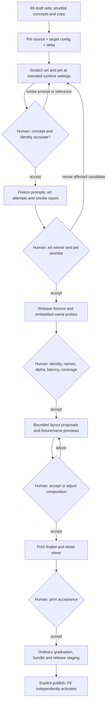

# Patrol Franchise expansion — optimized-workflow operating proposal

Status: future operating proposal; `pawmarvel-author workflow` is NOT
implemented. Prepared 2026-10-04. Use
[current-tool operations](PATROL_FRANCHISE_CURRENT_OPERATIONS.md) today.

This is a Patrol-specific application of
[the authoring automation design](AUTHORING_AUTOMATION_DESIGN.md), especially
category expansion (M4), post-scratch execution (M1), layout assistance (M2),
profile expansion (M3) and package coordination (M5). It does not introduce a
new FE contract or promise that the generated drafts have passed QA.

## 1. Start with the prepared pool, not automated invention

The private Revised Concept Matrix has 23 rows × 3 bottom lines. The 69 folders
already supply candidate reference images and explicit art/pet prompt text.
The pool index records exact copy, row/option, intended props and the nearest
approved source bundle. These are input proposals, not workflow state.

Pool directories and `design_id` both use readable
`<concept-name>-<bottom-line-text>` names. Resolve each directory through the
index's `folder` field and use that same value for target configs, experiments,
and bundles. The private `legacy_design_id` is provenance only.

Use the gallery to select a small category batch. Initial selection is a
creative/business decision. Then one workflow config per chosen variant pins
the exact input files and source revision. Do not execute all 69 variants in a
single implicit paid batch. Separate configs keep costs, failure recovery and
retirement understandable without introducing a grid scheduler.

Three different states must remain distinct:

1. A **concept draft** is visually plausible and has candidate prompts.
2. A **scratch-accepted candidate** produces credible art and personalized
   cutouts at intended runtime settings.
3. A **graduated product bundle** has target benchmarks, layout/assembly and
   print reviews. Only this is eligible for the normal release process.

## 2. Freeze franchise rules and the per-variant delta

Every source bundle remains immutable. A child receives its own design ID and
independent target assets; no live parent dependency is shipped to FE.

The category defaults are private authoring conveniences:

| Setting | Proposed Patrol default |
| --- | --- |
| Category | `patrol-franchise` |
| First target profile | `blanket-twin-full-7875x9375` |
| Name mode | `embedded-in-pet` |
| Art generation | OpenAI, explicit `gpt-image-2.5-sunburst`, high |
| Pet generation | OpenAI, explicit `gpt-image-2.5-sunburst`, low |
| Runtime references | Target finished design first; usually no supporting reference |
| Smoke | Reviewed 2–3 pets, one attempt each |
| Release | Reviewed exact selection, preferably 6–15 pets, one attempt each |
| Extra name probes | Short and 12-character names, generated separately and budgeted |
| Layout | One combined pet/props/name box; no separate name/font config |

A source's explicit runtime settings are inherited by the generic automation
design unless overridden. For these new candidates, selecting Sunburst when
the source used `gpt-image-2` is an intentional model change, not inheritance.
The plan must show it and require fresh benchmarks. Source art model/quality
cannot be recovered reliably from all current public bundles; configure them
explicitly rather than infer them from prompt titles.

For each selected variant, derive a small delta such as this Cookie Patrol
example (private authoring data, not a bundle schema):

```json
{
  "preserve": [
    "hand-inked pet illustration with fine fur strokes",
    "arched black slab-serif headline and four-part fixed artwork hierarchy",
    "handwritten name embedded in the pet asset",
    "two bottom paw prints and true-alpha separated production layers"
  ],
  "change": [
    "headline to COOKIE PATROL",
    "bottom line to Cookies Under Surveillance",
    "upper-right motif to cookie plate and small stocking silhouette",
    "center to attentive pet beside one cookie plate and a red scarf",
    "replace Santa source reference with the selected Cookie Patrol reference"
  ],
  "forbid": [
    "reference pet identity replacing customer identity",
    "Christmas gifts, sleigh or fixed copy inside the pet cutout",
    "pet, scarf, cookie plate or handwritten name inside reusable art",
    "white page background copied into either generated layer"
  ],
  "pet_treatment_changed": true,
  "layout_structure_changed": true
}
```

`layout_structure_changed` is conservative here: pose and prop footprint
change, so a parent layout is only a seed. For a genuine fixed-copy-only
alternative, flags may be false after review, but changed finished-reference
bytes still invalidate pet runtime QA. Do not treat unchanged prompt words as
unchanged inputs.

Use the supplied full prompt files as candidate text. Optional AI assistance
may propose a diff when a design fails scratch; it must not silently rewrite a
working prompt or mix in another collection's props. Never send a dynamic
category delta to FE instead of the resolved final prompt.

## 3. Config-driven execution and manual checkpoints

Initialize from the ordinary per-design config and an exact production-approved
source bundle, following the automation design's proposed config interface.
Pin the source release catalog digest, template ID, revision and manifest
digest. Load source assets without requiring its old authoring directory.
The user identifies the nine designs as approved; the future source-loader
still verifies release integrity and asks the owner to confirm production
approval. A local index or S3 object is not evidence of FE activation.

The prepared pool does not yet contain runnable workflow configs because the
workflow schema/CLI is not implemented. Initialization should fill the
following fields, then show a no-cost plan for review:

- scenario `category-variant`, category ID, target design/profile ID;
- exact source bundle/release identity and private delta;
- target reference image and the two accepted candidate prompt paths;
- explicit art/pet request settings and embedded-name policy;
- selected smoke/release fixture manifests and selection hashes;
- representative pet/name, additional artistic-name probes, call allowance;
- local authoring/exchange paths and explicit publication destination.

Keep secrets only in the existing shared private config. Resolve relative
paths against the config directory; snapshot all planned input bytes. A
single config points to one candidate, not a list of ambiguous alternatives.



The commands below illustrate the already-proposed interface; they are not
runnable today. Scenario/source fields must be completed in the initialized
config before planning:

```bash
WORKFLOW_CONFIG="$(pawmarvel-author workflow init --from-env --scenario category-variant)"
"${EDITOR:-vi}" "$WORKFLOW_CONFIG"
PLAN="$(pawmarvel-author workflow plan --config "$WORKFLOW_CONFIG" --until scratch)"
pawmarvel-author workflow run --plan "$PLAN"
# Inspect scratch output and choose in the review interface before continuing.
PLAN="$(pawmarvel-author workflow review --plan "$PLAN" --continue)"
```

Repeat review-and-continue only after inspecting each resulting checkpoint.
It records explicit human choices and runs the next planned phase within the
remaining allowance. It must not accept the next checkpoint automatically.
Operators no longer retype selected art/pet/layout paths; the coordinator
derives them from exact accepted decisions. Selective retries create new
attempts, not edits to immutable records.

## 4. Patrol-specific review packets

Every phase report should show base reference, target reference, exact target
copy, and the relevant generated artifacts together. Show changes explicitly,
not only a collection of attractive images.

| Packet | Automatic evidence | Human judgment retained |
| --- | --- | --- |
| Scratch | Prompt diff, input roles, art/pet images, effective runtime config | Franchise style, holiday interpretation, copy and split ownership |
| Art | Exact copy labels, alpha diagnostics, fixed-art candidates | Legibility, balance and absence of center fragments |
| Pet | Same fixture inventory, failures, latency and name-probe results | Likeness, anatomy, short-tail preservation, pose, costume and spelling |
| Layout | Small bounded set, successful release pets, name-probe cutouts, clipping/fit diagnostics | Pet prominence, prop/name collisions, aesthetic choice |
| Print | Selected pixel lineage, output dimensions and useful detail crops | Fine edges, text quality, print suitability |

For `embedded-in-pet`, names are raster content. The layout optimizer does
**not** invent a separate font layer or resize the name independently. It
places the whole cutout. Long-name failures go back to the pet prompt/runtime
or human layout adjustment. Name probes incur real image calls and cannot be
counted as additional unique pet fixtures.

The main fixture selection is reviewed once and used by both benchmark and
comparison. Missing coverage remains an explicit warning and manual decision,
not a new hidden hard gate. All failures and incomplete calls remain visible;
do not silently retry until only successes remain. Zero useful output cannot
be promoted as acceptable evidence.

## 5. Minimize work without weakening evidence

For a bottom-line-only change, reuse the approved prompt structure and layout
seed, but create target art and new evidence. Current FE bundles are complete
products, not recipes for overlaying arbitrary copy onto a shared parent.
Changing the target reference changes the online request, so fresh pet QA is
still required unless a later separately designed equivalence mechanism proves
the effective request unchanged. Cross-product/variant pet caches are deferred.

After one variant is accepted, leave unaffected artifacts intact during local
iteration. A pet prompt/model change requires new pet tests and assembly/name
checks, not an unrelated art call. A layout change needs the fixture/name
matrix rerendered, not new pet generation. Changed fixed text requires new art,
placement review and print checks. Do not carry over old passing decisions
when their evidence hashes change.

After the twin/full variant is approved and published, expand its profile via
the proposal's M3 path. Different ratios regenerate/adapt art and reseed layout;
equal ratios may copy/resize art with truthful local-derivation provenance.
Both paths retain independent target QA and print reviews. Keep the first
category pilot at a fixed profile so design and geometry failures are not
confounded.

## 6. Delivery stages and exit criteria

| Stage | Capability / dependency | Exit criterion |
| --- | --- | --- |
| A: current tools now | Pool review, copied candidate inputs, existing scratch and durable commands | One Santa/Cookie finalist and one different-pose finalist reach normal reviewed bundles; source bundles untouched |
| B: post-scratch pilot | Automation M0/M1; use already-tuned prompts as `new-design` inputs until category derivation exists | One config yields art/smoke/release evidence; restart does not duplicate succeeded calls; warnings preserved |
| C: layout assistance | M2 | Pet-only layout proposals replay exactly through existing renderer; names remain baked; fixture/probe evidence survives GUI edits |
| D: category derivation | M3 source loader + M4 delta/scratch flow | A Christmas child and a contrasting holiday child use verified source bundles without source authoring trees; no costume/copy leakage |
| E: package and batch operation | M5 | Accepted print result produces old-consumer-compatible bundle/release with no manual path stitching; publish still explicit |

Use the same quality rubric and fixture choices as the current-tool baseline.
Measure operator active minutes, paid calls, failures, repeat corrections and
runtime latency separately. A faster process that hides failures, reduces name
testing or accepts worse likeness has not met its exit criterion.

The first rollout should not require a new batch CLI, database, queue, category
service or shared-art registry. Operate several independent config-driven
workflows serially. A gallery/summary may link their status without becoming a
second decision system. Broader scheduling remains later work.

## 7. Artifact lifecycle and unchanged FE boundary

The draft pool/index remains private. The proposed coordinator adds private
`work/authoring/<design>/<profile>/workflows/<workflow-id>/` plans, snapshots,
events and reports around existing experiments/reviews/print/graduation.
Active workflow references protect needed local evidence from cleanup; retired
unselected work may be removed through an explicit dry-run cleanup plan.

Do not put category metadata, parent lookups, workflow state or draft prompts
into new public fields. The output remains the current complete bundle,
including both art resolutions, layouts, selected runtime prompt/model/quality,
ordered references, name-mode contract, exact assets and hashes, and QA replay.
Old consumers must validate and render the new bundles under the automation
design's compatibility checks. The FE owns product activation and rollback.

No proposal image or prompt is published automatically. Owners may approve
multiple bottom lines as separate products or retire losing options. Published
revisions remain immutable; retirement is a catalog/application decision, not
permission for local cleanup to delete S3 artifacts.
